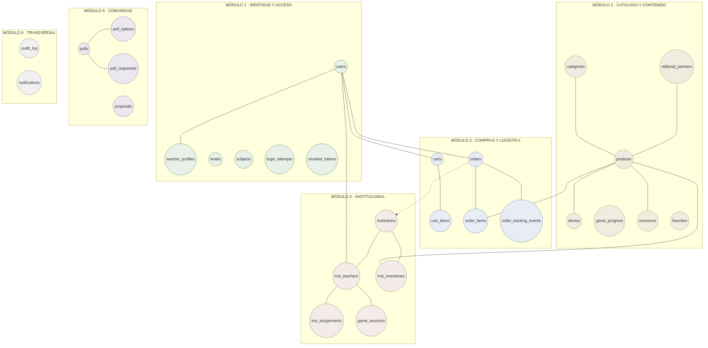
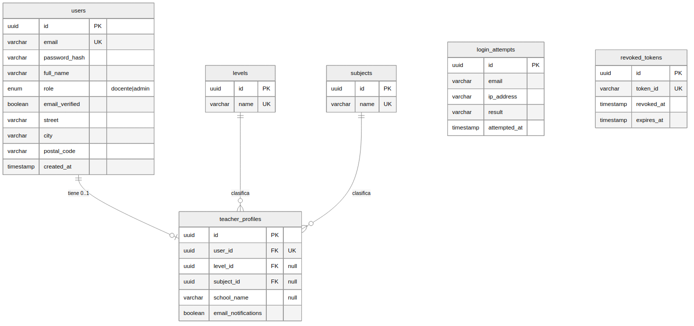
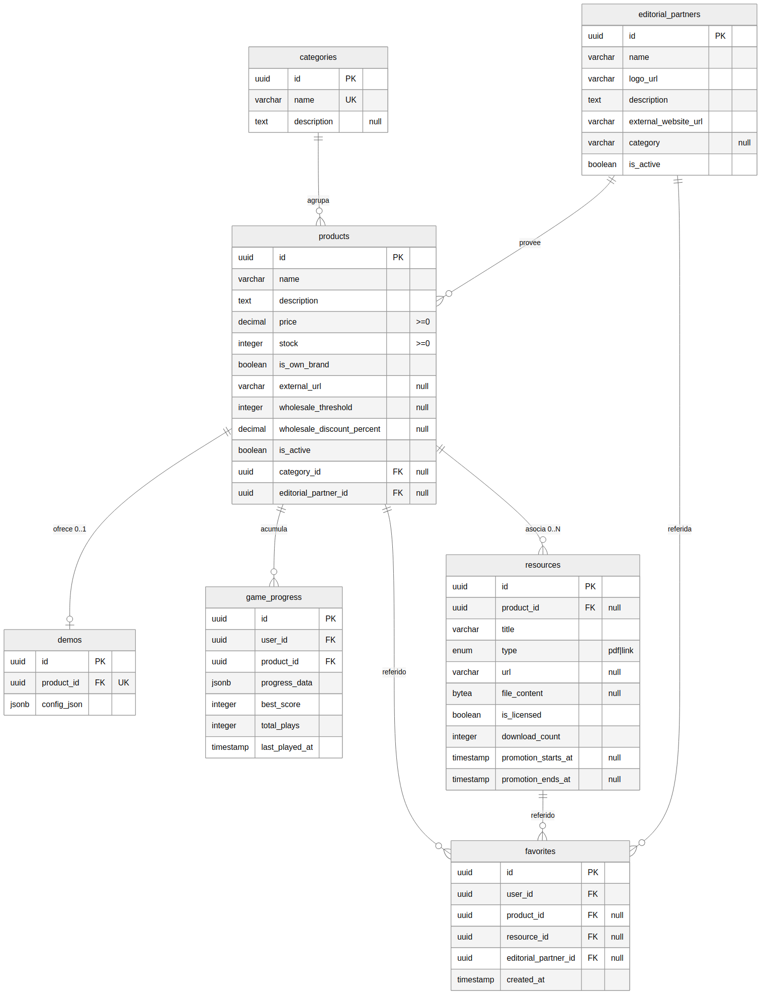
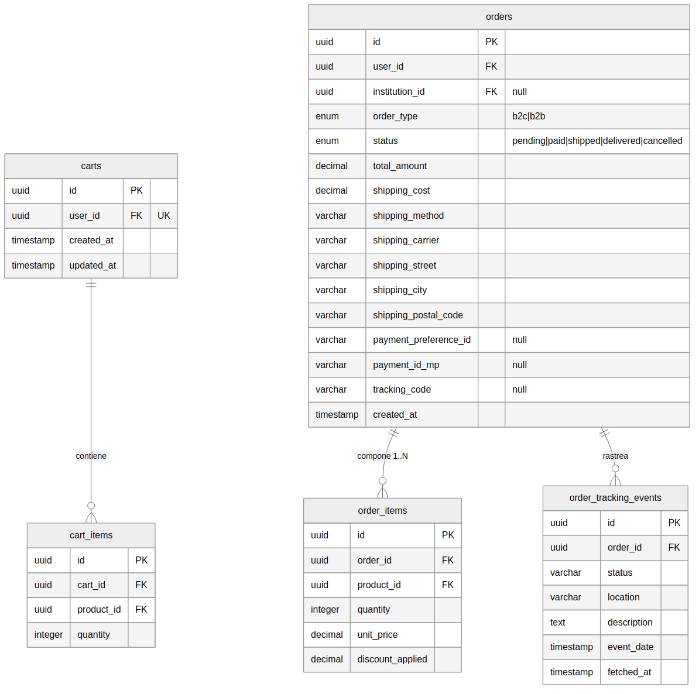
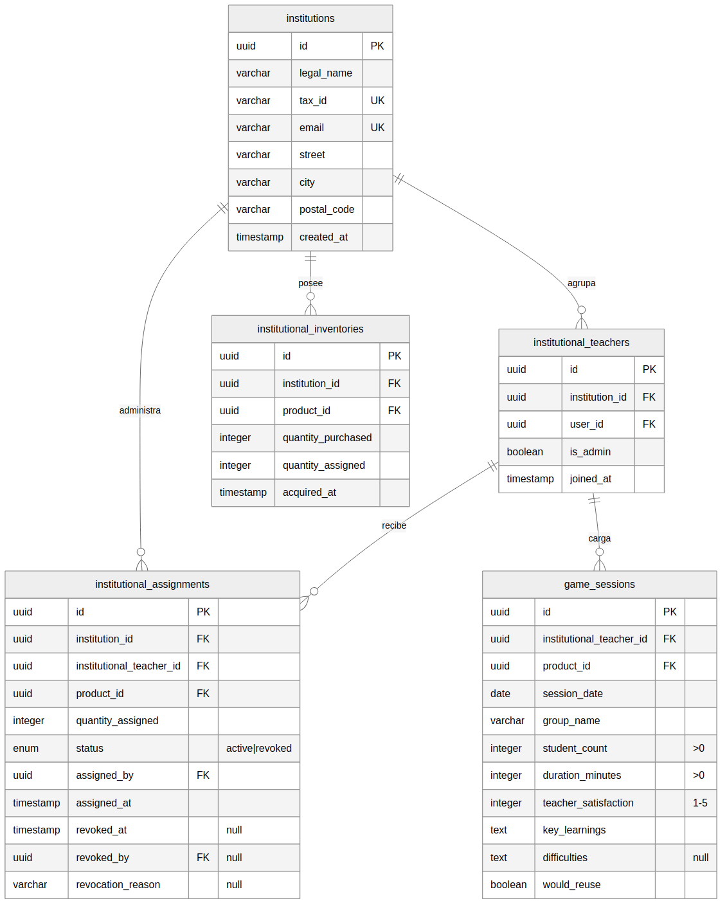
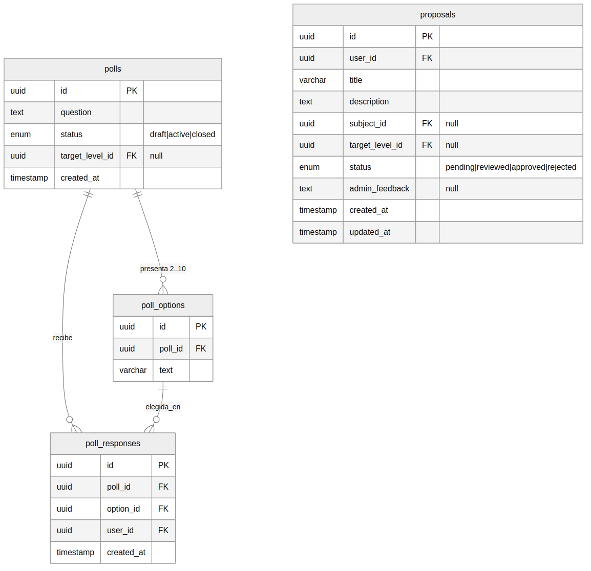
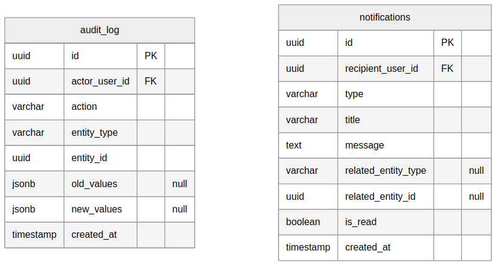

|  | **Sistema ACALUD** |
| --- | --- |
|  | Diagrama Entidad-Relación — Modelo de Datos |
|  | Versión: 00 | Fecha: 24/07/2026 | Página: 1 de 20 |

| Información del Documento |
| --- |
| Nombre del Proyecto | Sistema Acalud |
| Tipo de documento | Modelo de datos — Diagrama Entidad-Relación |
| Alcance | 30 entidades derivadas de las 34 especificaciones funcionales |
| Documento antecedente | Análisis Transversal — Consolidado General, versión 01 |
| Propósito | Definir el modelo de datos conceptual y lógico del sistema, como fundamento del esquema físico de la base de datos y de la implementación. |

---

## 1. Introducción

Este documento presenta el modelo de datos del sistema Acalud, derivado del análisis
transversal de las 34 especificaciones funcionales y de las 58 definiciones resueltas por el
equipo de proyecto.

El modelo se presenta en dos niveles. El **modelo conceptual** describe las entidades y sus
relaciones sin detalle de atributos, y ofrece una visión de conjunto organizada por módulos.
El **modelo lógico** detalla, para cada entidad, sus atributos, tipos de dato, claves
primarias y foráneas, restricciones de unicidad e integridad, y la cardinalidad de sus
relaciones.

La nomenclatura de entidades y atributos se expresa en idioma inglés, en concordancia con la
convención adoptada en la totalidad de la documentación funcional.

### 1.1 Convenciones

| Convención | Significado |
| --- | --- |
| PK | Clave primaria (Primary Key) |
| FK | Clave foránea (Foreign Key) |
| UK | Restricción de unicidad (Unique Key) |
| "null" | El atributo admite valor nulo |
| Tipo `uuid` | Identificador único universal, empleado como clave primaria de todas las entidades |
| Tipo `jsonb` | Estructura de datos semiestructurada |
| Tipo `bytea` | Contenido binario |

Todas las entidades adoptan un identificador único universal como clave primaria, en lugar de
claves naturales. Esta decisión uniforma el modelo, evita exponer información de negocio en
los identificadores y simplifica las relaciones.

---

## 2. Modelo conceptual

El modelo se organiza en seis módulos. Los primeros cinco corresponden a las áreas
funcionales del sistema; el sexto agrupa las entidades de alcance transversal.

### 2.1 Módulos del modelo

| Módulo | Entidades | Responsabilidad |
| --- | --- | --- |
| 1 · Identidad y Acceso | 6 | Cuentas de usuario, perfiles docentes, datos maestros de nivel y materia, y control de acceso |
| 2 · Catálogo y Contenido | 7 | Productos, categorías, demos jugables, progreso de juego, recursos descargables, favoritos y editoriales aliadas |
| 3 · Compras y Logística | 5 | Carritos, órdenes, detalle de órdenes y seguimiento logístico |
| 4 · Institucional | 5 | Instituciones, vínculos docentes, inventario, asignación de licencias y sesiones de uso |
| 5 · Comunidad | 4 | Encuestas, opciones, respuestas y propuestas de juegos |
| 6 · Transversal | 2 | Auditoría de operaciones y notificaciones |

### 2.2 Relaciones entre módulos

Las entidades de los distintos módulos se vinculan principalmente a través de dos entidades
centrales: `users`, del módulo de Identidad, y `products`, del módulo de Catálogo.

La entidad `users` participa en relaciones con perfiles, carritos, órdenes, progreso de
juego, favoritos, respuestas a encuestas, propuestas, vínculos institucionales,
notificaciones y auditoría. La entidad `products` participa en relaciones con demos, recursos,
favoritos, detalle de carrito, detalle de órdenes, inventario institucional, asignaciones y
sesiones de uso.

El módulo Institucional se vincula con el de Compras a través de la relación entre `orders` e
`institutions`, que sustenta la adquisición de lotes descripta en CU-24. El módulo
Transversal se vincula con todos los demás, dado que la auditoría y las notificaciones operan
sobre operaciones de cualquier módulo.

---

## 3. Modelo lógico por módulo

### 3.1 Módulo 1 · Identidad y Acceso

**Entidad `users`.** Núcleo de la identidad. Almacena las credenciales, los datos personales
y el domicilio predeterminado del usuario.

| Atributo | Tipo | Restricción | Origen |
| --- | --- | --- | --- |
| `id` | uuid | PK | — |
| `email` | varchar | UK, no nulo | CU-01 RN-001 |
| `password_hash` | varchar | no nulo | D-09 |
| `full_name` | varchar | no nulo | CU-01 §4 |
| `role` | enum | `docente`, `admin` | D-03, D-04 |
| `email_verified` | boolean | por defecto verdadero | D-11 |
| `street`, `number`, `city`, `province`, `postal_code` | varchar | admiten nulo | D-29 |
| `created_at`, `updated_at` | timestamp | — | — |

El dominio de `role` comprende únicamente dos valores, conforme a la decisión D-03 que retiró
el rol de estudiante. El atributo `email_verified` se incorpora reservado para la
funcionalidad diferida de verificación de correo (D-11).

**Entidad `teacher_profiles`.** Extensión opcional de `users` con la información pedagógica
del docente. La relación es de uno a cero o uno.

| Atributo | Tipo | Restricción | Origen |
| --- | --- | --- | --- |
| `id` | uuid | PK | — |
| `user_id` | uuid | FK → `users`, UK | CU-04 |
| `level_id` | uuid | FK → `levels`, null | CU-04 RN-002 |
| `subject_id` | uuid | FK → `subjects`, null | CU-04 RN-002 |
| `school_name` | varchar | null | CU-04 §3 |
| `email_notifications` | boolean | por defecto falso | D-06 |
| `updated_at` | timestamp | — | — |

La restricción de unicidad sobre `user_id` garantiza que un usuario tenga a lo sumo un perfil.

**Entidades `levels` y `subjects`.** Datos maestros. Cada una consta de identificador y nombre
único.

**Entidad `login_attempts`.** Registra los intentos de acceso para el control de bloqueo por
cuenta y la limitación por origen (D-08).

| Atributo | Tipo | Restricción | Origen |
| --- | --- | --- | --- |
| `id` | uuid | PK | — |
| `email` | varchar | no nulo | CU-02 RN-007 |
| `ip_address` | varchar | no nulo | CU-02 RNF-003 |
| `result` | varchar | no nulo | CU-02 A2.2 |
| `attempted_at` | timestamp | no nulo | — |

**Entidad `revoked_tokens`.** Sostiene la invalidación de sesión en el servidor (D-02). La
verificación de sesión consulta esta entidad; los registros se depuran una vez superada la
fecha de expiración natural.

| Atributo | Tipo | Restricción | Origen |
| --- | --- | --- | --- |
| `id` | uuid | PK | — |
| `token_id` | varchar | UK, no nulo | CU-03 RNF-002 |
| `revoked_at` | timestamp | no nulo | CU-03 |
| `expires_at` | timestamp | no nulo | CU-02 RN-004 |

---

### 3.2 Módulo 2 · Catálogo y Contenido

**Entidad `products`.** Núcleo del catálogo. Es la entidad más referenciada del modelo:
participa en once relaciones. Sus atributos fueron consolidados principalmente de CU-19, única
especificación que los enumera de manera taxativa.

| Atributo | Tipo | Restricción | Origen |
| --- | --- | --- | --- |
| `id` | uuid | PK | — |
| `name`, `description` | varchar, text | no nulos | CU-19 §4 |
| `price` | decimal | mayor o igual a cero | CU-19 RN-006 |
| `stock` | integer | mayor o igual a cero | CU-19 RN-007 |
| `is_own_brand` | boolean | no nulo | CU-19 RN-003 |
| `external_url` | varchar | null | CU-19 RN-003, RN-004 |
| `wholesale_threshold` | integer | null | CU-10 RN-001 |
| `wholesale_discount_percent` | decimal | null | CU-10 RN-002 |
| `is_active` | boolean | por defecto verdadero | D-55 |
| `category_id` | uuid | FK → `categories`, null | D-56 |
| `editorial_partner_id` | uuid | FK → `editorial_partners`, null | D-58 |
| `created_at`, `updated_at` | timestamp | — | — |

El atributo `is_active` sostiene la eliminación lógica (D-55). Los atributos de descuento
mayorista se completan conjuntamente o quedan ambos nulos, conforme a la regla de negocio.

**Entidad `categories`.** Incorporada por resolución de D-56. Consta de identificador, nombre
único y descripción opcional.

**Entidad `demos`.** Configuración de la demo asociada a un producto. La relación es de uno a
cero o uno.

| Atributo | Tipo | Restricción | Origen |
| --- | --- | --- | --- |
| `id` | uuid | PK | — |
| `product_id` | uuid | FK → `products`, UK | CU-06 §4 |
| `config_json` | jsonb | no nulo | CU-06 RN-001, D-57 |

La configuración semiestructurada contiene los parámetros de límite de la demo, así como la
dirección del motor de juego incorporada por resolución de D-57.

**Entidad `game_progress`.** Progreso de juego del docente por producto. Un registro por par
usuario-producto.

| Atributo | Tipo | Restricción | Origen |
| --- | --- | --- | --- |
| `id` | uuid | PK | — |
| `user_id` | uuid | FK → `users` | CU-07 RN-003 |
| `product_id` | uuid | FK → `products` | CU-07 RN-003 |
| `progress_data` | jsonb | no nulo | CU-07 RN-003 |
| `best_score` | integer | — | CU-07 RN-003 |
| `total_plays` | integer | — | CU-07 RN-003 |
| `last_played_at` | timestamp | — | CU-07 RN-003 |

La restricción de unicidad sobre el par `user_id`, `product_id` garantiza un único registro de
progreso por usuario y juego.

**Entidad `resources`.** Recursos descargables, gratuitos o licenciados. Incorpora el
contenido binario del archivo, conforme a la decisión provisional D-18.

| Atributo | Tipo | Restricción | Origen |
| --- | --- | --- | --- |
| `id` | uuid | PK | — |
| `product_id` | uuid | FK → `products`, null | D-19 |
| `title` | varchar | no nulo | CU-19 A9.4 |
| `type` | enum | `pdf`, `link` | CU-08 RN-003 |
| `url` | varchar | null | CU-08 RN-003 |
| `file_content` | bytea | null | D-18 |
| `is_licensed` | boolean | no nulo | CU-08 RN-001 |
| `download_count` | integer | por defecto cero | D-15 |
| `promotion_starts_at` | timestamp | null | D-16 |
| `promotion_ends_at` | timestamp | null | D-16 |
| `created_at` | timestamp | — | — |

La relación con `products` admite nulo, dado que existen recursos sin producto asociado
(D-19). El período de promoción se representa mediante las dos marcas temporales (D-16).

**Entidad `favorites`.** Referencia polimórfica que vincula un usuario con un producto, un
recurso o una editorial. Exactamente una de las tres referencias es no nula.

| Atributo | Tipo | Restricción | Origen |
| --- | --- | --- | --- |
| `id` | uuid | PK | — |
| `user_id` | uuid | FK → `users` | CU-18 §3 |
| `product_id` | uuid | FK → `products`, null | CU-18 RN-002 |
| `resource_id` | uuid | FK → `resources`, null | CU-18 RN-002 |
| `editorial_partner_id` | uuid | FK → `editorial_partners`, null | CU-18 RN-002 |
| `created_at` | timestamp | — | — |

Una restricción de integridad exige que exactamente una de las tres referencias sea no nula.
Tres índices únicos parciales, uno por referencia, garantizan que un usuario no guarde el
mismo elemento dos veces (D-14).

**Entidad `editorial_partners`.** Editoriales aliadas exhibidas en el directorio.

| Atributo | Tipo | Restricción | Origen |
| --- | --- | --- | --- |
| `id` | uuid | PK | — |
| `name`, `logo_url`, `description` | varchar, text | no nulos | CU-17 RN-002 |
| `external_website_url` | varchar | no nulo | CU-17 RN-002 |
| `category` | varchar | null | CU-17 A7.4 |
| `is_active` | boolean | por defecto verdadero | CU-17 RN-001 |

---

### 3.3 Módulo 3 · Compras y Logística

**Entidad `carts` y `cart_items`.** El carrito persiste el estado de compra en curso del
usuario registrado. La relación con `users` es de uno a cero o uno. El detalle se modela en
`cart_items`, con un registro por producto (D-05).

`cart_items` mantiene una restricción de unicidad sobre el par `cart_id`, `product_id`, de
modo que un producto figura una sola vez en el carrito acumulando su cantidad, conforme a
CU-10 RN-006.

**Entidad `orders`.** Núcleo del circuito comercial. Registra tanto las compras individuales
como las institucionales, distinguidas por el atributo `order_type`.

| Atributo | Tipo | Restricción | Origen |
| --- | --- | --- | --- |
| `id` | uuid | PK | — |
| `user_id` | uuid | FK → `users` | CU-12 §4 |
| `institution_id` | uuid | FK → `institutions`, null | D-26 |
| `order_type` | enum | `b2c`, `b2b` | CU-24 RN-003 |
| `status` | enum | `pending`, `paid`, `shipped`, `delivered`, `cancelled` | D-22 |
| `total_amount` | decimal | no nulo | CU-12 §4 |
| `shipping_cost` | decimal | — | D-28 |
| `shipping_method`, `shipping_carrier` | varchar | — | D-28 |
| `shipping_street`, `shipping_city`, `shipping_postal_code` | varchar | — | D-29 |
| `payment_preference_id` | varchar | null | CU-12 §4 |
| `payment_id_mp` | varchar | null | CU-12 §3 |
| `tracking_code` | varchar | null | CU-13 RN-002 |
| `created_at`, `updated_at` | timestamp | — | — |

El atributo `institution_id`, cuando está informado, indica que se trata de una compra
institucional, cuya confirmación de pago incrementa el inventario de la institución (D-26). El
atributo `order_type` se incorpora como resultado de la corrección de CU-24. Los atributos de
domicilio con prefijo `shipping_` conservan una copia del domicilio al momento de la compra,
de modo que una modificación posterior del domicilio del usuario no altere las órdenes
existentes (D-29).

**Entidad `order_items`.** Detalle de la orden. Conserva una instantánea del precio al momento
de la compra.

| Atributo | Tipo | Restricción | Origen |
| --- | --- | --- | --- |
| `id` | uuid | PK | — |
| `order_id` | uuid | FK → `orders` | CU-12 §4 |
| `product_id` | uuid | FK → `products` | CU-12 §4 |
| `quantity` | integer | no nulo | CU-05 RN-007 |
| `unit_price` | decimal | no nulo | CU-05 RN-007 |
| `discount_applied` | decimal | — | CU-10 §3 |

Los atributos `unit_price` y `discount_applied` constituyen una instantánea: conservan el
precio y descuento vigentes al confirmarse la compra, de modo que una modificación posterior
del precio del producto no altere el valor histórico de la orden (CU-22 RN-007).

**Entidad `order_tracking_events`.** Persiste los eventos de seguimiento logístico, cumpliendo
simultáneamente la función de almacenamiento temporal y de historial (D-25).

| Atributo | Tipo | Restricción | Origen |
| --- | --- | --- | --- |
| `id` | uuid | PK | — |
| `order_id` | uuid | FK → `orders` | CU-13 |
| `status` | varchar | no nulo | CU-13 §4 |
| `location`, `description` | varchar, text | — | CU-13 §4 |
| `event_date` | timestamp | — | CU-13 §4 |
| `fetched_at` | timestamp | — | CU-13 RN-003 |

---

### 3.4 Módulo 4 · Institucional

**Entidad `institutions`.** Registra los datos legales y de contacto de la institución.

| Atributo | Tipo | Restricción | Origen |
| --- | --- | --- | --- |
| `id` | uuid | PK | — |
| `legal_name` | varchar | no nulo | CU-23 RN-006 |
| `tax_id` | varchar | UK, no nulo | CU-23 RN-001 |
| `email` | varchar | UK, no nulo | CU-23 RN-002 |
| `street`, `number`, `city`, `province`, `postal_code` | varchar | no nulos | CU-23 RN-006, D-44 |
| `created_at` | timestamp | — | — |

El identificador tributario y el correo son únicos en el sistema.

**Entidad `institutional_teachers`.** Vínculo entre un usuario y una institución. Distingue al
encargado del docente mediante el atributo `is_admin`.

| Atributo | Tipo | Restricción | Origen |
| --- | --- | --- | --- |
| `id` | uuid | PK | — |
| `institution_id` | uuid | FK → `institutions` | CU-23 §3 |
| `user_id` | uuid | FK → `users` | CU-23 §3 |
| `is_admin` | boolean | por defecto falso | CU-23 RN-004 |
| `joined_at` | timestamp | — | — |

Esta entidad mantiene dos restricciones de unicidad. La primera, sobre el par
`institution_id`, `user_id`, impide vínculos duplicados. La segunda, un índice único parcial
sobre `user_id` condicionado a `is_admin` verdadero, garantiza que un usuario sea encargado de
una sola institución, sin impedir que sea docente en varias (D-35).

**Entidad `institutional_inventories`.** Tenencia de productos por institución. Un registro
por par institución-producto.

| Atributo | Tipo | Restricción | Origen |
| --- | --- | --- | --- |
| `id` | uuid | PK | — |
| `institution_id` | uuid | FK → `institutions` | CU-25 RN-001 |
| `product_id` | uuid | FK → `products` | CU-25 §4 |
| `quantity_purchased` | integer | no nulo | CU-25 RN-002 |
| `quantity_assigned` | integer | por defecto cero | CU-25 RN-002 |
| `acquired_at` | timestamp | — | CU-25 §3 |

El atributo `quantity_assigned` se conserva como valor agregado, actualizado en la misma
transacción que registra cada asignación o revocación (D-36). La cantidad disponible se
calcula como la diferencia entre lo adquirido y lo asignado.

**Entidad `institutional_assignments`.** Asignación de unidades del inventario a docentes.
Conserva el historial de asignaciones revocadas.

| Atributo | Tipo | Restricción | Origen |
| --- | --- | --- | --- |
| `id` | uuid | PK | — |
| `institution_id` | uuid | FK → `institutions` | CU-26 RN-006 |
| `institutional_teacher_id` | uuid | FK → `institutional_teachers` | D-42 |
| `product_id` | uuid | FK → `products` | CU-26 RN-006 |
| `quantity_assigned` | integer | mayor a cero | CU-26 RN-004 |
| `status` | enum | `active`, `revoked` | D-33, D-37 |
| `assigned_by` | uuid | FK → `institutional_teachers` | CU-26 RN-006 |
| `assigned_at` | timestamp | — | CU-26 RN-006 |
| `revoked_at` | timestamp | null | D-33 |
| `revoked_by` | uuid | FK → `institutional_teachers`, null | D-33 |
| `revocation_reason` | varchar | null | D-33 |

La revocación no elimina el registro sino que actualiza su estado, conforme a la decisión
D-33, preservando la trazabilidad histórica exigida por CU-28.

**Entidad `game_sessions`.** Registro pedagógico de uso de un juego físico. Constituye la
fuente de todos los reportes institucionales.

| Atributo | Tipo | Restricción | Origen |
| --- | --- | --- | --- |
| `id` | uuid | PK | — |
| `institutional_teacher_id` | uuid | FK → `institutional_teachers` | D-42 |
| `product_id` | uuid | FK → `products` | CU-29 RN-006 |
| `session_date` | date | no futura | CU-29 RN-002 |
| `group_name` | varchar | — | CU-30 §3 |
| `student_count` | integer | mayor a cero | CU-29 RN-003 |
| `duration_minutes` | integer | mayor a cero | CU-29 RN-003 |
| `teacher_satisfaction` | integer | de 1 a 5 | CU-29 RN-005 |
| `key_learnings` | text | mínimo 20 caracteres | CU-29 RN-004 |
| `difficulties` | text | null | CU-30 §3 |
| `would_reuse` | boolean | — | CU-30 §3 |
| `created_at` | timestamp | — | — |

La sesión referencia el vínculo institucional del docente, no directamente al usuario, de modo
que al desvincularse el docente, sus sesiones permanecen asociadas a la institución (D-42).

---

### 3.5 Módulo 5 · Comunidad

**Entidad `polls`.** Encuestas de opción múltiple parametrizadas por el administrador.

| Atributo | Tipo | Restricción | Origen |
| --- | --- | --- | --- |
| `id` | uuid | PK | — |
| `question` | text | no nulo | CU-20 §4 |
| `status` | enum | `draft`, `active`, `closed` | D-48 |
| `target_level_id` | uuid | FK → `levels`, null | CU-14 RN-003 |
| `created_at` | timestamp | — | — |

El atributo `status` reemplaza el indicador booleano original, para distinguir la encuesta no
publicada de la finalizada (D-48).

**Entidad `poll_options`.** Opciones de respuesta de una encuesta. Cada encuesta presenta
entre dos y diez opciones, conforme a la regla incorporada en la corrección de CU-20.

| Atributo | Tipo | Restricción | Origen |
| --- | --- | --- | --- |
| `id` | uuid | PK | — |
| `poll_id` | uuid | FK → `polls` | CU-20 §3 |
| `text` | varchar | no nulo, no vacío | CU-20 RN-003 |

**Entidad `poll_responses`.** Participación de un usuario en una encuesta. Una respuesta por
usuario y encuesta.

| Atributo | Tipo | Restricción | Origen |
| --- | --- | --- | --- |
| `id` | uuid | PK | — |
| `poll_id` | uuid | FK → `polls` | CU-14 §3 |
| `option_id` | uuid | FK → `poll_options` | CU-14 §3 |
| `user_id` | uuid | FK → `users` | CU-14 §3 |
| `created_at` | timestamp | — | — |

La restricción de unicidad sobre el par `poll_id`, `user_id` garantiza una única participación
por usuario y encuesta (D-46). El recuento de votos por opción se calcula en tiempo de
consulta sobre esta entidad, sin almacenarse (D-47).

**Entidad `proposals`.** Propuestas de juegos enviadas por los docentes.

| Atributo | Tipo | Restricción | Origen |
| --- | --- | --- | --- |
| `id` | uuid | PK | — |
| `user_id` | uuid | FK → `users` | CU-15 §3 |
| `title` | varchar | no nulo | CU-15 RN-001 |
| `description` | text | mínimo 50 caracteres | CU-15 RN-002 |
| `subject_id` | uuid | FK → `subjects`, null | CU-15 RN-007 |
| `target_level_id` | uuid | FK → `levels`, null | D-50 |
| `status` | enum | `pending`, `reviewed`, `approved`, `rejected` | CU-15 RN-003 |
| `admin_feedback` | text | null | CU-21 RN-003 |
| `created_at`, `updated_at` | timestamp | — | — |

El atributo `target_level_id` se incorpora por resolución de D-50.

---

### 3.6 Módulo 6 · Transversal

**Entidad `audit_log`.** Registro de auditoría de alcance transversal. Una única entidad
asienta las operaciones de todos los módulos, mediante un tipo de entidad genérico (D-27).

| Atributo | Tipo | Restricción | Origen |
| --- | --- | --- | --- |
| `id` | uuid | PK | — |
| `actor_user_id` | uuid | FK → `users` | Siete especificaciones |
| `action` | varchar | no nulo | CU-19 RN-002 |
| `entity_type` | varchar | no nulo | D-27 |
| `entity_id` | uuid | no nulo | D-27 |
| `old_values` | jsonb | null | CU-22 RN-008 |
| `new_values` | jsonb | null | CU-22 RN-008 |
| `created_at` | timestamp | no nulo | — |

Los atributos `entity_type` y `entity_id` identifican la entidad afectada por la operación, de
modo genérico, lo que permite auditar cualquier módulo con una única estructura.

**Entidad `notifications`.** Notificaciones a usuarios. Sostiene el canal de tablero descripto
en las especificaciones como "email o dashboard" (D-38).

| Atributo | Tipo | Restricción | Origen |
| --- | --- | --- | --- |
| `id` | uuid | PK | — |
| `recipient_user_id` | uuid | FK → `users` | CU-26 RN-008 |
| `type` | varchar | no nulo | D-38 |
| `title`, `message` | varchar, text | no nulos | D-38 |
| `related_entity_type` | varchar | null | D-38 |
| `related_entity_id` | uuid | null | D-38 |
| `is_read` | boolean | por defecto falso | D-38 |
| `created_at` | timestamp | — | — |

El envío por correo electrónico se resuelve como una acción adicional sobre el mismo registro.

---

## 4. Consideraciones de diseño

### 4.1 Normalización

El modelo se encuentra en tercera forma normal. Cada atributo depende de la clave primaria de
su entidad, no existen dependencias transitivas entre atributos no clave, y los grupos
repetitivos se resolvieron en entidades separadas.

Se admiten dos excepciones deliberadas, ambas justificadas:

**Instantáneas de precio en `order_items`.** Los atributos `unit_price` y `discount_applied`
duplican información que en el momento de la compra reside en `products`. La duplicación es
deliberada: la orden debe conservar el precio histórico con independencia de las
modificaciones posteriores del catálogo (CU-22 RN-007).

**Cantidad asignada agregada en `institutional_inventories`.** El atributo `quantity_assigned`
constituye un valor derivable de la suma de las asignaciones activas. Su almacenamiento
responde al requerimiento expreso de las especificaciones (CU-26 RN-007, CU-27 RN-004) y su
consistencia se garantiza mediante actualización transaccional.

Las instantáneas de domicilio en `orders` obedecen al mismo criterio que las de precio.

### 4.2 Integridad referencial

Las claves foráneas que representan una pertenencia estructural, como la de `order_items`
respecto de `orders`, o la de `poll_options` respecto de `polls`, se comportan de manera que
la eliminación de la entidad principal no deje registros huérfanos.

Las claves foráneas que representan una referencia, como la de `products` respecto de
`categories`, admiten nulo y se comportan de manera que la eliminación de la entidad
referida no elimine la que la referencia.

Conforme a las decisiones D-49 y D-55, ciertas entidades no admiten eliminación física cuando
poseen registros dependientes: las encuestas con respuestas registradas y los productos con
órdenes asociadas se retiran mediante cambio de estado, preservando la integridad histórica.

### 4.3 Restricciones de unicidad e integridad

El modelo define las siguientes restricciones más allá de las claves primarias:

| Entidad | Restricción | Propósito |
| --- | --- | --- |
| `users` | `email` único | Identificador de acceso |
| `teacher_profiles` | `user_id` único | Un perfil por usuario |
| `institutions` | `tax_id` y `email` únicos | Identidad institucional |
| `institutional_teachers` | par institución-usuario único | Sin vínculos duplicados |
| `institutional_teachers` | usuario único donde es encargado | Un encargo por usuario |
| `institutional_inventories` | par institución-producto único | Un registro de tenencia por producto |
| `game_progress` | par usuario-producto único | Un progreso por juego |
| `cart_items` | par carrito-producto único | Sin ítems duplicados |
| `poll_responses` | par encuesta-usuario único | Una participación por encuesta |
| `favorites` | tres índices parciales por referencia | Sin favoritos duplicados |
| `demos` | `product_id` único | Una demo por producto |
| `favorites` | exactamente una referencia no nula | Integridad de la referencia polimórfica |

---

## 5. Trazabilidad hacia las especificaciones

Cada entidad del modelo se origina en una o más especificaciones funcionales. La tabla
siguiente resume la correspondencia.

| Entidad | Especificaciones de origen |
| --- | --- |
| `users` | CU-01, 02, 03, 04 |
| `teacher_profiles` | CU-01, 04 |
| `levels`, `subjects` | CU-04, 14, 15 |
| `login_attempts` | CU-02 |
| `revoked_tokens` | CU-03 |
| `products` | CU-19 y todo el circuito comercial e institucional |
| `categories` | CU-19 |
| `demos` | CU-06, 07, 19 |
| `game_progress` | CU-07 |
| `resources` | CU-08, 09, 19 |
| `favorites` | CU-18 |
| `editorial_partners` | CU-17 |
| `carts`, `cart_items` | CU-10 |
| `orders` | CU-11, 12, 13, 24 |
| `order_items` | CU-05, 12 |
| `order_tracking_events` | CU-13 |
| `institutions` | CU-23 |
| `institutional_teachers` | CU-23, 26, 28 |
| `institutional_inventories` | CU-24, 25 |
| `institutional_assignments` | CU-26, 27 |
| `game_sessions` | CU-29, 30, 31, 32, 33 |
| `polls`, `poll_options` | CU-14, 16, 20 |
| `poll_responses` | CU-14 |
| `proposals` | CU-15, 21 |
| `audit_log` | CU-19, 21, 22, 23, 26, 27, 29 |
| `notifications` | CU-15, 21, 26, 27 |

---

## 6. Registro de revisiones

| Revisión | Fecha | Ítem | Descripción | Intervino |
| --- | --- | --- | --- | --- |
| 00 | 24/07/2026 | Documento total | Versión inicial |  |

## 7. Participantes y Aprobaciones

| **Confecciona** | **Revisa** | **Aprueba** |
| --- | --- | --- |
|  |  |  |
