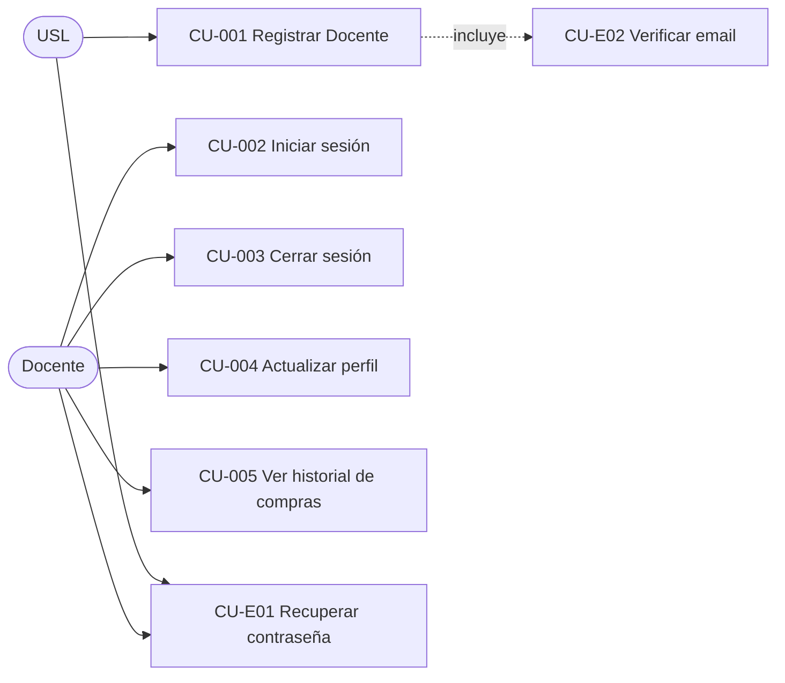

# 1.1-A · Casos de Uso — Autenticación y Perfil

| Campo | Valor |
|---|---|
| **Artefacto** | 1.1 Casos de uso detallados · Tanda 1/3 · Módulo A |
| **Versión** | 0.1.0 · **Fecha:** 2026-07-04 · **Estado:** 🟡 Borrador |
| **Cobertura** | CU-001..005 (matriz) + CU-E01, CU-E02 (extendidos) |
| **Convenciones** | Plantilla L2 completa · Gherkin stateless · IDs `@scenario-id:AUT-CUxxx-TIPO-NNN` |
| **Fundamento de seguridad** | OWASP ASVS 4.0.3 §V2 (credenciales), §V3 (sesiones) — `OWASP_Application_Security_Verification_Standard_4_0_3es.pdf` de la base de conocimiento |

**Nota de estado del modelo:** los nombres de tablas/campos en precondiciones son
provisionales hasta el modelo de datos (2.3); expresan *verificabilidad*, no esquema final.

**Parámetros ratificables de este módulo** (valores por defecto; el equipo puede ajustar):

| ID | Parámetro | Valor default |
|---|---|---|
| PA-01 | Longitud de contraseña | 12–128 caracteres, sin reglas de composición, verificada contra lista de contraseñas filtradas (ASVS V2.1) |
| PA-02 | Bloqueo por fuerza bruta | 5 intentos fallidos en 15 min → bloqueo 15 min + email de aviso |
| PA-03 | Vigencia token verificación de email | 24 h, un solo uso |
| PA-04 | Vigencia token recuperación de contraseña | 30 min, un solo uso |
| PA-05 | Sesión | 7 días con renovación deslizante; logout invalida server-side |
| PA-06 | Cuenta no verificada | Puede navegar logueada; **no puede**: checkout, descargar recursos licenciados, cargar sesiones de uso |

## Diagrama de casos de uso del módulo (actores integrados)



---

## CU-001 · Registrar Docente

| | |
|---|---|
| **UC-ID** | UC-AUT-001 · v0.1.0 · DRAFT |
| **Actor primario** | USL |
| **Actores secundarios** | Servicio de email (SMTP/API, entrega at-least-once) |
| **Frecuencia estimada** | ~20/día, pico 0,5 RPS (evento de difusión) |

**Objetivo (qué/por qué):** crear una cuenta de Docente para habilitar compras, recursos
licenciados y comunidad; es la puerta de entrada de todo el valor B2C.

**PRECONDICIONES**
- BD: `SELECT count(*) FROM docentes WHERE email = :email` → 0 (email no registrado).
- AUTH: sin sesión activa (si hay sesión, redirigir a inicio).
- INFRA: servicio de email operativo (si cae, ver flujo E2).

**POSTCONDICIONES**
- BD: INSERT en `docentes` (email, hash_password, nombre, apellido, estado=`no_verificada`,
  creada_en) + INSERT token de verificación (hash, expira_en=+24 h, usado=false).
- EVENTOS: `DocenteRegistrado` (docente_id, timestamp).
- EFECTOS: email de verificación enviado (garantía at-least-once, reintentos con backoff).

**FLUJO PRINCIPAL**
1. USL completa email, contraseña, nombre y apellido.
2. Sistema valida formato de email y política de contraseña (PA-01) **en servidor**.
3. Sistema crea la cuenta en estado `no_verificada` y el token de verificación.
4. Sistema envía email con enlace de verificación y responde con pantalla "revisá tu correo".
5. Continúa en CU-E02.

**FLUJOS ALTERNATIVOS**
- A1 — Email ya registrado: el sistema responde **exactamente igual** que en el paso 4
  (anti-enumeración), pero el email enviado dice "ya tenés una cuenta" con enlace a
  recuperación (CU-E01). No se crea cuenta duplicada.

**FLUJOS DE EXCEPCIÓN**
- E1 — Contraseña débil o filtrada: rechazo 422 con motivo específico; no se crea cuenta.
- E2 — Servicio de email caído: la cuenta SÍ se crea; el envío queda encolado con reintentos
  (backoff exponencial, máx. 6 intentos/24 h); el USL ve la misma pantalla del paso 4 y
  dispone de "reenviar verificación" (rate limit: 3/hora por cuenta).

**⚠️ Edge cases & reglas de negocio**
- Normalización de email: trim + lowercase antes de unicidad (constraint UNIQUE en BD, no
  solo validación de aplicación).
- Rate limit de registro: 10 registros/hora por IP (mitiga bots; sin CAPTCHA en v1).
- Batch: no aplica (entidad única). *Checklist de lote: no corresponde — declarado.*

**🤖 Directivas técnicas para la IA**
- Hash de contraseña: **argon2id** (parámetros por defecto de la librería oficial del stack).
- El token de verificación se almacena **hasheado**; el enlace lleva el valor en claro.
- Respuesta idéntica (mismo status, mismo cuerpo, tiempo comparable) exista o no el email.
- Test de integración obligatorio: unicidad de email contra BD real (no mock del repositorio).

```gherkin
# language: es
Característica: Registro de Docente
  Como usuario sin login quiero crear una cuenta de docente
  Para comprar juegos y acceder a recursos licenciados

  @smoke @auth @criticidad-alta @scenario-id:AUT-CU001-HAPPY-001
  Escenario: Registro exitoso crea cuenta no verificada y envía email
    Dado que no existe ningún docente con email "maria@escuela.edu.ar"
    Cuando envía el formulario de registro con:
      | campo      | valor                  |
      | email      | maria@escuela.edu.ar   |
      | contraseña | correcta-bateria-caballo-grapa |
      | nombre     | María                  |
      | apellido   | Pérez                  |
    Entonces la respuesta debe tener status 201
    Y debe existir un docente "maria@escuela.edu.ar" en estado "no_verificada"
    Y debe registrarse el evento "DocenteRegistrado"
    Y debe encolarse un email de verificación a "maria@escuela.edu.ar"

  @auth @seguridad @scenario-id:AUT-CU001-ALT-001
  Escenario: Registro con email ya existente no revela la existencia de la cuenta
    Dado que existe un docente verificado con email "maria@escuela.edu.ar"
    Cuando envía el formulario de registro con ese mismo email y una contraseña válida
    Entonces la respuesta debe ser idéntica en status y cuerpo a la del registro exitoso
    Y no debe crearse un segundo docente con ese email
    Y debe encolarse un email de tipo "cuenta-existente" en lugar del de verificación

  @auth @seguridad @scenario-id:AUT-CU001-EXC-001
  Escenario: Contraseña presente en lista de contraseñas filtradas es rechazada
    Dado que no existe ningún docente con email "nuevo@escuela.edu.ar"
    Cuando envía el formulario de registro con contraseña "123456789012"
    Entonces la respuesta debe tener status 422
    Y el cuerpo debe indicar que la contraseña figura en listas de contraseñas comprometidas
    Y no debe existir ningún docente con email "nuevo@escuela.edu.ar"
```

---

## CU-E02 · Verificar email

| | |
|---|---|
| **UC-ID** | UC-AUT-E02 · v0.1.0 · DRAFT |
| **Actor primario** | USL (con cuenta `no_verificada`) |
| **Frecuencia** | 1 por registro + reenvíos |

**Objetivo:** confirmar la propiedad del email para habilitar las capacidades completas
de la cuenta (PA-06); requisito de higiene de identidad previo a cualquier compra.

**PRECONDICIONES**
- BD: token existe, `usado=false`, `expira_en > now()`, asociado a cuenta `no_verificada`.

**POSTCONDICIONES**
- BD: `docentes.estado = 'verificada'`; token marcado `usado=true` (transacción única).
- EVENTOS: `EmailVerificado`.

**FLUJO PRINCIPAL**
1. USL abre el enlace del email.
2. Sistema valida el token (existencia, vigencia, no usado) y activa la cuenta.
3. Sistema inicia sesión automáticamente y redirige al catálogo con aviso de bienvenida.

**FLUJOS DE EXCEPCIÓN**
- E1 — Token vencido/usado/inexistente: mensaje único "enlace inválido o vencido" +
  botón de reenvío (rate limit PA: 3/hora). No distingue el motivo (anti-sondeo).

**⚠️ Edge cases & reglas de negocio**
- Verificación con sesión de otra cuenta abierta: cerrar esa sesión antes de activar.
- Reenvío invalida tokens anteriores (solo el último token es válido).
- Batch: no aplica — declarado.

**🤖 Directivas técnicas para la IA**
- Activación y marcado de token en **una transacción**; segunda visita al mismo enlace cae
  en E1 (idempotencia del lado del efecto: la cuenta ya quedó verificada).

```gherkin
# language: es
Característica: Verificación de email

  @smoke @auth @scenario-id:AUT-CUE02-HAPPY-001
  Escenario: Token vigente verifica la cuenta y abre sesión
    Dado un docente "maria@escuela.edu.ar" en estado "no_verificada"
    Y un token de verificación vigente y no usado para esa cuenta
    Cuando abre el enlace de verificación con ese token
    Entonces la cuenta debe quedar en estado "verificada"
    Y el token debe quedar marcado como usado
    Y debe crearse una sesión activa para la cuenta

  @auth @scenario-id:AUT-CUE02-EXC-001
  Escenario: Token ya usado no re-verifica ni revela estado
    Dado un docente "maria@escuela.edu.ar" en estado "verificada"
    Y un token de verificación marcado como usado para esa cuenta
    Cuando abre el enlace de verificación con ese token
    Entonces debe ver el mensaje "enlace inválido o vencido"
    Y el estado de la cuenta debe permanecer "verificada"
```

---

## CU-002 · Iniciar sesión como Docente

| | |
|---|---|
| **UC-ID** | UC-AUT-002 · v0.1.0 · DRAFT |
| **Actor primario** | Docente |
| **Frecuencia** | ~200/día, pico 2 RPS |

**Objetivo:** autenticar al docente para operar su cuenta; primera línea de defensa del
sistema (ASVS §V2/V3).

**PRECONDICIONES**
- BD: cuenta existe (cualquier estado) · CONC: cuenta no bloqueada por PA-02
  (`bloqueada_hasta IS NULL OR bloqueada_hasta < now()`).

**POSTCONDICIONES**
- Sesión creada server-side (PA-05); `ultimo_login` actualizado; contador de intentos
  fallidos reseteado. EVENTOS: `SesionIniciada` (con IP y user-agent para auditoría).

**FLUJO PRINCIPAL**
1. Docente ingresa email y contraseña.
2. Sistema verifica credenciales contra el hash almacenado.
3. Sistema crea sesión y redirige según contexto (checkout pendiente → checkout).

**FLUJOS ALTERNATIVOS**
- A1 — Cuenta `no_verificada`: sesión se crea con capacidades limitadas (PA-06) y banner
  permanente "verificá tu email" con acción de reenvío.

**FLUJOS DE EXCEPCIÓN**
- E1 — Credenciales inválidas: mensaje único "email o contraseña incorrectos" (sin
  distinguir cuál); incrementa contador de intentos.
- E2 — Umbral PA-02 alcanzado: bloqueo temporal 15 min; email de aviso a la cuenta; los
  intentos durante el bloqueo NO extienden el bloqueo (evita DoS de extensión infinita).

**⚠️ Edge cases & reglas de negocio**
- El contador de intentos es por cuenta **y** por IP (dos límites independientes).
- Login exitoso NO invalida otras sesiones activas (multi-dispositivo permitido).
- Batch: no aplica — declarado.

**🤖 Directivas técnicas para la IA**
- Comparación de hash en tiempo constante; mismo tiempo de respuesta exista o no la cuenta
  (ejecutar el hash igual con un dummy si no existe).
- Cookie de sesión: `HttpOnly`, `Secure`, `SameSite=Lax`.

```gherkin
# language: es
Característica: Inicio de sesión de Docente

  @smoke @auth @criticidad-alta @scenario-id:AUT-CU002-HAPPY-001
  Escenario: Credenciales válidas crean sesión
    Dado un docente verificado "maria@escuela.edu.ar" con contraseña conocida
    Cuando inicia sesión con esas credenciales
    Entonces la respuesta debe tener status 200
    Y debe existir una sesión activa asociada a la cuenta
    Y el evento "SesionIniciada" debe registrarse con IP y user-agent

  @auth @seguridad @scenario-id:AUT-CU002-EXC-001
  Escenario: Quinto intento fallido bloquea la cuenta 15 minutos
    Dado un docente verificado "maria@escuela.edu.ar"
    Y 4 intentos fallidos de inicio de sesión para esa cuenta en los últimos 15 minutos
    Cuando intenta iniciar sesión con contraseña incorrecta
    Entonces la cuenta debe quedar bloqueada hasta dentro de 15 minutos
    Y debe encolarse un email de aviso de bloqueo
    Y los intentos siguientes deben responder "cuenta temporalmente bloqueada" sin evaluar credenciales

  @auth @scenario-id:AUT-CU002-ALT-001
  Escenario: Cuenta no verificada inicia sesión con capacidades limitadas
    Dado un docente "nuevo@escuela.edu.ar" en estado "no_verificada" con contraseña conocida
    Cuando inicia sesión con esas credenciales
    Entonces debe existir una sesión activa marcada como "capacidades-limitadas"
    Y la interfaz debe mostrar el banner de verificación pendiente
```

---

## CU-003 · Cerrar sesión

| | |
|---|---|
| **UC-ID** | UC-AUT-003 · v0.1.0 · DRAFT · **Actor:** Docente |

**Objetivo:** terminar la sesión de forma verificable en el servidor (no solo borrar la
cookie del cliente) — requisito ASVS §V3.

**PRE:** sesión activa. **POST:** sesión invalidada server-side; cookie expirada.
**FLUJO:** 1. Docente acciona "cerrar sesión" → 2. invalidación server-side → 3. redirección
a home como USL. **EXCEPCIÓN E1:** sesión ya vencida → misma redirección (idempotente).
**Edge cases:** el carrito persiste asociado a la cuenta (no se pierde al salir). Batch: no
aplica — declarado. **Directiva IA:** invalidación por identificador de sesión en el store
server-side; nunca confiar solo en la expiración de la cookie.

```gherkin
# language: es
Característica: Cierre de sesión

  @smoke @auth @scenario-id:AUT-CU003-HAPPY-001
  Escenario: Logout invalida la sesión en el servidor
    Dado un docente con sesión activa y un ítem en su carrito
    Cuando cierra sesión
    Entonces la sesión no debe ser reutilizable aunque se reenvíe la cookie original
    Y al volver a iniciar sesión el carrito debe conservar su ítem
```

---

## CU-004 · Actualizar perfil

| | |
|---|---|
| **UC-ID** | UC-AUT-004 · v0.1.0 · DRAFT · **Actor:** Docente |

**Objetivo:** mantener datos de contacto y entrega correctos; el domicilio alimenta la
cotización de envíos (CU-011).

**PRE:** sesión activa. **POST:** UPDATE de campos editados + evento `PerfilActualizado`
(con lista de campos, para auditoría).

**FLUJO PRINCIPAL:** editar nombre, apellido, teléfono, domicilio (calle, número, CP,
provincia, localidad). **ALTERNATIVOS:** A1 — cambio de **email**: requiere contraseña
actual; el email nuevo entra en estado pendiente y se verifica (reusa CU-E02); el email
anterior sigue activo hasta confirmar; se notifica al email anterior. A2 — cambio de
**contraseña**: requiere contraseña actual; aplica PA-01; invalida **todas las demás**
sesiones activas; email de aviso. **EXCEPCIÓN E1:** contraseña actual incorrecta → 403,
sin cambios, cuenta el intento para PA-02.

**⚠️ Edge cases:** CP inválido para Argentina → validación de formato (4 dígitos o CPA);
el domicilio NO se borra si hay un pedido en curso que lo referencia (los pedidos copian
el domicilio al crearse — *snapshot*, no referencia). Batch: no aplica — declarado.

**🤖 Directivas IA:** los pedidos guardan copia inmutable del domicilio de entrega;
cambiar el perfil jamás altera pedidos históricos.

```gherkin
# language: es
Característica: Actualización de perfil

  @auth @scenario-id:AUT-CU004-ALT-001
  Escenario: Cambio de contraseña invalida las otras sesiones
    Dado un docente con sesión activa en el dispositivo A y otra sesión en el dispositivo B
    Cuando cambia su contraseña desde el dispositivo A proporcionando la contraseña actual
    Entonces la sesión del dispositivo B debe quedar invalidada
    Y la sesión del dispositivo A debe permanecer activa
    Y debe encolarse un email de aviso de cambio de contraseña

  @auth @scenario-id:AUT-CU004-HAPPY-001
  Escenario: El domicilio de un pedido histórico no cambia al editar el perfil
    Dado un docente con un pedido despachado al domicilio "Calle Vieja 100"
    Cuando actualiza su domicilio de perfil a "Calle Nueva 200"
    Entonces el pedido histórico debe seguir mostrando "Calle Vieja 100"
    Y las nuevas cotizaciones de envío deben usar "Calle Nueva 200"
```

---

## CU-005 · Ver historial de compras

| | |
|---|---|
| **UC-ID** | UC-AUT-005 · v0.1.0 · DRAFT · **Actor:** Docente |

**Objetivo:** dar al docente acceso permanente a sus pedidos **personales** y sus
comprobantes; frontera explícita con el historial institucional (CU-025, otro actor).

**PRE:** sesión activa (verificada o no — ver historial no está en PA-06).
**POST:** ninguna mutación (lectura).

**FLUJO:** listado paginado (20/página) de pedidos propios, del más reciente al más
antiguo: número, fecha, ítems, total, estado del ciclo de vida, acceso al comprobante
(PDF y, si existe, CAE de homologación) y al seguimiento (CU-013).

**⚠️ Edge cases:** pedidos de compras institucionales hechas por el Encargado NO aparecen
acá aunque el docente pertenezca a la institución (autorización por propiedad del recurso:
`pedido.docente_id = sesión.docente_id`). Historial vacío → estado vacío amable con enlace
al catálogo. Batch: no aplica — declarado.

**🤖 Directivas IA:** autorización a nivel de query (WHERE por docente_id de la sesión),
nunca por ocultamiento de UI; test que verifique que un docente no puede leer el pedido de
otro por ID directo (IDOR — ASVS §V4).

```gherkin
# language: es
Característica: Historial de compras del Docente

  @smoke @auth @scenario-id:AUT-CU005-HAPPY-001
  Escenario: El historial lista solo pedidos propios con su comprobante
    Dado un docente A con 2 pedidos propios y un docente B con 1 pedido
    Cuando el docente A consulta su historial de compras
    Entonces debe ver exactamente sus 2 pedidos con estado y enlace al comprobante
    Y no debe ver el pedido del docente B

  @seguridad @scenario-id:AUT-CU005-EXC-001
  Escenario: Acceso directo por ID a un pedido ajeno es rechazado
    Dado un docente A autenticado y un pedido perteneciente al docente B
    Cuando el docente A solicita el detalle del pedido de B por su identificador
    Entonces la respuesta debe tener status 404
    Y el intento debe registrarse en el log de auditoría
```

---

## CU-E01 · Recuperar contraseña

| | |
|---|---|
| **UC-ID** | UC-AUT-E01 · v0.1.0 · DRAFT · **Actor:** USL / Docente |

**Objetivo:** restituir el acceso sin intervención humana y sin filtrar qué emails
existen; vector clásico de ataque, tratamiento ASVS §V2.5.

**PRE:** ninguna (flujo público). **POST (solo si el email existe):** token de
recuperación (PA-04) creado; email encolado.

**FLUJO PRINCIPAL:** 1. Solicita recuperación con email → 2. respuesta **siempre
idéntica**: "si el email existe, te enviamos instrucciones" → 3. abre enlace con token
vigente → 4. define contraseña nueva (PA-01) → 5. todas las sesiones activas se
invalidan; email de confirmación.

**EXCEPCIONES:** E1 — token vencido/usado → mensaje único + re-solicitar. E2 — rate
limit: 3 solicitudes/hora por email y por IP.

**⚠️ Edge cases:** cuenta `no_verificada` que recupera contraseña: el flujo verifica
además el email (doble efecto, evita cuentas zombies). Tokens anteriores se invalidan al
emitir uno nuevo. Batch: no aplica — declarado.

**🤖 Directivas IA:** token hasheado en BD; comparación en tiempo constante; el paso 5 es
transaccional (nueva contraseña + invalidación de sesiones + marcado de token).

```gherkin
# language: es
Característica: Recuperación de contraseña

  @auth @seguridad @scenario-id:AUT-CUE01-HAPPY-001
  Escenario: Restablecer contraseña invalida sesiones y tokens previos
    Dado un docente verificado con una sesión activa y un token de recuperación vigente
    Cuando define una contraseña nueva válida usando ese token
    Entonces la contraseña anterior no debe permitir iniciar sesión
    Y la sesión previamente activa debe quedar invalidada
    Y el token debe quedar marcado como usado

  @auth @seguridad @scenario-id:AUT-CUE01-ALT-001
  Escenario: La solicitud no revela si el email existe
    Dado que no existe ninguna cuenta con email "inexistente@nada.com"
    Cuando solicita recuperación para "inexistente@nada.com"
    Entonces la respuesta debe ser idéntica en status, cuerpo y tiempo aparente a la de un email existente
    Y no debe encolarse ningún email
```

---

## Registro de cambios

| Versión | Fecha | Cambio | Autor |
|---|---|---|---|
| 0.1.0 | 2026-07-04 | 7 CU del módulo Autenticación y Perfil; parámetros PA-01..06 | Arquitecto (Claude) |
