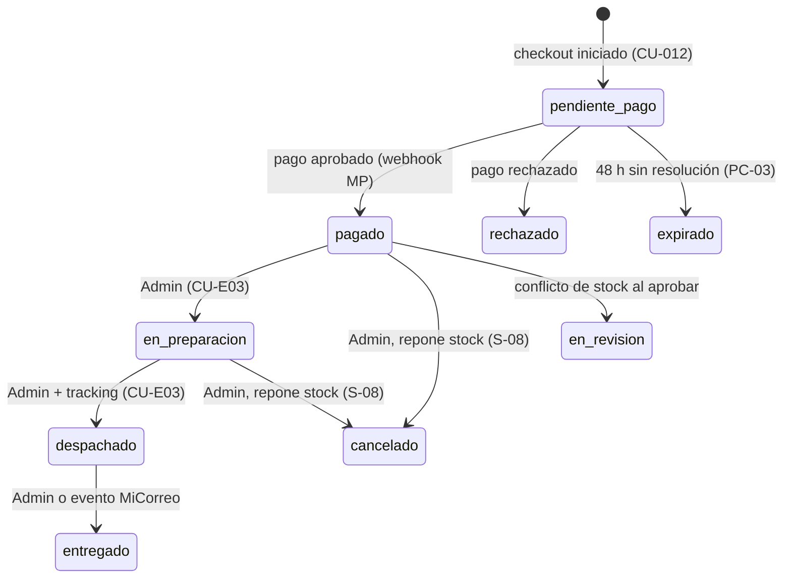

# 1.1-B · Casos de Uso — Carrito, Checkout y Pedidos

| Campo | Valor |
|---|---|
| **Artefacto** | 1.1 Casos de uso detallados · Tanda 1/3 · Módulo B |
| **Versión** | 0.1.0 · **Fecha:** 2026-07-04 · **Estado:** 🟡 Borrador |
| **Cobertura** | CU-010..013 (matriz) + CU-E03 (extendido) |
| **Criticidad** | **Flujo crítico del sistema.** CU-012 será la vitrina L3 (artefacto 3.2) |
| **Integraciones** | Mercado Pago (sandbox) · MiCorreo (test) · ARCA (homologación) — siempre vía puertos |

**Parámetros ratificables del módulo:**

| ID | Parámetro | Valor default |
|---|---|---|
| PC-01 | Timeout de cotización MiCorreo | 3 s → activa fallback a Tabla de tarifas |
| PC-02 | Vigencia de una cotización de envío | Hasta iniciar checkout; el checkout siempre recotiza |
| PC-03 | Expiración de pedido `pendiente_pago` | 48 h → estado `expirado` (job periódico) — **S-09** |
| PC-04 | Máximo de líneas por carrito | 50 líneas, 99 unidades por línea |
| PC-05 | Descuento mayorista (ejemplo de regla) | Por producto: ≥10 unidades → % configurado en CU-022 |
| PC-06 | Reintentos de emisión de comprobante | 3 intentos con backoff; si ARCA falla, emite PDF y encola reintento ARCA |

## Máquina de estados del Pedido (fuente de verdad del módulo)



**Reglas transversales de la máquina:** toda transición no dibujada es **inválida** y
responde 409; toda transición registra evento de auditoría (quién, cuándo, desde→hacia);
los estados terminales son `entregado`, `rechazado`, `expirado`, `cancelado`.

---

## CU-010 · Agregar producto con descuento mayorista

| | |
|---|---|
| **UC-ID** | UC-CHK-010 · v0.1.0 · DRAFT |
| **Actor primario** | Docente |
| **Frecuencia** | ~100/día, pico 2 RPS |

**Objetivo:** construir el carrito aplicando automáticamente las reglas de precio por
cantidad (el diferencial B2C del negocio) sin que el cliente pueda manipular precios.

**PRECONDICIONES**
- BD: producto existe, `publicado=true`, `stock > 0`.
- AUTH: sesión de Docente activa (el carrito es por cuenta, no por dispositivo).

**POSTCONDICIONES**
- BD: UPSERT línea de carrito (producto, cantidad); totales **calculados, no almacenados**.

**FLUJO PRINCIPAL**
1. Docente indica producto y cantidad.
2. Sistema valida stock disponible informativamente (autoritativo recién en CU-012).
3. Sistema recalcula el carrito **en servidor**: precio unitario vigente, regla mayorista
   aplicable (PC-05), subtotales y total.
4. Respuesta muestra el desglose: precio de lista, descuento aplicado, ahorro.

**FLUJOS ALTERNATIVOS**
- A1 — Producto ya en carrito: suma cantidades (tope PC-04) y recalcula el tramo mayorista
  (puede cruzar umbral y cambiar el precio de TODA la línea).
- A2 — Cantidad solicitada > stock: ajusta a stock disponible y lo informa.

**FLUJOS DE EXCEPCIÓN**
- E1 — Producto despublicado con carrito armado: la línea queda marcada `no_disponible`;
  no bloquea el resto del carrito; el checkout la excluye explícitamente.

**⚠️ Edge cases & reglas de negocio**
- El precio mostrado en catálogo puede cambiar antes del checkout: el carrito SIEMPRE
  recalcula con precios vigentes al momento (nunca "congela" precio — el congelamiento
  ocurre recién al crear el Pedido en CU-012).
- Regla mayorista por **producto individual**, no por total del carrito (decisión ratificable).
- Batch: no aplica (una línea por operación) — declarado.

**🤖 Directivas técnicas para la IA**
- El cliente envía SOLO (producto_id, cantidad). Precios, descuentos y totales se calculan
  server-side en cada lectura del carrito. Test: manipular el payload con precios no debe
  tener efecto alguno.

```gherkin
# language: es
Característica: Carrito con descuento mayorista

  @smoke @checkout @scenario-id:CHK-CU010-HAPPY-001
  Escenario: Cruzar el umbral mayorista reprecia toda la línea
    Dado un producto "Juego Fracciones" con precio de lista 10000 ARS
    Y una regla mayorista de 15% para 10 o más unidades de ese producto
    Y un docente con 9 unidades de ese producto en el carrito
    Cuando agrega 1 unidad más del mismo producto
    Entonces la línea debe tener 10 unidades a precio unitario 8500 ARS
    Y el desglose debe mostrar el ahorro de 15000 ARS respecto del precio de lista

  @checkout @seguridad @scenario-id:CHK-CU010-EXC-001
  Escenario: Un precio enviado por el cliente es ignorado
    Dado un producto "Juego Fracciones" con precio de lista 10000 ARS
    Cuando un docente agrega ese producto enviando en el payload un precio de 1 ARS
    Entonces la línea del carrito debe registrar el precio de servidor de 10000 ARS
```

---

## CU-011 · Calcular costo de envío

| | |
|---|---|
| **UC-ID** | UC-CHK-011 · v0.1.0 · DRAFT |
| **Actor primario** | Docente |
| **Actores secundarios** | MiCorreo API (REST, ambiente test) · Tabla de tarifas (fallback) |
| **Frecuencia** | ~60/día, pico 1 RPS |

**Objetivo:** dar un costo de envío confiable antes de pagar; primera integración externa
visible del sistema y demostración del patrón puerto/fallback.

**PRECONDICIONES**
- BD: carrito con ≥1 línea disponible; peso total calculable (`Σ peso_producto × cantidad`).
- INPUT: código postal destino + modalidad (domicilio / sucursal).

**POSTCONDICIONES**
- Ninguna mutación persistente (la cotización vive en la respuesta; PC-02).

**FLUJO PRINCIPAL**
1. Docente ingresa CP y modalidad.
2. Sistema invoca el puerto `ShippingProvider.cotizar(peso, cp, modalidad)`.
3. Adaptador MiCorreo responde dentro de PC-01 → se muestra tarifa con origen `micorreo`.

**FLUJOS ALTERNATIVOS**
- A1 — **Fallback**: timeout PC-01, error 5xx o credenciales inválidas → el puerto conmuta
  a `TarifaLocalAdapter` (peso × zona por CP) y responde con origen `tabla_local`. El
  docente ve la tarifa normalmente; el origen queda en telemetría interna.

**FLUJOS DE EXCEPCIÓN**
- E1 — CP inválido/no cubierto: 422 con mensaje accionable; sin cotización.

**⚠️ Edge cases & reglas de negocio**
- Producto sin peso cargado: el carrito lo permite pero la cotización responde E1 con
  detalle interno "peso faltante" y alerta al Admin (hueco de datos de catálogo).
- La tarifa de la demo debe ser **determinista**: en ambiente demo el adaptador MiCorreo
  puede fijarse por configuración a la tabla local (flag).
- Batch: no aplica — declarado.

**🤖 Directivas técnicas para la IA**
- Circuit breaker simple en el adaptador MiCorreo: 3 fallos consecutivos → abierto 60 s
  (va directo a fallback, sin esperar timeout). Registrar métrica de conmutaciones.

```gherkin
# language: es
Característica: Cotización de envío con fallback

  @smoke @checkout @integracion @scenario-id:CHK-CU011-HAPPY-001
  Escenario: Cotización exitosa vía MiCorreo
    Dado un carrito con peso total de 2.5 kg
    Y el adaptador MiCorreo responde en menos de 3 segundos
    Cuando el docente cotiza envío a domicilio al CP "1900"
    Entonces debe recibir un costo de envío mayor a 0
    Y la cotización debe registrar origen "micorreo"

  @checkout @resiliencia @scenario-id:CHK-CU011-ALT-001
  Escenario: Caída de MiCorreo conmuta a tabla local sin error visible
    Dado un carrito con peso total de 2.5 kg
    Y el adaptador MiCorreo no responde dentro del timeout configurado
    Cuando el docente cotiza envío a domicilio al CP "1900"
    Entonces debe recibir un costo de envío calculado por la tabla local
    Y la respuesta al docente no debe contener ningún error
    Y la telemetría debe registrar una conmutación a fallback
```

---

## CU-012 · Finalizar compra (Mercado Pago) — ★ flujo crítico

| | |
|---|---|
| **UC-ID** | UC-CHK-012 · v0.1.0 · DRAFT |
| **Actor primario** | Docente (verificado — PA-06) |
| **Actores secundarios** | Mercado Pago (sandbox, redirect + webhook) · `ReceiptProvider` · Servicio de email |
| **Frecuencia** | ~30/día, pico 0,5 RPS |

**Objetivo:** convertir el carrito en un Pedido pagado exactamente una vez, con stock
descontado exactamente una vez y comprobante emitido — el corazón transaccional del sistema.

**PRECONDICIONES**
- AUTH: sesión de Docente en estado `verificada`.
- BD: carrito ≥1 línea disponible; para cada línea `stock ≥ cantidad`.
- INPUT: domicilio de entrega confirmado + cotización de envío recalculada (PC-02).
- INFRA: adaptador MP operativo (sin fallback: si MP sandbox está caído, el checkout
  informa indisponibilidad temporal — decisión: no hay pago alternativo en v1).

**POSTCONDICIONES (garantizadas al completar el flujo feliz)**
- BD: Pedido con **snapshot inmutable** (líneas, precios congelados, domicilio, envío) en
  estado `pagado`; stock decrementado; carrito vaciado.
- EVENTOS: `PedidoCreado`, `PagoAprobado`, `StockDescontado`, `ComprobanteEmitido`.
- EFECTOS: email de confirmación con comprobante adjunto (at-least-once).

**FLUJO PRINCIPAL**
1. Docente confirma domicilio; sistema recotiza envío (CU-011).
2. Sistema valida stock y precios vigentes, crea Pedido `pendiente_pago` con snapshot y
   una **clave de idempotencia propia** (pedido_id).
3. Sistema crea la preferencia de pago en MP (sandbox) referenciando pedido_id y
   redirige al docente al checkout de MP.
4. MP notifica el resultado vía **webhook** (y el docente vuelve por back_url).
5. Webhook `aprobado`: en una transacción — pedido → `pagado`, stock decrementado por
   línea, carrito vaciado.
6. Sistema emite comprobante vía `ReceiptProvider` (PDF siempre; ARCA homologación si el
   adaptador está activo — PC-06) y encola el email.

**FLUJOS ALTERNATIVOS**
- A1 — Pago `rechazado`: pedido → `rechazado`; stock intacto; **carrito se conserva**;
  docente ve el motivo y puede reintentar (nuevo pedido).
- A2 — Pago `pendiente` (medios offline del sandbox): pedido queda `pendiente_pago`
  hasta webhook definitivo o expiración PC-03.
- A3 — Docente abandona en MP: pedido `pendiente_pago` hasta expiración PC-03 (S-09);
  el stock NO está reservado durante `pendiente_pago` (decisión ratificable: sin reservas
  en v1; el control autoritativo es al aprobar).

**FLUJOS DE EXCEPCIÓN**
- E1 — **Webhook duplicado** (MP reintenta): la segunda notificación con el mismo
  payment_id no produce ningún efecto adicional (ver checklist de lote).
- E2 — **Conflicto de stock al aprobar** (otro pedido consumió el stock durante el pago):
  el pedido pasa a `en_revision` + alerta al Admin; NO se descuenta stock parcial; el
  Admin resuelve manualmente (cancela y se comunica). Sin reembolso automático en v1 (S-08).
- E3 — Falla la emisión del comprobante: el pedido queda `pagado` igualmente (el pago es
  el hecho jurídico); el comprobante se reintenta (PC-06) y el email sale al lograrlo.

**⚠️ Edge cases & reglas de negocio — checklist de lote (no omitible)**
```
CARDINALIDAD:  el Pedido itera sobre N líneas al descontar stock.
               0 líneas → imposible (precondición carrito ≥1).
               1 línea  → caso trivial de la misma transacción.
               N líneas → TODAS dentro de una única transacción de BD.
IDEMPOTENCIA:  DOS claves distintas y explícitas:
               (a) por PEDIDO: pedido_id referencia externa en MP; un carrito → un intento
                   de pago activo a la vez (constraint: no más de un pedido pendiente_pago
                   por carrito-origen).
               (b) por NOTIFICACIÓN: payment_id de MP con UNIQUE constraint en la tabla de
                   pagos procesados; la key del webhook NO es la key del pedido (una orden
                   puede recibir varios payment_id si el docente reintenta el pago).
FALLO PARCIAL: descuento de stock multi-línea = ROLLBACK TOTAL. Si la línea 3 de 3 no
               tiene stock, ninguna línea se descuenta y aplica E2. Prohibido el estado
               "pedido pagado con stock parcialmente descontado".
```
- Verificación de firma/origen del webhook (secreto de MP sandbox) antes de procesar.
- Los montos se validan contra el snapshot: si MP informa un monto distinto al del pedido,
  el pago se marca `en_revision` (nunca se aprueba en silencio).

**🤖 Directivas técnicas para la IA**
- Transacción del paso 5 con `UPDATE stock SET cantidad = cantidad - :n WHERE producto_id
  = :id AND cantidad >= :n` verificando filas afectadas (optimistic decrement); si alguna
  línea afecta 0 filas → rollback → E2.
- El test de idempotencia del webhook debe ejecutarse contra **BD real con el UNIQUE
  constraint activo** (mockear el repositorio invalida el test — regla de la metodología).
- Módulo pre-asignado a **modelo alto (Opus/Fable)** en el plan 5.2.

```gherkin
# language: es
Característica: Finalización de compra con Mercado Pago
  Regla: el pago se acredita exactamente una vez y el stock se descuenta exactamente una vez

  @smoke @checkout @criticidad-critica @scenario-id:CHK-CU012-HAPPY-001
  Escenario: Pago aprobado crea pedido pagado con stock descontado y comprobante
    Dado un docente verificado con un carrito de 2 líneas con stock suficiente
    Y una cotización de envío vigente al CP "1900"
    Cuando completa el checkout y el webhook de MP notifica "aprobado" para su pago
    Entonces el pedido debe quedar en estado "pagado" con snapshot de precios y domicilio
    Y el stock de cada producto debe haberse decrementado exactamente en la cantidad comprada
    Y el carrito debe quedar vacío
    Y debe emitirse un comprobante y encolarse el email de confirmación

  @checkout @criticidad-critica @idempotencia @scenario-id:CHK-CU012-EXC-001
  Escenario: Webhook duplicado no descuenta stock dos veces
    Dado un pedido en estado "pagado" cuyo pago "pay_123" ya fue procesado
    Y el stock del producto quedó en 8 unidades tras ese pago
    Cuando el webhook de MP vuelve a notificar "aprobado" para el mismo pago "pay_123"
    Entonces la respuesta al webhook debe ser exitosa (MP no debe reintentar)
    Y el stock del producto debe permanecer en 8 unidades
    Y no debe emitirse un segundo comprobante ni un segundo email

  @checkout @criticidad-critica @scenario-id:CHK-CU012-EXC-002
  Escenario: Conflicto de stock al aprobar deja el pedido en revisión sin descuento parcial
    Dado un pedido "pendiente_pago" con 2 líneas: producto A (cantidad 1) y producto B (cantidad 3)
    Y el stock actual de B es 2 unidades por una venta concurrente
    Cuando el webhook de MP notifica "aprobado" para ese pedido
    Entonces el pedido debe quedar en estado "en_revision"
    Y el stock de A y de B debe permanecer sin cambios
    Y debe generarse una alerta para el Admin

  @checkout @scenario-id:CHK-CU012-ALT-001
  Escenario: Pago rechazado conserva el carrito
    Dado un docente verificado con un carrito de 1 línea
    Cuando completa el checkout y el webhook de MP notifica "rechazado"
    Entonces el pedido debe quedar en estado "rechazado"
    Y el stock debe permanecer sin cambios
    Y el carrito debe conservar su línea para reintentar
```

---

## CU-013 · Seguir pedido logístico

| | |
|---|---|
| **UC-ID** | UC-CHK-013 · v0.1.0 · DRAFT · **Actor:** Docente |

**Objetivo:** visibilidad del pedido pagado hasta la entrega, combinando estados internos
(máquina de estados) y eventos de tracking externos (MiCorreo) o manuales.

**PRE:** sesión activa; pedido propio en estado ≥ `pagado`.
**POST:** ninguna mutación (lectura); consulta a MiCorreo cacheada 15 min.

**FLUJO:** línea de tiempo unificada: transiciones internas (con fecha/hora) + eventos del
tracking si `numero_tracking` existe (origen MiCorreo o carga manual del Admin).
**ALTERNATIVO A1:** sin tracking aún (pedido `pagado`/`en_preparacion`) → muestra estado
interno y leyenda "te avisaremos al despachar". **EXCEPCIÓN E1:** MiCorreo caído → muestra
timeline interna + último tracking cacheado con marca temporal (degradación visible pero
útil).

**⚠️ Edge cases:** mismo control IDOR que CU-005 (pedido ajeno → 404). Batch: no aplica —
declarado. **Directiva IA:** el tracking externo jamás modifica el estado interno salvo el
evento "entregado" de MiCorreo, que dispara la transición `despachado → entregado`
(idempotente).

```gherkin
# language: es
Característica: Seguimiento de pedido

  @checkout @resiliencia @scenario-id:CHK-CU013-EXC-001
  Escenario: Caída de MiCorreo degrada a timeline interna con caché
    Dado un pedido propio "despachado" con tracking y eventos cacheados hace 10 minutos
    Y el adaptador MiCorreo no responde
    Cuando el docente consulta el seguimiento
    Entonces debe ver la línea de tiempo de estados internos completa
    Y los eventos de tracking cacheados con su marca temporal de actualización
    Y ningún error bloqueante
```

---

## CU-E03 · Gestionar ciclo de vida del pedido (Admin)

| | |
|---|---|
| **UC-ID** | UC-PED-E03 · v0.1.0 · DRAFT |
| **Actor primario** | Admin Acalud (MFA activo — S-06) |
| **Frecuencia** | ~30 transiciones/día |

**Objetivo:** operar los pedidos pagados hasta la entrega — el hueco operativo detectado
en la matriz original; sin esto, CU-013 no tiene datos que mostrar.

**PRECONDICIONES:** sesión Admin con MFA; pedido en estado no terminal.
**POSTCONDICIONES:** transición válida aplicada + evento de auditoría (admin_id,
desde→hacia, timestamp, nota opcional).

**FLUJO PRINCIPAL:** listado operable de pedidos filtrable por estado → detalle →
acciones según la máquina de estados: `pagado → en_preparacion`; `en_preparacion →
despachado` (exige `numero_tracking`: manual o importado de MiCorreo); `despachado →
entregado` (manual o por evento MiCorreo).

**FLUJOS ALTERNATIVOS**
- A1 — **Cancelación** (`pagado` o `en_preparacion` → `cancelado`): repone stock de todas
  las líneas (transacción única, espejo del descuento) + email al docente. **Sin
  reembolso automático en v1** — pagos sandbox; queda registrado como limitación declarada (**S-08**).
- A2 — Resolución de `en_revision`: el Admin cancela (repone nada — el stock nunca se
  descontó) o fuerza a `pagado` si el conflicto se resolvió (re-ejecuta el descuento con
  las mismas garantías de CU-012).

**FLUJOS DE EXCEPCIÓN**
- E1 — Transición inválida (p. ej. `entregado → en_preparacion`): 409 + sin efectos.
- E2 — Despacho sin tracking: 422 "tracking requerido".

**⚠️ Edge cases & reglas de negocio — checklist de lote (reposición multi-línea)**
```
CARDINALIDAD:  reposición itera N líneas del pedido: 1..N → una única transacción.
IDEMPOTENCIA:  por PEDIDO: la cancelación de un pedido ya cancelado responde 409 y no
               repone stock dos veces (la transición inválida es la guarda).
FALLO PARCIAL: reposición multi-línea = ROLLBACK TOTAL (espejo exacto del descuento).
```

**🤖 Directivas IA:** las transiciones se implementan como comandos explícitos de la
máquina de estados (no updates directos de columna); cada comando valida el estado origen
dentro de la transacción (`WHERE estado = :origen`). Módulo pre-asignado a modelo alto.

```gherkin
# language: es
Característica: Ciclo de vida del pedido (backoffice)

  @admin @pedidos @scenario-id:PED-CUE03-HAPPY-001
  Escenario: Despacho con tracking habilita el seguimiento del docente
    Dado un pedido en estado "en_preparacion" de un docente
    Y una sesión de Admin con MFA verificado
    Cuando el Admin lo transiciona a "despachado" cargando el tracking "CA123456789AR"
    Entonces el pedido debe quedar "despachado" con ese tracking
    Y debe registrarse el evento de auditoría con el identificador del Admin
    Y el docente debe ver el tracking en su seguimiento

  @admin @pedidos @criticidad-alta @scenario-id:PED-CUE03-ALT-001
  Escenario: Cancelación repone stock exactamente una vez
    Dado un pedido "pagado" con 2 líneas que descontaron 1 y 3 unidades de stock
    Cuando el Admin lo cancela con una nota
    Entonces el pedido debe quedar "cancelado"
    Y el stock de cada producto debe haberse repuesto exactamente en 1 y 3 unidades
    Y un segundo intento de cancelación debe responder 409 sin reponer stock nuevamente

  @admin @pedidos @scenario-id:PED-CUE03-EXC-001
  Escenario: Transición inválida es rechazada sin efectos
    Dado un pedido en estado "entregado"
    Cuando el Admin intenta transicionarlo a "en_preparacion"
    Entonces la respuesta debe tener status 409
    Y el pedido debe permanecer "entregado" sin nuevos eventos de auditoría
```

---

## Supuestos nuevos surgidos en esta tanda (a incorporar en 0.1 §10)

| ID | Supuesto | Origen |
|---|---|---|
| S-08 | Cancelación repone stock y notifica; **reembolso automático fuera de alcance v1** (pagos sandbox). | CU-E03 A1 |
| S-09 | Pedidos `pendiente_pago` expiran a las 48 h por job periódico. | CU-012 A3 / PC-03 |
| S-10 | **Sin reserva de stock** durante `pendiente_pago`; el control autoritativo ocurre al aprobar (E2 cubre el conflicto). | CU-012 A3 |

## Registro de cambios

| Versión | Fecha | Cambio | Autor |
|---|---|---|---|
| 0.1.0 | 2026-07-04 | 5 CU del flujo crítico; máquina de estados; parámetros PC-01..06; S-08..10 | Arquitecto (Claude) |
