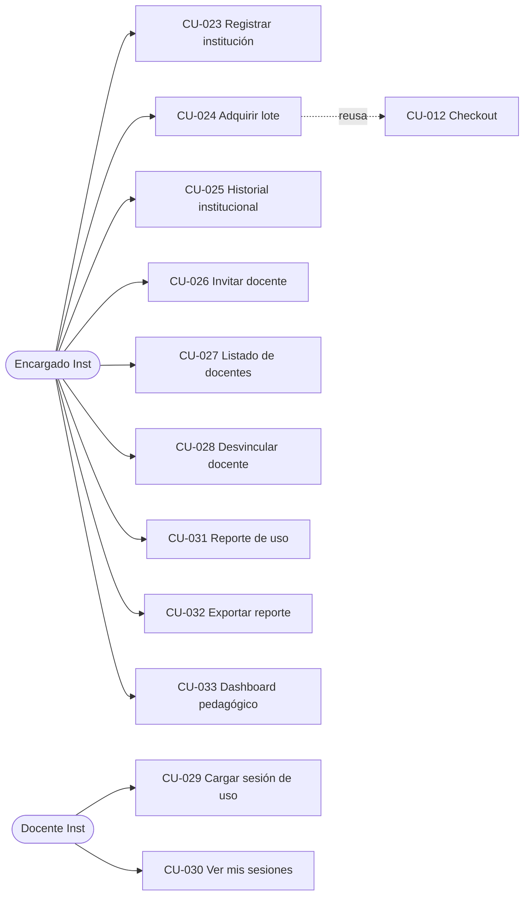
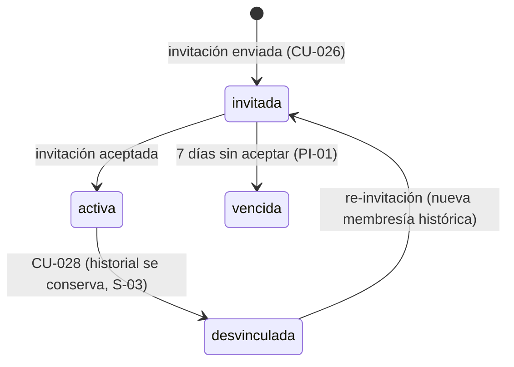

# 1.1-C · Casos de Uso — Instituciones

| Campo | Valor |
|---|---|
| **Artefacto** | 1.1 Casos de uso detallados · Tanda 2/3 · Módulo C |
| **Versión** | 0.1.0 · **Fecha:** 2026-07-04 · **Estado:** 🟡 Borrador |
| **Cobertura** | CU-023..033 (matriz completa del módulo) |
| **Dependencias** | S-01/S-02/S-03 (identidad y membresías) · Máquina de estados del Pedido (1.1-B) |

**Modelo de autorización del módulo (extiende S-01):** una **Membresía** vincula una
cuenta de persona con una Institución y porta un **rol**: `encargado` o `docente`. La misma
cuenta puede ser encargada de una institución y docente de otra (S-02). Toda operación de
este módulo ocurre dentro de un **contexto institucional explícito** (selector cuando hay
más de una membresía activa).

**Parámetros ratificables del módulo:**

| ID | Parámetro | Valor default |
|---|---|---|
| PI-01 | Vigencia de invitación | 7 días, un solo uso, reenvío máx. 3/día |
| PI-02 | Ventana de edición/borrado de una sesión propia | 48 h desde la carga — **S-14** |
| PI-03 | Carga retroactiva de sesiones | Fecha no futura, hasta 90 días hacia atrás |
| PI-04 | Tope de exportación | 5 000 filas por export; si excede, exige acotar filtros |
| PI-05 | Rangos de una sesión | Alumnos 1..100 · Duración 5..240 min |

## Diagrama de casos de uso del módulo (actores integrados)



## Máquina de estados de la Membresía



---

## CU-023 · Registrar institución educativa

| | |
|---|---|
| **UC-ID** | UC-INS-023 · v0.1.0 · DRAFT |
| **Actor primario** | Persona con cuenta (deviene Encargado) |
| **Frecuencia** | ~2/semana |

**Objetivo:** dar de alta el sujeto B2B del sistema y su primer encargado; abre el canal
institucional completo (lotes, membresías, métricas).

**PRECONDICIONES**
- AUTH: sesión de cuenta `verificada` (una institución la registra una persona real del sistema).
- BD: no existe institución activa con el mismo CUIT (`SELECT count(*) FROM instituciones
  WHERE cuit = :cuit AND estado != 'suspendida'` → 0).

**POSTCONDICIONES**
- BD: INSERT institución (razón social, CUIT ficticio válido en formato, nivel educativo,
  domicilio, estado=`activa`) + INSERT membresía (cuenta, institución, rol=`encargado`,
  estado=`activa`).
- EVENTOS: `InstitucionRegistrada`.

**FLUJO PRINCIPAL**
1. La persona completa los datos de la institución.
2. Sistema valida formato de CUIT (dígito verificador) y unicidad.
3. Sistema crea la institución activa y la membresía de encargado en una transacción.
4. Redirige al panel institucional vacío (onboarding: invitar docentes, comprar lote).

**FLUJOS DE EXCEPCIÓN**
- E1 — CUIT duplicado: 409 con mensaje "la institución ya existe; contactá a su encargado
  o al soporte" (no revela quién es el encargado).

**⚠️ Edge cases & reglas de negocio**
- **Sin flujo de aprobación previa en v1** (**S-11**): la institución nace activa; el Admin
  puede suspenderla desde el backoffice (la suspensión congela compras y cargas de sesión,
  no borra datos).
- Una persona puede ser encargada de más de una institución (S-02 aplica también al rol).
- Batch: no aplica — declarado.

**🤖 Directivas técnicas para la IA**
- Validador de CUIT con dígito verificador real (los datos son ficticios pero válidos en
  formato — R-04 "se diseña como si fuera real").

```gherkin
# language: es
Característica: Registro de institución educativa

  @smoke @instituciones @scenario-id:INS-CU023-HAPPY-001
  Escenario: El registro crea la institución y la membresía de encargado atómicamente
    Dado una cuenta verificada "directora@sanmartin.edu.ar" sin membresías
    Cuando registra la institución "Escuela San Martín" con CUIT válido "30-71234567-8"
    Entonces debe existir la institución "Escuela San Martín" en estado "activa"
    Y la cuenta debe tener una membresía "activa" con rol "encargado" en esa institución
    Y debe registrarse el evento "InstitucionRegistrada"
```

---

## CU-024 · Adquirir lote de juegos físicos — ★ reusa CU-012

| | |
|---|---|
| **UC-ID** | UC-INS-024 · v0.1.0 · DRAFT |
| **Actor primario** | Encargado Inst |
| **Actores secundarios** | Los mismos de CU-012 (MP sandbox, MiCorreo, ReceiptProvider) |
| **Frecuencia** | ~5/mes, tickets grandes |

**Objetivo:** compra B2B en cantidad. **Por regla anti-duplicación, este CU se especifica
como especialización de CU-012**: hereda íntegros su flujo, su máquina de estados, sus
excepciones y su checklist de lote. Abajo, solo los **deltas**.

**DELTAS respecto de CU-012**
1. **Contexto de compra:** el Encargado opera "en nombre de" la institución (selector de
   contexto). El Pedido registra `comprador_tipo = institucion` + `institucion_id`, además
   de la cuenta que lo ejecutó (auditoría de quién compró).
2. **Autorización:** membresía `activa` con rol `encargado` en la institución del contexto.
3. **Domicilio de entrega:** el de la institución por defecto (editable por pedido; snapshot
   igual que CU-012).
4. **Descuento mayorista:** mismas reglas PC-05 — los volúmenes institucionales los cruzan
   naturalmente.
5. **Efecto adicional al aprobar el pago:** los juegos del lote entran al **catálogo
   institucional** (la lista de juegos sobre los que se pueden cargar sesiones — S-13).
6. **Visibilidad:** el pedido aparece en CU-025 (historial institucional), NO en el CU-005
   personal de la cuenta del encargado.

**⚠️ Checklist de lote:** heredado íntegro de CU-012 (cardinalidad N líneas en una
transacción; idempotencia por pedido y por payment_id; fallo parcial = rollback total).
Delta: el alta al catálogo institucional (punto 5) ocurre **en la misma transacción** que
el descuento de stock — un lote pagado sin catálogo habilitado es un estado prohibido.

**🤖 Directivas IA:** implementar como el mismo comando de checkout con una estrategia de
contexto (personal | institucional); prohibido duplicar el flujo. Módulo pre-asignado a
modelo alto (comparte criticidad con CU-012).

```gherkin
# language: es
Característica: Compra institucional de lote

  @smoke @instituciones @criticidad-critica @scenario-id:INS-CU024-HAPPY-001
  Escenario: El lote pagado habilita el catálogo institucional en la misma transacción
    Dado una encargada con contexto en "Escuela San Martín"
    Y un carrito institucional con 15 unidades de "Juego Fracciones"
    Cuando completa el checkout y el webhook de MP notifica "aprobado"
    Entonces el pedido debe quedar "pagado" con comprador tipo "institucion"
    Y el stock debe decrementarse en 15 unidades exactamente una vez
    Y "Juego Fracciones" debe figurar en el catálogo institucional de "Escuela San Martín"
    Y el pedido debe aparecer en el historial institucional y no en el personal

  @instituciones @seguridad @scenario-id:INS-CU024-EXC-001
  Escenario: Un docente sin rol de encargado no puede comprar en nombre de la institución
    Dado un docente con membresía "activa" rol "docente" en "Escuela San Martín"
    Cuando intenta iniciar un checkout en contexto institucional
    Entonces la respuesta debe tener status 403
    Y no debe crearse ningún pedido institucional
```

---

## CU-025 · Ver historial de compras institucionales

| | |
|---|---|
| **UC-ID** | UC-INS-025 · v0.1.0 · DRAFT · **Actor:** Encargado Inst |

**Objetivo:** espejo institucional de CU-005: pedidos de la institución, sus estados,
comprobantes y quién los ejecutó. **PRE:** membresía activa rol `encargado` en el contexto.
**POST:** lectura. **FLUJO:** listado paginado (20/página) filtrable por estado y rango de
fechas; cada pedido con acceso a comprobante y seguimiento. **Edge cases:** un encargado de
dos instituciones ve SOLO la del contexto activo (query siempre acotado por
`institucion_id` del contexto + verificación de membresía); IDOR test igual que CU-005.
Batch: no aplica — declarado.

```gherkin
# language: es
Característica: Historial institucional

  @instituciones @seguridad @scenario-id:INS-CU025-EXC-001
  Escenario: El historial no cruza instituciones para un encargado múltiple
    Dado una cuenta encargada de "Escuela San Martín" y de "Instituto Belgrano"
    Y un pedido pagado perteneciente a "Instituto Belgrano"
    Cuando consulta el historial con contexto activo en "Escuela San Martín"
    Entonces el pedido de "Instituto Belgrano" no debe aparecer en la respuesta
```

---

## CU-026 · Registrar/Invitar docente a la institución

| | |
|---|---|
| **UC-ID** | UC-INS-026 · v0.1.0 · DRAFT |
| **Actor primario** | Encargado Inst |
| **Actores secundarios** | Servicio de email · CU-001 (si la persona no tiene cuenta) |

**Objetivo:** poblar la institución con docentes reales con consentimiento — **solo por
invitación aceptada** (**S-12**): el encargado nunca crea cuentas ni contraseñas ajenas.

**PRECONDICIONES**
- AUTH: rol `encargado` del contexto. BD: no existe membresía `activa` ni `invitada`
  vigente para (email, institución).

**POSTCONDICIONES**
- BD: membresía `invitada` (email destino, token PI-01) + email encolado.
- EVENTOS: `DocenteInvitado`.

**FLUJO PRINCIPAL**
1. Encargado ingresa el email del docente.
2. Sistema crea la membresía `invitada` y envía el email con enlace de aceptación.
3. La persona abre el enlace: **si tiene cuenta**, confirma con sesión iniciada; **si no
   tiene**, completa CU-001 (y CU-E02) y al verificar acepta la invitación.
4. Membresía → `activa` rol `docente`; ambos (docente y encargado) ven el alta.

**FLUJOS ALTERNATIVOS**
- A1 — Rechazo explícito: la persona declina; membresía → `vencida` con motivo `rechazada`.
- A2 — Reenvío: regenera token (invalida el anterior), respeta rate limit PI-01.

**FLUJOS DE EXCEPCIÓN**
- E1 — Invitación a email con membresía ya activa: 409 informativo.
- E2 — Token vencido (PI-01): mensaje único + posibilidad de pedir reenvío al encargado.

**⚠️ Edge cases & reglas de negocio**
- La invitación es a un **email**, no a una cuenta: si la persona registra la cuenta con
  otro email, la invitación no aplica (vínculo estricto email↔invitación).
- Re-invitar a un docente `desvinculado` crea una membresía NUEVA (la anterior conserva su
  historial — S-03); las sesiones históricas siguen asociadas a la membresía vieja.
- Invitaciones masivas: fuera de alcance v1 (una por operación). Batch: no aplica — declarado.

**🤖 Directivas IA:** aceptación transaccional (validar token + activar membresía + marcar
usado); el enlace de invitación con cuenta ajena logueada NO acepta en silencio: muestra a
quién está dirigida y exige cambio de cuenta.

```gherkin
# language: es
Característica: Invitación de docentes a la institución

  @smoke @instituciones @scenario-id:INS-CU026-HAPPY-001
  Escenario: Persona sin cuenta acepta la invitación al completar su registro
    Dado una invitación vigente de "Escuela San Martín" a "nuevo@profe.com" sin cuenta previa
    Cuando la persona completa el registro con ese email y verifica su cuenta desde el enlace
    Entonces debe existir una membresía "activa" rol "docente" entre esa cuenta y la institución
    Y la invitación debe quedar consumida y no reutilizable

  @instituciones @seguridad @scenario-id:INS-CU026-EXC-001
  Escenario: Una cuenta distinta a la invitada no puede aceptar la invitación
    Dado una invitación vigente dirigida a "profe-a@escuela.com"
    Y una sesión activa de la cuenta "profe-b@escuela.com"
    Cuando abre el enlace de invitación
    Entonces el sistema debe indicar a qué email está dirigida sin aceptarla
    Y no debe crearse ninguna membresía para "profe-b@escuela.com"
```

---

## CU-027 · Ver listado de docentes institucionales

| | |
|---|---|
| **UC-ID** | UC-INS-027 · v0.1.0 · DRAFT · **Actor:** Encargado Inst |

**Objetivo:** panel operativo de membresías. **FLUJO:** listado con nombre, email, estado
de membresía (`invitada`/`activa`/`desvinculada`/`vencida`), fecha de alta, sesiones
cargadas (contador), y acciones contextuales (reenviar invitación, desvincular). Filtro
por estado; búsqueda por nombre/email. **Edge cases:** los `desvinculados` se listan bajo
filtro explícito (no en la vista default) — la historia no desaparece (S-03). Batch: no
aplica — declarado.

```gherkin
# language: es
Característica: Listado de docentes de la institución

  @instituciones @scenario-id:INS-CU027-HAPPY-001
  Escenario: El listado default muestra activos e invitados con sus acciones
    Dado una institución con 2 membresías activas, 1 invitada y 1 desvinculada
    Cuando la encargada consulta el listado de docentes
    Entonces debe ver 3 filas con su estado correspondiente
    Y la fila desvinculada solo debe aparecer al aplicar el filtro "desvinculados"
```

---

## CU-028 · Desvincular docente de la institución

| | |
|---|---|
| **UC-ID** | UC-INS-028 · v0.1.0 · DRAFT · **Actor:** Encargado Inst |

**Objetivo:** dar de baja el vínculo preservando la integridad histórica (S-03).
**PRE:** membresía `activa` rol `docente` en el contexto. **POST:** membresía →
`desvinculada` (fecha, quién); las sesiones históricas permanecen; el docente pierde el
contexto institucional (no más cargas ni lecturas de esa institución). Evento
`DocenteDesvinculado` + email informativo al docente.

**⚠️ Edge cases:** el encargado no puede desvincularse **a sí mismo** si es el único
encargado (la institución quedaría acéfala) → 409 "designá otro encargado primero"
(promoción de rol: fuera de alcance v1, se documenta como limitación — **S-15**: gestión
de múltiples encargados/promoción queda para v2; en v1 el encargado fundador es único y
fijo). Idempotencia: desvincular a un ya desvinculado → 409. Batch: no aplica — declarado.

```gherkin
# language: es
Característica: Desvinculación de docente

  @instituciones @scenario-id:INS-CU028-HAPPY-001
  Escenario: La desvinculación conserva las sesiones históricas
    Dado un docente con membresía activa y 12 sesiones cargadas en "Escuela San Martín"
    Cuando la encargada lo desvincula
    Entonces la membresía debe quedar "desvinculada"
    Y las 12 sesiones deben seguir apareciendo en los reportes institucionales
    Y el docente no debe poder cargar nuevas sesiones para esa institución
```

---

## CU-029 · Cargar estadísticas de uso de un juego físico — ★ corazón pedagógico

| | |
|---|---|
| **UC-ID** | UC-INS-029 · v0.1.0 · DRAFT |
| **Actor primario** | Docente Inst (membresía activa rol `docente`) |
| **Frecuencia** | ~40/día en horario escolar; **caso de uso mobile por excelencia** |

**Objetivo:** registrar el uso real de un juego en el aula — el dato que diferencia a
Acalud de una tienda; alimenta CU-030/031/032/033.

**PRECONDICIONES**
- AUTH: membresía `activa` rol `docente` en el contexto institucional elegido.
- BD: el juego pertenece al **catálogo institucional** (adquirido vía CU-024 — **S-13**).

**POSTCONDICIONES**
- BD: INSERT sesión (institución, membresía, juego, fecha, curso/grado, cantidad_alumnos,
  duración_min, observaciones opcionales). EVENTOS: `SesionDeUsoRegistrada`.

**FLUJO PRINCIPAL**
1. Docente elige institución (si tiene varias — S-02), juego (solo catálogo institucional),
   fecha (PI-03), curso/grado, alumnos y duración (PI-05), observaciones.
2. Sistema valida rangos y pertenencia del juego al catálogo institucional.
3. Registra la sesión y confirma con acceso directo a "cargar otra" (uso en ráfaga en el aula).

**FLUJOS ALTERNATIVOS**
- A1 — Edición/borrado propio dentro de PI-02 (48 h): permitido con auditoría; después,
  inmutable (**S-14**) — la integridad de reportes vale más que la corrección tardía.

**FLUJOS DE EXCEPCIÓN**
- E1 — Juego fuera del catálogo institucional: 422 "este juego no está habilitado para tu
  institución" (lista los habilitados).
- E2 — Fecha futura o > 90 días atrás: 422 con el rango permitido.

**⚠️ Edge cases & reglas de negocio**
- La sesión pertenece a la **membresía** (no solo a la cuenta): si el docente está en dos
  instituciones, cada sesión queda inequívocamente en una (el contexto es parte del dato).
- Doble carga accidental (mismo juego, misma fecha, mismo curso, misma duración, < 2 min
  entre envíos): advertencia de posible duplicado con confirmación explícita — no bloqueo
  duro (dos sesiones reales idénticas son legítimas).
- Batch: no aplica (una sesión por operación; carga masiva fuera de alcance v1) — declarado.

**🤖 Directivas IA:** formulario mobile-first (esta pantalla se usa con el teléfono en el
aula — decisión de UX registrada); validaciones espejo cliente/servidor, autoritativas en
servidor.

```gherkin
# language: es
Característica: Carga de sesión de uso pedagógico

  @smoke @instituciones @scenario-id:INS-CU029-HAPPY-001
  Escenario: Carga válida sobre un juego del catálogo institucional
    Dado una docente con membresía activa en "Escuela San Martín"
    Y "Juego Fracciones" pertenece al catálogo institucional por un lote pagado
    Cuando carga una sesión de ayer, curso "4°B", 28 alumnos, 45 minutos
    Entonces la sesión debe quedar registrada asociada a su membresía y a la institución
    Y debe registrarse el evento "SesionDeUsoRegistrada"

  @instituciones @scenario-id:INS-CU029-EXC-001
  Escenario: Juego no adquirido por la institución es rechazado
    Dado una docente con membresía activa en "Escuela San Martín"
    Y "Juego Geometría" no figura en el catálogo institucional
    Cuando intenta cargar una sesión sobre "Juego Geometría"
    Entonces la respuesta debe tener status 422
    Y no debe registrarse ninguna sesión

  @instituciones @scenario-id:INS-CU029-ALT-001
  Escenario: La sesión es inmutable pasada la ventana de edición
    Dado una sesión propia cargada hace 49 horas
    Cuando la docente intenta editar la cantidad de alumnos
    Entonces la respuesta debe tener status 409
    Y la sesión debe permanecer sin cambios
```

---

## CU-030 · Ver mis sesiones cargadas

| | |
|---|---|
| **UC-ID** | UC-INS-030 · v0.1.0 · DRAFT · **Actor:** Docente Inst |

**Objetivo:** autoconsulta y corrección temprana (PI-02). **FLUJO:** listado paginado de
sesiones **propias** del contexto institucional activo, con filtros por juego y rango de
fechas; indica cuáles siguen editables (ventana PI-02). **Edge cases:** sesiones de
membresías desvinculadas: visibles en modo lectura bajo un selector "instituciones
anteriores" (son SUS datos aportados — transparencia). Batch: no aplica — declarado.

```gherkin
# language: es
Característica: Mis sesiones cargadas

  @instituciones @scenario-id:INS-CU030-HAPPY-001
  Escenario: El listado separa lo editable de lo inmutable
    Dado una docente con una sesión cargada hace 2 horas y otra hace 3 días
    Cuando consulta sus sesiones
    Entonces la primera debe indicarse como editable y la segunda como inmutable
```

---

## CU-031 · Ver reporte de uso institucional (por juego/docente)

| | |
|---|---|
| **UC-ID** | UC-INS-031 · v0.1.0 · DRAFT · **Actor:** Encargado Inst |

**Objetivo:** la contracara analítica de CU-029: qué juegos se usan, cuánto y por quién.
**PRE:** rol `encargado` del contexto. **FLUJO:** reporte tabular con dos cortes
conmutables — **por juego** (sesiones, docentes distintos, alumnos alcanzados como Σ,
minutos totales, última sesión) y **por docente** (sesiones, juegos distintos, alumnos,
minutos) — con filtros por rango de fechas y juego/docente específico. Las sesiones de
membresías desvinculadas cuentan (S-03), señalizadas.

**⚠️ Edge cases:** "alumnos alcanzados" es Σ de `cantidad_alumnos` (con nota metodológica:
puede contar al mismo alumno en varias sesiones — es una métrica de exposición, no de
individuos únicos; el sistema no registra identidad de alumnos, **decisión de privacidad
deliberada**). Institución sin sesiones → estado vacío con CTA a invitar docentes. Batch:
no aplica (lectura agregada) — declarado. **Directiva IA:** agregaciones por query
(GROUP BY), sin tablas de resumen precalculadas en v1 (la escala no lo exige — ver NFR 1.2).

```gherkin
# language: es
Característica: Reporte de uso institucional

  @instituciones @scenario-id:INS-CU031-HAPPY-001
  Escenario: El corte por juego agrega sesiones de docentes activos y desvinculados
    Dado "Juego Fracciones" con 10 sesiones de una docente activa y 5 de un docente desvinculado
    Cuando la encargada consulta el reporte por juego sin filtros
    Entonces "Juego Fracciones" debe mostrar 15 sesiones y 2 docentes distintos
```

---

## CU-032 · Exportar reporte (PDF/Excel)

| | |
|---|---|
| **UC-ID** | UC-INS-032 · v0.1.0 · DRAFT · **Actor:** Encargado Inst |

**Objetivo:** llevar el reporte CU-031 a los formatos que circulan en una escuela.
**PRE:** las de CU-031. **FLUJO:** con los filtros vigentes, genera **XLSX** (datos
tabulares + hoja de metadatos: institución, filtros, fecha de generación, total de filas)
o **PDF** (presentación con encabezado institucional). Generación **síncrona** con tope
PI-04; si excede, 422 "acotá los filtros".

**⚠️ Edge cases & checklist de lote (aplica: itera N filas)**
```
CARDINALIDAD:  0 filas → archivo VÁLIDO con encabezados y metadatos "0 resultados"
               (un export vacío es información, no error). 1..N → normal hasta PI-04.
IDEMPOTENCIA:  operación de solo lectura; regenerar produce un archivo nuevo con nueva
               marca temporal — sin efectos colaterales que proteger.
FALLO PARCIAL: la generación es atómica: el archivo se entrega completo o falla con 500;
               prohibido servir un XLSX truncado (generar a archivo temporal y entregar
               al completar).
```
**Directiva IA:** el nombre del archivo incluye institución + rango + timestamp
(`sanmartin_uso_2026-06-01_2026-06-30_20260704T1030.xlsx`).

```gherkin
# language: es
Característica: Exportación de reportes

  @instituciones @scenario-id:INS-CU032-ALT-001
  Escenario: Export sin resultados entrega archivo válido con metadatos
    Dado una institución sin sesiones en el rango filtrado
    Cuando la encargada exporta el reporte en XLSX
    Entonces debe recibir un archivo válido con los encabezados de columnas
    Y la hoja de metadatos debe indicar 0 resultados y los filtros aplicados
```

---

## CU-033 · Ver dashboard de métricas pedagógicas

| | |
|---|---|
| **UC-ID** | UC-INS-033 · v0.1.0 · DRAFT · **Actor:** Encargado Inst |

**Objetivo:** la síntesis visual del valor institucional; probable pantalla estrella de la
defensa. **FLUJO:** para el rango elegido (default: últimos 30 días): 4 KPI (sesiones,
docentes activos, alumnos alcanzados, minutos de juego) con variación vs. período
anterior; serie temporal de sesiones por semana; top 5 juegos por sesiones; top 5 docentes
por sesiones. **Edge cases:** misma nota metodológica de CU-031; períodos sin datos
grafican en cero (nunca gráfico vacío roto); consultas en vivo (sin precálculo, misma
directiva que CU-031). Batch: no aplica — declarado.

```gherkin
# language: es
Característica: Dashboard pedagógico

  @instituciones @scenario-id:INS-CU033-HAPPY-001
  Escenario: Los KPI reflejan el rango y su variación contra el período anterior
    Dado una institución con 20 sesiones en los últimos 30 días y 10 en los 30 previos
    Cuando la encargada abre el dashboard con el rango default
    Entonces el KPI de sesiones debe mostrar 20 con una variación de +100%
```

---

## Supuestos nuevos surgidos en esta tanda (a incorporar en 0.1 §10)

| ID | Supuesto | Origen |
|---|---|---|
| S-11 | Instituciones nacen activas sin aprobación previa; el Admin puede suspender. | CU-023 |
| S-12 | Alta de docentes **solo por invitación aceptada**; el encargado nunca crea cuentas ajenas. | CU-026 |
| S-13 | Las sesiones solo se cargan sobre juegos del **catálogo institucional** (adquiridos por lote). | CU-024/029 |
| S-14 | Sesión editable/borrable por su autor solo 48 h; luego inmutable. | CU-029 |
| S-15 | Un único encargado fijo por institución en v1 (promoción/multi-encargado → v2). | CU-028 |

## Registro de cambios

| Versión | Fecha | Cambio | Autor |
|---|---|---|---|
| 0.1.0 | 2026-07-04 | 11 CU del módulo Instituciones; membresías con rol; PI-01..05; S-11..15 | Arquitecto (Claude) |
