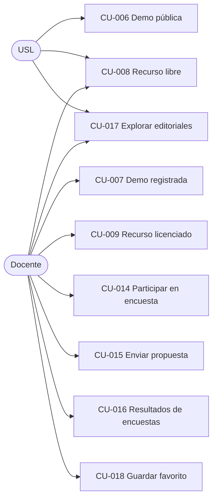

# 1.1-D · Casos de Uso — Demos, Recursos, Comunidad y Vitrina

| Campo | Valor |
|---|---|
| **Artefacto** | 1.1 Casos de uso detallados · Tanda 3/3 · Módulo D |
| **Versión** | 0.1.0 · **Fecha:** 2026-07-04 · **Estado:** 🟡 Borrador |
| **Cobertura** | CU-006..009 (Demos y Contenido) · CU-014..016 (Comunidad) · CU-017..018 (Vitrina) |

**Parámetros ratificables del módulo:**

| ID | Parámetro | Valor default |
|---|---|---|
| PD-01 | Adjunto de propuesta | PDF/JPG/PNG, máx. 10 MB, 1 archivo |
| PD-02 | Rate limit de propuestas | 3 por docente por día |
| PD-03 | Descargas de recursos | Ilimitadas para quien tiene derecho; cada descarga se registra (auditoría) |
| PD-04 | Vigencia de enlace de descarga firmado | 5 minutos, un solo uso |

## Diagrama de casos de uso (actores integrados)



---

## CU-006 / CU-007 · Probar demo de juego (pública / registrada)

| | |
|---|---|
| **UC-ID** | UC-DEM-006 / UC-DEM-007 · v0.1.0 · DRAFT |
| **Actores** | USL (006) · Docente (007) |

**Objetivo:** que el juego se pueda experimentar antes de comprarlo — el gancho comercial
del catálogo.

**Modelo (S-16):** una **Demo** es contenido digital embebido asociado a un juego
(HTML5 interactivo, PDF de muestra o video, según el juego). Cada demo declara si es
`publica` (visible sin login) o `completa` (requiere cuenta). Un juego puede tener ambas:
la pública como versión limitada, la completa para registrados.

**FLUJO (común):** desde la ficha del juego → "probar demo" → el contenido se sirve
embebido sin descarga directa del archivo fuente. **Delta CU-007:** requiere sesión; el
sistema registra la prueba (`DemoProbada`: docente, juego, timestamp) — insumo de interés
comercial para el Admin.

**EXCEPCIONES:** E1 — juego sin demo del tipo solicitado: la ficha no ofrece el botón
(estado imposible por diseño); acceso directo por URL → 404. E2 — USL intenta demo
completa: redirección a login/registro con retorno a la demo.

**⚠️ Edge cases:** demos de juegos despublicados dejan de servirse (aunque la URL haya
circulado). Batch: no aplica — declarado. **Directiva IA:** contenido de demo servido con
cabeceras que dificulten el hotlinking (Referer/token de sesión de visualización);
suficiente para el alcance, sin DRM (fuera de alcance v1).

```gherkin
# language: es
Característica: Demos de juegos

  @smoke @demos @scenario-id:DEM-CU006-HAPPY-001
  Escenario: Un visitante prueba la demo pública sin cuenta
    Dado un juego publicado "Juego Fracciones" con demo pública
    Cuando un visitante sin sesión abre la demo desde la ficha del juego
    Entonces el contenido de la demo debe servirse embebido con status 200

  @demos @scenario-id:DEM-CU007-HAPPY-001
  Escenario: La demo completa registra la prueba del docente
    Dado un docente con sesión activa y un juego con demo completa
    Cuando abre la demo completa
    Entonces el contenido debe servirse
    Y debe registrarse el evento "DemoProbada" con docente, juego y timestamp

  @demos @scenario-id:DEM-CU007-EXC-001
  Escenario: Un visitante es redirigido a login ante una demo completa
    Dado un juego con demo completa y un visitante sin sesión
    Cuando intenta acceder a la demo completa por su URL
    Entonces debe ser redirigido al inicio de sesión con retorno a la demo
```

---

## CU-008 · Descargar Recurso Libre

| | |
|---|---|
| **UC-ID** | UC-DEM-008 · v0.1.0 · DRAFT · **Actores:** USL / Docente |

**Objetivo:** distribución abierta de material pedagógico — captación y SEO del catálogo.
**FLUJO:** ficha del recurso → descargar → el sistema entrega el archivo vía **enlace
firmado de corta vida** (PD-04) y registra la descarga (anónima si USL, con docente_id si
hay sesión). **Edge cases:** recurso despublicado → 404 aunque el enlace viejo circule
(la firma expira sola — PD-04). Batch: no aplica — declarado. **Directiva IA:** los
archivos NUNCA se sirven por URL pública permanente del storage; siempre enlace firmado
emitido por el backend (patrón único compartido con CU-009).

```gherkin
# language: es
Característica: Descarga de recursos libres

  @recursos @scenario-id:DEM-CU008-HAPPY-001
  Escenario: La descarga usa un enlace firmado de corta vida
    Dado un recurso libre publicado "Guía de fracciones"
    Cuando un visitante solicita descargarlo
    Entonces debe recibir un enlace firmado con vigencia máxima de 5 minutos
    Y la descarga debe registrarse sin identidad de docente
```

---

## CU-009 · Descargar Recurso Licenciado — ★ vitrina de autorización

| | |
|---|---|
| **UC-ID** | UC-DEM-009 · v0.1.0 · DRAFT · **Actor:** Docente (verificado) |

**Objetivo:** entregar el material premium **solo a quien compró el juego asociado**
(S-04) — el caso de control de autorización por recurso del sistema (ASVS §V4).

**PRECONDICIONES**
- AUTH: sesión `verificada` (PA-06).
- BD (la regla de oro): existe un pedido en estado ≥ `pagado` (no cancelado) del docente —
  **o de una institución donde tiene membresía activa** — que contenga el juego asociado
  al recurso. *(Extensión institucional: los docentes de una institución acceden a los
  recursos de los juegos comprados por lote — coherente con S-13; ratificable.)*

**POSTCONDICIONES:** descarga registrada (docente, recurso, vía: personal|institucional).

**FLUJO:** ficha del juego (sección "recursos del juego") → los licenciados aparecen
desbloqueados o bloqueados según derecho → descargar → enlace firmado PD-04.

**EXCEPCIONES:** E1 — sin derecho: 403 con CTA "este recurso se desbloquea comprando el
juego" (enlace a la ficha). E2 — derecho por pedido luego **cancelado**: el derecho cae
(la verificación es en vivo contra pedidos válidos, no un flag pegajoso).

**⚠️ Edge cases:** docente desvinculado pierde la vía institucional al instante (verificación
en vivo de membresía activa); si además compró el juego personalmente, conserva la vía
personal. Batch: no aplica — declarado.

**🤖 Directivas IA:** la autorización es una **query en el momento de la descarga** (no un
booleano materializado al comprar); test IDOR obligatorio: docente sin derecho pidiendo el
enlace firmado por ID directo → 403 + auditoría. Módulo citado en el checklist ASVS (3.3).

```gherkin
# language: es
Característica: Recursos licenciados

  @smoke @recursos @seguridad @scenario-id:DEM-CU009-HAPPY-001
  Escenario: La compra del juego desbloquea su recurso licenciado
    Dado un docente verificado con un pedido "pagado" que incluye "Juego Fracciones"
    Y un recurso licenciado "Fichas avanzadas" asociado a ese juego
    Cuando solicita descargar "Fichas avanzadas"
    Entonces debe recibir el enlace firmado de descarga
    Y la descarga debe registrarse con vía "personal"

  @recursos @seguridad @scenario-id:DEM-CU009-EXC-001
  Escenario: La cancelación del pedido revoca el derecho de descarga
    Dado un docente cuyo único pedido con "Juego Fracciones" fue cancelado
    Cuando solicita descargar el recurso licenciado del juego
    Entonces la respuesta debe tener status 403
    Y no debe emitirse ningún enlace firmado

  @recursos @instituciones @scenario-id:DEM-CU009-ALT-001
  Escenario: La membresía institucional habilita los recursos del lote
    Dado una docente con membresía activa en una institución que compró "Juego Fracciones" por lote
    Y la docente no compró el juego personalmente
    Cuando solicita descargar el recurso licenciado del juego
    Entonces debe recibir el enlace firmado
    Y la descarga debe registrarse con vía "institucional"
```

---

## CU-014 · Participar en encuesta

| | |
|---|---|
| **UC-ID** | UC-COM-014 · v0.1.0 · DRAFT · **Actor:** Docente |

**Objetivo:** el insumo de co-creación. **PRE:** encuesta `publicada` y vigente; el
docente no respondió aún (**S-17**: una respuesta por docente por encuesta, inmutable).
**POST:** respuesta registrada (por pregunta, tipada) + evento. **FLUJO:** listado de
encuestas vigentes → responder (tipos de pregunta según CU-020) → confirmación con
resumen. **EXCEPCIONES:** E1 — reenvío del mismo docente → 409 "ya participaste".
E2 — encuesta cerrada entre apertura y envío → 410 con disculpa. **Edge cases:** preguntas
obligatorias vs opcionales según parametrización; respuestas de texto con límite 1 000
caracteres. Batch: no aplica — declarado. **Directiva IA:** unicidad (docente, encuesta)
por constraint en BD, no solo validación de aplicación.

```gherkin
# language: es
Característica: Participación en encuestas

  @comunidad @scenario-id:COM-CU014-EXC-001
  Escenario: La segunda respuesta del mismo docente es rechazada por la base
    Dado una encuesta publicada y un docente que ya la respondió
    Cuando envía una segunda respuesta manipulando la petición
    Entonces la respuesta debe tener status 409
    Y debe existir exactamente una respuesta de ese docente para esa encuesta
```

---

## CU-015 · Enviar propuesta de juego

| | |
|---|---|
| **UC-ID** | UC-COM-015 · v0.1.0 · DRAFT · **Actor:** Docente |

**Objetivo:** canal formal de ideas de la comunidad hacia la editorial.
**PRE:** sesión verificada; bajo rate limit PD-02. **POST:** propuesta `recibida`
(título, descripción, área, edad objetivo, adjunto opcional PD-01) + evento.
**FLUJO:** formulario → validaciones → confirmación con número de propuesta →
seguimiento de estado en "mis propuestas". **ALTERNATIVO A1:** retiro por el autor
mientras esté `recibida` (**S-19**) → `retirada`. **EXCEPCIONES:** E1 — adjunto inválido
(tipo/tamaño PD-01) → 422. **Edge cases:** la propuesta es inmutable tras el envío (S-19);
correcciones = retirar y reenviar. El adjunto se almacena en el mismo storage privado que
los recursos (enlace firmado para el Admin). Batch: no aplica — declarado.

```gherkin
# language: es
Característica: Propuestas de juegos

  @comunidad @scenario-id:COM-CU015-HAPPY-001
  Escenario: El envío deja la propuesta en estado recibida y visible para su autor
    Dado un docente verificado dentro de su límite diario de propuestas
    Cuando envía la propuesta "Juego de estadística con dados" con un PDF de 2 MB
    Entonces la propuesta debe quedar en estado "recibida" con un número asignado
    Y debe aparecer en el listado "mis propuestas" del docente
```

---

## CU-016 · Ver resultados de encuestas

| | |
|---|---|
| **UC-ID** | UC-COM-016 · v0.1.0 · DRAFT · **Actor:** Docente |

**Objetivo:** devolverle a la comunidad lo que la comunidad aportó — transparencia que
alimenta la participación. **Regla de visibilidad (S-18):** los resultados se publican a
docentes **cuando la encuesta cierra**, en forma **agregada y sin identidades**; las
respuestas de texto libre NO se muestran a docentes (solo el Admin las ve, en CU-020/021).
**FLUJO:** listado de encuestas cerradas → resultados: distribución por opción (conteo y
%), promedio para escalas, total de participantes. **Edge cases:** encuesta cerrada con
< 5 participantes muestra los agregados con la advertencia "muestra chica" (sin ocultar —
los datos son ficticios, pero la nota metodológica es parte del realismo). Batch: no
aplica — declarado.

```gherkin
# language: es
Característica: Resultados de encuestas

  @comunidad @scenario-id:COM-CU016-HAPPY-001
  Escenario: Los resultados agregados se publican al cierre sin identidades
    Dado una encuesta cerrada con 12 respuestas
    Cuando un docente consulta sus resultados
    Entonces debe ver la distribución agregada por opción y el total de participantes
    Y no debe ver ninguna respuesta de texto libre ni identidad de participantes

  @comunidad @scenario-id:COM-CU016-EXC-001
  Escenario: Una encuesta vigente no expone resultados
    Dado una encuesta publicada y aún vigente con respuestas cargadas
    Cuando un docente intenta acceder a sus resultados
    Entonces la respuesta debe indicar que los resultados se publican al cierre
```

---

## CU-017 · Explorar editoriales aliadas

| | |
|---|---|
| **UC-ID** | UC-VIT-017 · v0.1.0 · DRAFT · **Actores:** USL / Docente |

**Objetivo:** la vitrina — valor de red para el ecosistema editorial, sin transacciones.
**FLUJO:** grilla de editoriales (logo, nombre, descripción breve) → ficha: descripción
completa, sitio externo (enlace saliente con `rel="noopener"`), y **productos exhibidos**
(imagen, nombre, descripción; **sin precio, sin botón de compra** — la ausencia es
deliberada y se testea). **Edge cases:** editorial despublicada por el Admin desaparece de
la grilla y su ficha responde 404. Batch: no aplica — declarado.

```gherkin
# language: es
Característica: Vitrina de editoriales aliadas

  @vitrina @scenario-id:VIT-CU017-HAPPY-001
  Escenario: La ficha de editorial exhibe productos sin mecánica de compra
    Dado una editorial aliada publicada con 3 productos exhibidos
    Cuando un visitante abre su ficha
    Entonces debe ver los 3 productos con imagen y descripción
    Y la respuesta no debe contener precios ni acciones de compra para esos productos
```

---

## CU-018 · Guardar favorito

| | |
|---|---|
| **UC-ID** | UC-VIT-018 · v0.1.0 · DRAFT · **Actor:** Docente |

**Objetivo:** persistir interés del docente en editoriales. **Alcance (S-20):** en v1 los
favoritos son sobre **editoriales** (no sobre productos exhibidos) — cierra la ambigüedad
anotada en el Glosario. **FLUJO:** toggle en grilla/ficha → sección "mis favoritos".
**Edge cases:** favorito idempotente (marcar dos veces = un favorito; el toggle alterna);
editorial despublicada permanece en favoritos marcada "no disponible" (no se borra data
del docente en silencio). Batch: no aplica — declarado.

```gherkin
# language: es
Característica: Favoritos de editoriales

  @vitrina @scenario-id:VIT-CU018-HAPPY-001
  Escenario: El favorito es idempotente y reversible
    Dado un docente con sesión activa y una editorial publicada
    Cuando marca la editorial como favorita dos veces seguidas y luego la desmarca
    Entonces la editorial no debe figurar en sus favoritos
    Y en ningún momento debe haber existido más de un registro de favorito
```

---

## Supuestos nuevos surgidos en esta tanda (a incorporar en 0.1 §10)

| ID | Supuesto | Origen |
|---|---|---|
| S-16 | Demo = contenido digital embebido (HTML5/PDF/video) por juego, con variante `publica` y/o `completa`. | CU-006/007 |
| S-17 | Una respuesta por docente por encuesta, inmutable. | CU-014 |
| S-18 | Resultados de encuestas visibles para docentes recién al cierre, agregados y sin identidades; texto libre solo para Admin. | CU-016 |
| S-19 | Propuesta inmutable tras envío; retirable por el autor mientras esté `recibida`. | CU-015 |
| S-20 | Favoritos sobre editoriales (no productos exhibidos) en v1. | CU-018 |
| S-22 | Acceso institucional a recursos licenciados: la membresía activa habilita los recursos de los juegos comprados por lote. | CU-009 |

## Registro de cambios

| Versión | Fecha | Cambio | Autor |
|---|---|---|---|
| 0.1.0 | 2026-07-04 | 9 CU públicos; PD-01..04; S-16..S-20, S-22 | Arquitecto (Claude) |
