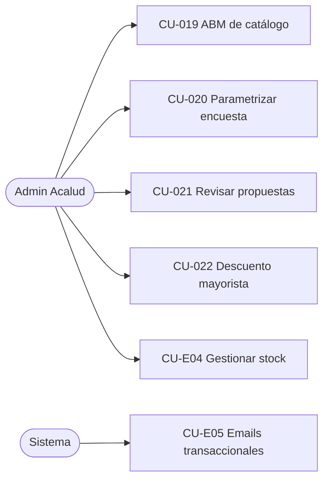

# 1.1-E · Casos de Uso — Administración (backoffice)

| Campo | Valor |
|---|---|
| **Artefacto** | 1.1 Casos de uso detallados · Tanda 3/3 · Módulo E |
| **Versión** | 0.1.0 · **Fecha:** 2026-07-04 · **Estado:** 🟡 Borrador |
| **Cobertura** | CU-019..022 (matriz) + CU-E04 (stock) + CU-E05 (emails transaccionales) |
| **Actor transversal** | Admin Acalud — sesión con **MFA obligatorio** (S-06); toda mutación deja evento de auditoría (admin_id, acción, timestamp) |

**Parámetros ratificables del módulo:**

| ID | Parámetro | Valor default |
|---|---|---|
| PG-01 | Imágenes de juego | JPG/PNG/WebP, máx. 5 MB c/u, hasta 6 por juego |
| PG-02 | Archivos de recursos | PDF/ZIP, máx. 50 MB |
| PG-03 | Reintentos de email | 6 intentos, backoff exponencial, ventana 24 h |
| PG-04 | Publicación de juego | Exige: precio > 0, **peso > 0** (**S-21**, insumo de CU-011), ≥1 imagen, descripción |

## Diagrama de casos de uso (actores integrados)



---

## CU-019 · Gestionar catálogo (ABM)

| | |
|---|---|
| **UC-ID** | UC-ADM-019 · v0.1.0 · DRAFT · **Actor:** Admin |

**Objetivo:** el origen de todo el contenido vendible: juegos, sus demos, sus recursos y
las editoriales de la vitrina.

**PRE:** sesión Admin con MFA. **POST:** mutación + evento de auditoría con diff de campos.

**FLUJO PRINCIPAL (juego):** alta en estado `borrador` → carga de datos (nombre,
descripción, precio de lista, **peso**, área/edad, imágenes PG-01) → asociación de demos
(S-16) y recursos (`libre`/`licenciado`, PG-02) → **publicar** (valida PG-04).
**ALTERNATIVOS:** A1 — **despublicar**: el juego sale del catálogo visible; los pedidos
históricos no se alteran (snapshot de CU-012); los recursos licenciados ya adquiridos
siguen descargables (el derecho nace del pedido, no de la publicación — coherente con
CU-009). A2 — edición de precio: afecta carritos vivos en el próximo recálculo (CU-010),
jamás pedidos creados. A3 — ABM de **editoriales aliadas** y sus productos exhibidos
(vitrina; sin precio por diseño). **EXCEPCIONES:** E1 — publicar sin PG-04 completo → 422
listando faltantes. E2 — **eliminar**: solo juegos sin ventas históricas; con ventas → 409
"despublicá en su lugar" (integridad referencial de pedidos).

**⚠️ Edge cases:** despublicar un juego con lotes institucionales vigentes NO rompe S-13
(el catálogo institucional referencia la compra, no la publicación). Batch: no aplica
(operaciones unitarias; importación masiva fuera de alcance v1) — declarado.

**🤖 Directivas IA:** borrado lógico universal en catálogo (`publicado`, `eliminado_en`);
las imágenes al storage privado con variantes de tamaño generadas al subir.

```gherkin
# language: es
Característica: ABM de catálogo

  @admin @catalogo @scenario-id:ADM-CU019-EXC-001
  Escenario: No se puede publicar un juego sin peso cargado
    Dado un juego en borrador con precio e imágenes pero sin peso
    Cuando el Admin intenta publicarlo
    Entonces la respuesta debe tener status 422 indicando "peso" entre los faltantes
    Y el juego debe permanecer en estado "borrador"

  @admin @catalogo @scenario-id:ADM-CU019-ALT-001
  Escenario: Despublicar no revoca recursos licenciados ya adquiridos
    Dado un docente con pedido "pagado" que incluye "Juego Fracciones"
    Cuando el Admin despublica "Juego Fracciones"
    Entonces el juego no debe aparecer en el catálogo público
    Y el docente debe seguir pudiendo descargar el recurso licenciado del juego
```

---

## CU-020 · Parametrizar encuesta

| | |
|---|---|
| **UC-ID** | UC-ADM-020 · v0.1.0 · DRAFT · **Actor:** Admin |

**Objetivo:** construir el instrumento de co-creación sin tocar código.
**FLUJO:** alta `borrador` (título, descripción, vigencia desde/hasta) → preguntas
ordenables de tipo: opción única, opción múltiple, escala 1–5, texto libre (límite 1 000);
cada una obligatoria u opcional → **publicar**. Ciclo: `borrador → publicada → cerrada`
(cierre manual o automático al vencer la vigencia). **Regla de congelamiento:** publicada
con ≥1 respuesta, la estructura es **inmutable** (solo cerrar) — protege la validez de los
agregados de CU-016. **EXCEPCIONES:** E1 — editar publicada con respuestas → 409. E2 —
publicar sin preguntas → 422. **Edge cases:** el Admin ve resultados en vivo (incluye
texto libre e identidades — S-18 restringe a docentes, no al Admin); duplicar una encuesta
cerrada como plantilla de una nueva. Batch: no aplica — declarado.

```gherkin
# language: es
Característica: Parametrización de encuestas

  @admin @comunidad @scenario-id:ADM-CU020-EXC-001
  Escenario: Una encuesta publicada con respuestas no admite cambios de estructura
    Dado una encuesta "publicada" con 3 respuestas registradas
    Cuando el Admin intenta agregar una pregunta
    Entonces la respuesta debe tener status 409
    Y la encuesta debe conservar su estructura original
```

---

## CU-021 · Revisar propuestas de juegos

| | |
|---|---|
| **UC-ID** | UC-ADM-021 · v0.1.0 · DRAFT · **Actor:** Admin |

**Objetivo:** cerrar el ciclo de co-creación con respuesta formal al docente.
**FLUJO:** cola filtrable por estado (`recibida`/`en_revision`/`aceptada`/`rechazada`/
`retirada`) → detalle con adjunto (enlace firmado) → transiciones: `recibida →
en_revision`; `en_revision → aceptada|rechazada` **con mensaje obligatorio** al docente
(dispara email E05 y es visible en "mis propuestas"). **EXCEPCIONES:** E1 — transición
inválida → 409 (mismo patrón de máquina de estados que CU-E03). **Edge cases:** propuesta
`retirada` por el autor es de solo lectura para el Admin. Batch: no aplica — declarado.
**Directiva IA:** reutilizar la infraestructura de máquina de estados de pedidos
(comandos + validación de estado origen en transacción).

```gherkin
# language: es
Característica: Revisión de propuestas

  @admin @comunidad @scenario-id:ADM-CU021-HAPPY-001
  Escenario: El rechazo exige mensaje y notifica al autor
    Dado una propuesta "en_revision" de un docente
    Cuando el Admin la rechaza con el mensaje "No encaja en la línea 2026, reintentá con foco en primaria"
    Entonces la propuesta debe quedar "rechazada" con ese mensaje visible para el docente
    Y debe encolarse el email de novedad de propuesta al autor
```

---

## CU-022 · Configurar descuento mayorista

| | |
|---|---|
| **UC-ID** | UC-ADM-022 · v0.1.0 · DRAFT · **Actor:** Admin |

**Objetivo:** la palanca de precios B2B/B2C por volumen que consume CU-010/024.
**MODELO:** por producto, lista de **tramos** `(cantidad_mínima, % descuento)`;
ej.: `≥10 → 15 %`, `≥50 → 25 %`. **REGLAS DE VALIDEZ (atómicas al guardar):** sin tramos
duplicados en cantidad_mínima; el % debe ser estrictamente creciente con la cantidad
(comprar más nunca puede convenir menos); % en rango 1–90. **VIGENCIA:** inmediata — los
carritos vivos recalculan en la próxima lectura (CU-010); los pedidos creados no cambian
(snapshot). **EXCEPCIONES:** E1 — set de tramos inválido → 422 con la regla violada; no se
persiste ningún tramo del set (todo-o-nada).

**⚠️ Checklist de lote (aplica: el set de tramos se valida y persiste como unidad)**
```
CARDINALIDAD:  0 tramos = producto sin descuento (estado válido). 1..N tramos → set completo.
IDEMPOTENCIA:  guardar el mismo set dos veces = mismo estado final (reemplazo total del set).
FALLO PARCIAL: prohibido persistir un subconjunto de tramos; validación y reemplazo en
               una transacción (todo-o-nada).
```

```gherkin
# language: es
Característica: Descuentos mayoristas

  @admin @precios @scenario-id:ADM-CU022-EXC-001
  Escenario: Un set con descuento decreciente es rechazado íntegro
    Dado un producto con un tramo vigente de 10 unidades al 15%
    Cuando el Admin intenta guardar el set [10→15%, 50→10%]
    Entonces la respuesta debe tener status 422 por descuento no creciente
    Y el producto debe conservar exactamente su tramo vigente anterior
```

---

## CU-E04 · Gestionar stock

| | |
|---|---|
| **UC-ID** | UC-ADM-E04 · v0.1.0 · DRAFT · **Actor:** Admin |

**Objetivo:** que el número de stock sea **confiable y auditable** — sin esto, S-05 y las
garantías transaccionales de CU-012 descansan sobre un dato basura.

**MODELO — kardex simple:** el stock de un producto es la suma de sus **movimientos**,
cada uno con tipo y origen: `venta (−)` [CU-012/024], `reposición por cancelación (+)`
[CU-E03], `ajuste manual (±)` con **motivo obligatorio** (`recepción`, `merma`,
`corrección de inventario`) [este CU]. **FLUJO:** panel de stock por producto (actual,
últimos movimientos) → ajuste manual (cantidad ± y motivo) → confirmación. **EXCEPCIONES:**
E1 — ajuste que dejaría stock < 0 → 422 (el stock físico no puede ser negativo; si hay
sobreventa real, el camino es E2 de CU-012, no un número negativo). **Edge cases:** el
campo `stock` materializado y los movimientos deben cuadrar SIEMPRE — verificación de
consistencia disponible en el panel (recalcula desde movimientos y compara). Batch: no
aplica (ajustes unitarios) — declarado.

**🤖 Directivas IA:** el ajuste manual usa la misma primitiva transaccional que
venta/reposición (un solo camino de escritura al stock); test de consistencia
kardex↔materializado en la suite de integración.

```gherkin
# language: es
Característica: Gestión de stock

  @admin @stock @scenario-id:ADM-CUE04-HAPPY-001
  Escenario: El ajuste manual queda auditado y cuadra con el kardex
    Dado un producto con stock 10 y su historial de movimientos consistente
    Cuando el Admin registra un ajuste de +5 con motivo "recepción"
    Entonces el stock debe quedar en 15
    Y debe existir un movimiento "ajuste manual +5 recepción" con el identificador del Admin
    Y la verificación de consistencia debe cuadrar

  @admin @stock @scenario-id:ADM-CUE04-EXC-001
  Escenario: Un ajuste que deja stock negativo es rechazado
    Dado un producto con stock 3
    Cuando el Admin registra un ajuste de -5 con motivo "merma"
    Entonces la respuesta debe tener status 422
    Y el stock debe permanecer en 3
```

---

## CU-E05 · Emails transaccionales (actor: Sistema)

| | |
|---|---|
| **UC-ID** | UC-SIS-E05 · v0.1.0 · DRAFT · **Actor:** SystemJob (cola de emails) |

**Objetivo:** garantizar la entrega de las comunicaciones que otros CU prometen — el CU
transversal que evita duplicar "y se envía un email" en doce lugares.

**CATÁLOGO (cada uno con su plantilla):** verificación de email (CU-001/E02) ·
recuperación de contraseña (CU-E01) · aviso de bloqueo (CU-002) · aviso de cambio de
contraseña/email (CU-004) · invitación institucional (CU-026) · confirmación de compra
**con comprobante adjunto** (CU-012/024, S-07) · cancelación de pedido (CU-E03) · despacho
con tracking (CU-E03) · novedad de propuesta (CU-021).

**GARANTÍAS:** entrega **at-least-once** con reintentos PG-03; cada email tiene un
`email_id` único → el reintento del worker no duplica envíos ya confirmados
(deduplicación por `email_id` — idempotencia del worker); los fallos definitivos (6
intentos agotados) quedan visibles en un panel mínimo de Admin con reintento manual.

**⚠️ Checklist de lote (aplica: el worker procesa N emails encolados por corrida)**
```
CARDINALIDAD:  cola vacía → corrida vacía válida. 1..N → procesamiento por lotes de 20.
IDEMPOTENCIA:  por EMAIL (email_id), nunca por lote: el reintento de una corrida caída
               retoma los no confirmados sin reenviar los confirmados.
FALLO PARCIAL: el lote admite resultado parcial POR DISEÑO (cada email es independiente);
               un email fallido no bloquea a los demás; su contador de intentos avanza solo.
```
**Directiva IA:** el envío desde los CU de negocio es **encolar** (INSERT transaccional
junto con la operación de negocio — patrón outbox simplificado); el worker es el único que
habla con el proveedor de email.

```gherkin
# language: es
Característica: Cola de emails transaccionales

  @sistema @email @idempotencia @scenario-id:SIS-CUE05-EXC-001
  Escenario: Una corrida caída no duplica los emails ya confirmados
    Dado un lote de 3 emails donde 2 fueron confirmados antes de caer el worker
    Cuando el worker vuelve a correr
    Entonces solo el email no confirmado debe enviarse
    Y los contadores de intentos de los confirmados deben permanecer sin cambios
```

---

## Supuestos nuevos surgidos en esta tanda (a incorporar en 0.1 §10)

| ID | Supuesto | Origen |
|---|---|---|
| S-21 | Peso > 0 obligatorio para publicar un juego (insumo de cotización CU-011). | CU-019 / PG-04 |
| S-23 | Un único Admin operativo en v1 (multi-admin con permisos granulares → v2). | Módulo E |

## Registro de cambios

| Versión | Fecha | Cambio | Autor |
|---|---|---|---|
| 0.1.0 | 2026-07-04 | 6 CU de backoffice; kardex de stock; outbox de emails; PG-01..04; S-21, S-23 | Arquitecto (Claude) |
