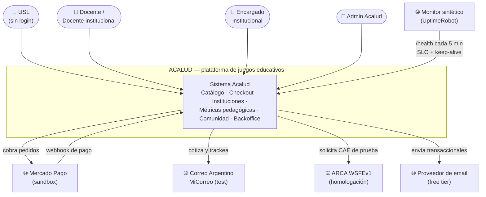
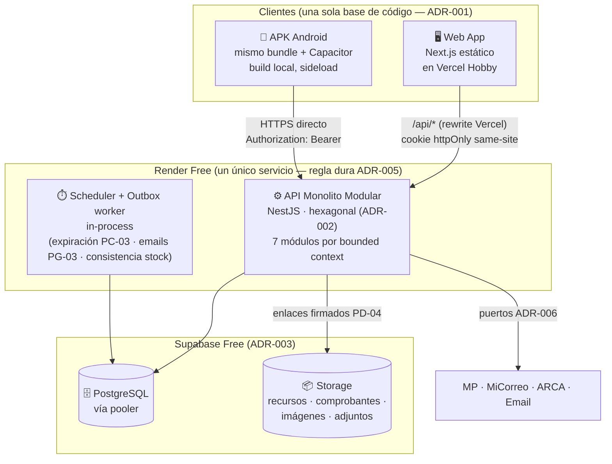
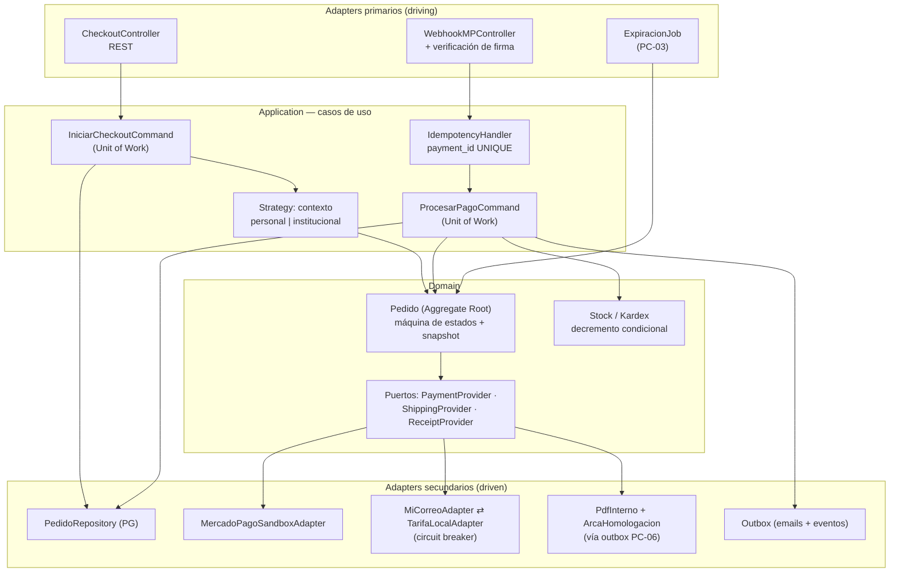

# 2.1 · Arquitectura C4 — Contexto, Contenedores, Componentes

| Campo | Valor |
|---|---|
| **Artefacto** | 2.1 Diagramas C4 |
| **Versión** | 0.1.0 · **Fecha:** 2026-07-04 · **Estado:** 🟡 Borrador |
| **Depende de** | ADR-001..006 |
| **Nota** | Diagramas en Mermaid (renderizan en GitHub). Nivel 3 solo para el módulo crítico (Compras); los demás módulos siguen la misma anatomía hexagonal. Nivel 4 (código) se omite deliberadamente: lo cubre el repositorio con ejemplos reales (artefacto 5.1). |

## Nivel 1 — Contexto del sistema

**Lectura:** cuatro actores humanos, cinco sistemas externos. La única entrada asíncrona
externa es el webhook de MP (vector de seguridad prioritario para 3.1). El monitor cumple
doble función (NFR-D1 + anti-spin-down, ADR-005).

## Nivel 2 — Contenedores

**Decisiones visibles acá:** transporte dual de sesión (ADR-004); worker y jobs dentro del
proceso (ADR-005: no hay horas para un segundo servicio); el storage nunca se expone
directo — siempre enlaces firmados de corta vida (PD-04).

## Nivel 3 — Componentes del módulo Compras (el crítico)

**Regla de dependencias verificada en el dibujo:** las flechas de dominio salen solo hacia
puertos; ningún componente de `DOM` conoce un adapter concreto. `ProcesarPagoCommand` es la
transacción única del paso 5 de CU-012: transición de estado + decremento multi-línea +
outbox, todo-o-nada.

**Los otros seis módulos** (Identidad, Catálogo, Logística, Comprobantes, Comunidad,
Institucional) replican esta anatomía; sus componentes se enumeran en 2.3 junto a sus
Aggregates — repetir seis diagramas idénticos sería ruido, no información.

## Registro de cambios
| Versión | Fecha | Cambio |
|---|---|---|
| 0.1.0 | 2026-07-04 | Niveles 1–3 iniciales | 
