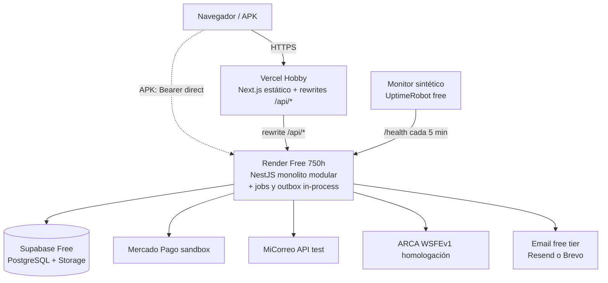

# ADR-005 · Hosting y topología $0 (free tiers sin tarjeta)

| Campo | Valor |
|---|---|
| **Estado** | ✅ Aceptada (2026-07-04) |
| **Decide** | Dónde corre cada pieza, con qué cuotas y qué plan B |
| **Trazabilidad** | R-01, NFR-D (SLO/cold starts), NFR-F2 (completa la tabla de cuotas), CE-05 |

## Topología

## Decisiones y justificación (fuentes verificadas 2026-07-04)

1. **Frontend en Vercel (Hobby):** sitio estático de ADR-001, sin tarjeta, con los rewrites
   `/api/*` que sostienen la cookie same-site de ADR-004.
2. **Backend en Render (free web service):** deploy desde GitHub sin tarjeta; el free tier
   permite un web service con base 750 h/mes — exactamente **un** servicio always-on
   (mes = 720 h) con margen. El **worker de outbox y los jobs** (expiración PC-03,
   verificación de consistencia de stock) corren **in-process** con scheduler interno: no
   hay horas para un segundo servicio, y el monolito modular (ADR-002) lo hace natural.
   Spin-down tras 15 min de inactividad con cold start de 30–60 s: ya declarado y excluido
   del SLO en **NFR-D4**.
3. **Keep-alive = monitoreo:** el monitor sintético de NFR-D1 (UptimeRobot free, check cada
   5 min sobre `/health` y `/ready`) cumple doble función: mide el SLO **y** evita el
   spin-down de Render y la pausa por inactividad de Supabase (`/ready` toca la BD). Un
   mecanismo, tres problemas resueltos, cero costo.
4. **BD + Storage en Supabase:** ADR-003.
5. **Email:** puerto `EmailProvider` con candidatos **Resend** o **Brevo** (ambos con free
   tier sin tarjeta según su documentación; volumen diario de sobra para NFR-C).
   **Verificación de límites vigentes al implementar = tarea de la etapa 5.1**; elegir uno
   es cambiar un adapter, no una decisión estructural.
6. **Dominios:** subdominios gratuitos (`*.vercel.app`, `*.onrender.com`). Dominio propio:
   fuera de alcance $0, declarado.
7. **Secretos:** variables de entorno de cada plataforma (Vercel/Render), nunca en el repo;
   el certificado ARCA y el token MiCorreo entran por env/secret files de Render.
8. **APK:** se construye local (ADR-001) y se publica como asset en GitHub Releases —
   distribución directa R-07 con hash SHA-256 publicado.

## Tabla de cuotas — completa NFR-F2 (umbral de alerta: 80 %)

| Recurso | Límite free (a confirmar al alta) | Umbral 80 % | Riesgo real para NFR-C |
|---|---|---|---|
| Supabase BD | ~500 MB | 400 MB | Bajo: seed NFR-C3 estimado ≪ 100 MB |
| Supabase Storage | ~1 GB | 0,8 GB | Medio: recursos PDF/imágenes — cuidar tamaños PG-01/02 |
| Render horas | 750 h/mes | 1 servicio (720 h) + builds | Nulo si hay UN solo servicio (regla dura) |
| Render ancho de banda | ~100 GB/mes | 80 GB | Bajo |
| Vercel ancho de banda | ~100 GB/mes | 80 GB | Bajo |
| Emails/día | según proveedor (≥100/día) | 80 % | Bajo (NFR-C: ~40 emails/día pico) |
| UptimeRobot monitores | 50 monitores / check 5 min | — | Nulo (usamos 2) |

*Los valores exactos se confirman al crear cada cuenta y se corrigen en esta tabla —
es la única parte de este ADR marcada como verificación pendiente.*

## Alternativas consideradas y descartadas

| Alternativa | Razón (fuentes 2026-07-04) |
|---|---|
| **Railway** | Sin free tier permanente y exige tarjeta desde 2023 — viola R-01. |
| **Fly.io** | Sin free tier para usuarios nuevos; requiere tarjeta — viola R-01. |
| **Cloudflare Workers** | Free generoso pero corre en isolates V8 sin APIs de Node: el cliente SOAP/certificados de ARCA y el proceso persistente del outbox no encajan. |
| **Todo-en-Vercel (API serverless)** | Sin proceso persistente para outbox/jobs en hobby; timeouts cortos rozan NFR-L7; los cold starts se multiplican por función. |
| **Google Cloud Run** | Técnicamente excelente (escala a cero, 2 M requests free) pero el alta de GCP pide tarjeta — viola R-01. Queda como plan B si algún free tier muta. |

## Consecuencias

- ✅ CE-05 verificable (facturación $0); una sola pieza always-on que cuidar; el "modo
  demo" (NFR-D5) tiene todos sus botones identificados.
- ⚠️ Los free tiers cambian sin aviso (Railway y Fly ya lo hicieron): mitigación
  estructural = puertos + scripts de deploy versionados; plan B nominal por pieza (Neon
  para BD, Koyeb/Cloud Run para API). Revisión de condiciones en cada hito del plan (NFR-F4).
- ⚠️ Restricción operativa dura derivada: **prohibido agregar un segundo servicio en
  Render** — cualquier necesidad nueva entra al monolito o no entra.

## Registro de cambios
| Versión | Fecha | Cambio |
|---|---|---|
| 1.0.0 | 2026-07-04 | Decisión aceptada; tabla de cuotas inicial |
