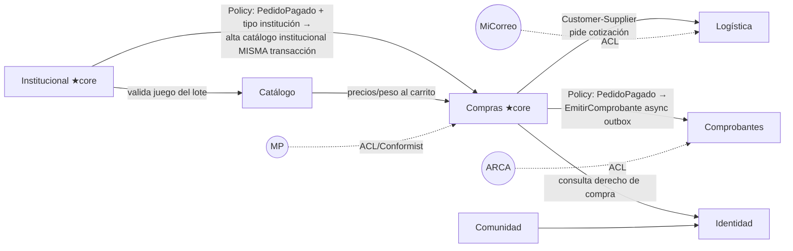

# 2.3 · Modelo de dominio (DDD) y modelo de datos

| Campo | Valor |
|---|---|
| **Artefacto** | 2.3 Modelo de dominio + datos |
| **Versión** | 0.1.0 · **Fecha:** 2026-07-04 · **Estado:** 🟡 Borrador |
| **Fundamento** | DDD estratégico/táctico (Evans, `Evans03.pdf` de la base de conocimiento) · ADR-002/003 |
| **Nota de nombres** | Tablas y campos en `snake_case` español, un término = un significado (Glosario 0.2) |

## 1. Categorización de dominios

| Categoría | Dominios | Consecuencia |
|---|---|---|
| **Core** | **Institucional** (el círculo pedagógico: lotes → catálogo institucional → sesiones → reportes — el diferencial declarado en Visión §2) y **Compras** (el checkout con sus garantías transaccionales) | DDD táctico completo, máxima atención de diseño y de modelo (5.2) |
| **Supporting** | Catálogo y Contenido (incluye Vitrina), Logística, Comprobantes, Comunidad | Diseño sólido pero sin sofisticación extra |
| **Generic** | Email transaccional; **Identidad/Auth** | Email: delegado a proveedor (ADR-006). Identidad: *genérico que se construye por decisión académica explícita* (ADR-004) — se declara la tensión con la práctica estándar ("generic = off-the-shelf") y su justificación: material ASVS para la tesis. |

## 2. Bounded Contexts (7 + plataforma)

| # | Contexto | Aggregates raíz | Nota de lenguaje |
|---|---|---|---|
| BC1 | **Identidad y Acceso** | Cuenta · Sesión · TokenDeUso | "Cuenta" es la persona; "Docente" es cómo la ven los demás contextos |
| BC2 | **Catálogo y Contenido** | Juego (con Demos y Recursos) · EditorialAliada (con ProductosExhibidos) | "Recurso licenciado" solo existe aquí; el *derecho* de descarga se calcula en BC3+BC7 (CU-009) |
| BC3 | **Compras** | Carrito · Pedido (con Líneas, snapshot) · Stock/Kardex · ReglaMayorista | "Pedido" nace en checkout; su domicilio es copia, no referencia |
| BC4 | **Logística** | Cotización (efímera) · Envío (tracking) · TablaDeTarifas | "Envío" pertenece 1:1 al Pedido pero su ciclo lo gobierna este contexto |
| BC5 | **Comprobantes** | Comprobante (PDF/CAE) | "CAE" solo tiene sentido aquí |
| BC6 | **Comunidad** | Encuesta (con Preguntas) · Respuesta · Propuesta | "Respuesta" es una por cuenta y encuesta (S-17) |
| BC7 | **Institucional** | Institución · Membresía (con rol) · CatálogoInstitucional · SesiónDeUso | "Docente institucional" = Membresía activa, no otra cuenta (S-01) |
| — | **Plataforma** (técnico) | Outbox · EventoDeAuditoría | Soporte transversal; no es dominio de negocio |

## 3. Context Map

**Reglas de integración (monolito modular):**
1. Entre contextos: **eventos de dominio in-process**. Síncronos y en la misma transacción
   solo cuando el CU lo exige (único caso: CU-024 punto 5, alta de catálogo institucional);
   el resto vía **outbox** (comprobantes, emails) — desacople temporal con at-least-once +
   idempotencia.
2. Los adapters externos **son** las Anti-Corruption Layers: el modelo de MP/MiCorreo/ARCA
   jamás cruza el puerto (se traduce a tipos del dominio en el adapter).
3. **Propiedad de tablas:** cada módulo escribe SOLO sus tablas (tabla de propiedad en §6);
   las FKs entre contextos existen (integridad física) pero la escritura cruzada está
   prohibida y la bloquea el linter de dependencias (ADR-002). Esto previene el anti-patrón
   *Tight Coupling vía Shared Database* dentro del monolito.

## 4. Event Storming condensado (ES-2: Command → Aggregate → Evento → Policy)

| Command (Actor) | Aggregate | Evento | Policy disparada |
|---|---|---|---|
| RegistrarCuenta (USL) | Cuenta | `DocenteRegistrado` | Encolar email de verificación |
| IniciarCheckout (Docente/Encargado) | Pedido | `PedidoCreado` | Crear preferencia MP |
| ProcesarPagoAprobado (webhook) | Pedido + Stock | `PedidoPagado` · `StockDescontado` | (a) Emitir comprobante [outbox] · (b) email confirmación [outbox] · (c) **si institucional:** alta catálogo institucional [misma tx] |
| ProcesarPagoRechazado (webhook) | Pedido | `PedidoRechazado` | Conservar carrito |
| ExpirarPedidos (job) | Pedido | `PedidoExpirado` | — |
| TransicionarPedido (Admin) | Pedido | `PedidoDespachado` / `PedidoEntregado` / `PedidoCancelado` | Despacho→email tracking; cancelación→**reponer stock [misma tx]** + email |
| InvitarDocente (Encargado) | Membresía | `DocenteInvitado` | Email de invitación |
| AceptarInvitación (persona) | Membresía | `MembresiaActivada` | Notificar a ambos |
| DesvincularDocente (Encargado) | Membresía | `DocenteDesvinculado` | Email informativo; sesiones se conservan (S-03) |
| CargarSesión (Docente inst.) | SesiónDeUso | `SesionDeUsoRegistrada` | — |
| ResolverPropuesta (Admin) | Propuesta | `PropuestaResuelta` | Email al autor con mensaje |
| DescargarRecurso (Docente) | — (query de derecho) | `DescargaRegistrada` | — |

**Hotspot resuelto en diseño:** el doble efecto de `PedidoPagado` (comprobante async vs
catálogo institucional síncrono) quedó decidido y justificado — el catálogo institucional es
invariante del lote (1.1-C: "lote pagado sin catálogo habilitado es estado prohibido"), el
comprobante no (CU-012 E3: el pago es el hecho jurídico; el comprobante se reintenta).

## 5. Invariantes por Aggregate (las que el código DEBE proteger)

| Aggregate | Invariantes |
|---|---|
| **Pedido** | Nace con ≥1 línea (Factory); snapshot de precios/domicilio inmutable; transiciones solo por la máquina de estados (1.1-B); `monto_total = Σ líneas + envío` verificado contra lo notificado por MP |
| **Stock/Kardex** | `stock_actual = Σ movimientos` siempre; nunca < 0; un movimiento por causa (venta/reposición/ajuste) con referencia al origen |
| **Membresía** | Máx. una vigente (invitada/activa) por (institución, email); rol ∈ {encargado, docente}; desvinculación no borra historial |
| **Sesión de uso** | Juego ∈ catálogo institucional (S-13); rangos PI-05; inmutable pasadas 48 h (S-14) |
| **Respuesta** | Una por (cuenta, encuesta); inmutable (S-17) |
| **Encuesta** | Estructura congelada con ≥1 respuesta (CU-020) |
| **Comprobante** | Solo sobre pedido ≥ pagado; PDF siempre; CAE opcional |
| **Cuenta/Sesión** | Token de sesión opaco hasheado; revocación server-side multi-canal (ADR-004) |

## 6. Modelo de datos

```mermaid
erDiagram
    cuentas ||--o{ sesiones : tiene
    cuentas ||--o{ tokens_de_uso : tiene
    cuentas ||--o{ membresias : participa
    instituciones ||--o{ membresias : agrupa
    instituciones ||--o{ catalogo_institucional : habilita
    juegos ||--o{ catalogo_institucional : figura
    juegos ||--o{ demos : ofrece
    juegos ||--o{ recursos : incluye
    juegos ||--o{ tramos_descuento : tarifa
    juegos ||--o{ movimientos_stock : registra
    editoriales ||--o{ productos_exhibidos : exhibe
    cuentas ||--o{ favoritos : marca
    editoriales ||--o{ favoritos : recibe
    cuentas ||--o{ carritos : posee
    carritos ||--o{ carrito_lineas : contiene
    cuentas ||--o{ pedidos : realiza
    instituciones ||--o{ pedidos : compra
    pedidos ||--o{ pedido_lineas : contiene
    pedidos ||--|| envios : despacha
    pedidos ||--o{ pagos_procesados : notificado
    pedidos ||--o{ comprobantes : certificado
    encuestas ||--o{ preguntas : compone
    encuestas ||--o{ respuestas : recibe
    cuentas ||--o{ respuestas : emite
    cuentas ||--o{ propuestas : envia
    membresias ||--o{ sesiones_uso : carga
    juegos ||--o{ sesiones_uso : sobre
    cuentas ||--o{ descargas : ejecuta
    recursos ||--o{ descargas : de
```

**Columnas de las tablas críticas** (el resto sigue el patrón obvio de sus CU):

- `pedidos`: id, comprador_tipo (`personal|institucion`), cuenta_id (quién ejecutó),
  institucion_id NULL, estado, **domicilio_snapshot** (jsonb), envio_costo, envio_origen
  (`micorreo|tabla`), monto_total, creado_en, expira_en, versión de auditoría por eventos.
- `pedido_lineas`: pedido_id, juego_id, cantidad, **precio_unitario_snapshot**,
  descuento_pct_snapshot.
- `pagos_procesados`: **payment_id UNIQUE**, pedido_id, estado_mp, monto_notificado,
  payload_crudo (jsonb), procesado_en — la tabla de idempotencia del webhook.
- `movimientos_stock`: juego_id, tipo (`venta|reposicion|ajuste`), cantidad_signada,
  motivo NULL, referencia (pedido_id | admin_id), creado_en. `juegos.stock_actual`
  materializado con CHECK ≥ 0.
- `membresias`: institucion_id, email_invitado, cuenta_id NULL (se liga al aceptar), rol,
  estado, token_invitacion_hash, historial de fechas.
- `sesiones_uso`: membresia_id, institucion_id (desnormalizado a propósito: la sesión
  sobrevive a la membresía — S-03), juego_id, fecha, curso, cantidad_alumnos, duracion_min,
  observaciones, creado_en, editable_hasta.
- `outbox_emails` / `eventos_auditoria`: **append-only por permisos de BD** (NFR-S6).

**Constraints de integridad crítica (los tests de 1.1 los verifican contra BD real):**

| Constraint | Protege |
|---|---|
| `UNIQUE pagos_procesados(payment_id)` | Webhook duplicado (CU-012 E1) |
| `UNIQUE respuestas(encuesta_id, cuenta_id)` | Doble respuesta (CU-014 E1) |
| `UNIQUE parcial membresias(institucion_id, email_invitado) WHERE estado IN ('invitada','activa')` | Membresía duplicada (CU-026 E1) — el parcial permite el re-invitar tras desvincular |
| `UNIQUE catalogo_institucional(institucion_id, juego_id)` | Idempotencia del alta por lote |
| `CHECK juegos.stock_actual >= 0` + decremento condicional | Sobreventa (Lost Update) |
| `UNIQUE cuentas(email)` (normalizado lower/trim) | Cuentas duplicadas (CU-001 A1) |
| `CHECK tramos_descuento` (pct 1–90; sin duplicados por cantidad) + validación de monotonía en aplicación | CU-022 |
| Permisos append-only en auditoría/outbox/kardex | NFR-S6, integridad del kardex |

**Propiedad de tablas por módulo** (escritura exclusiva del dueño — regla §3.3):
BC1: cuentas, sesiones, tokens_de_uso · BC2: juegos, demos, recursos, editoriales,
productos_exhibidos, favoritos, tramos_descuento · BC3: carritos, carrito_lineas, pedidos,
pedido_lineas, pagos_procesados, movimientos_stock · BC4: envios, tabla_tarifas · BC5:
comprobantes · BC6: encuestas, preguntas, respuestas, propuestas · BC7: instituciones,
membresias, catalogo_institucional, sesiones_uso · Plataforma: outbox_emails,
eventos_auditoria, descargas.

## 7. Mapeo CU → Bounded Context (completa la columna "Componente" de 1.3)

BC1: CU-001..005, E01, E02 · BC2: CU-006..009 (derecho de 009 consulta BC3/BC7), CU-017..019
(parcial), E04 · BC3: CU-010, 012, 022, 024, E03 · BC4: CU-011, 013 · BC5: comprobantes de
CU-012/024 · BC6: CU-014..016, 020, 021 · BC7: CU-023, 025..033 · Plataforma: E05.

## Registro de cambios
| Versión | Fecha | Cambio |
|---|---|---|
| 0.1.0 | 2026-07-04 | Modelo completo: categorización, 7 BCs, context map, eventos, invariantes, ER y constraints |
