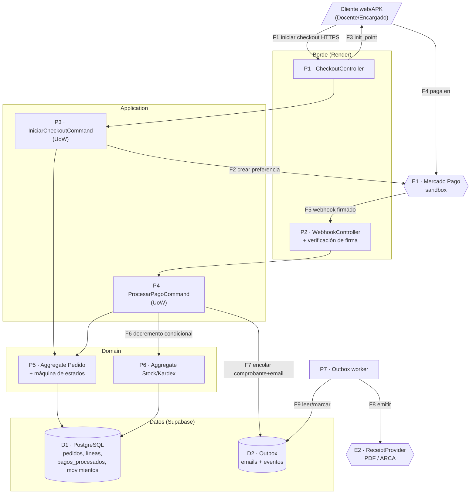

# 3.2 · Vitrina L3 — Análisis exhaustivo del flujo de Checkout

| Campo | Valor |
|---|---|
| **Artefacto** | 3.2 Vitrina de profundidad L3 (la demostración de método elegida — Visión §4) |
| **Versión** | 0.1.0 · **Fecha:** 2026-07-04 · **Estado:** 🟡 Borrador |
| **Alcance** | CU-012 / CU-024 (checkout personal e institucional) — el único hecho transaccional con dinero, stock y comprobante del sistema |
| **Método L3** | STRIDE **+ LINDDUN** por elemento del DFD (las 6+7 dimensiones, sin omitir ninguna) **y** las 5 preguntas de interrogación de fallo por componente. Este es el rigor que en el resto del sistema se aplica selectivamente (3.1) y aquí, completo. |

> **Por qué este flujo.** Concentra todo lo que puede salir caro: suplantación de pago,
> pérdida o doble descuento de stock, doble cobro percibido, fuga de datos personales y de
> pago, y fallo parcial entre efectos que deben ser atómicos. Si el método aguanta acá,
> aguanta en todo el sistema. La conclusión operativa de este análisis retroalimenta el
> diseño (varias filas ⏳ se vuelven gates del plan 5.2).

## 1. DFD de máximo detalle del flujo

Elementos: **Procesos** P1–P7 · **Almacenes** D1–D2 · **Externos** E1–E2 · **Flujos** F1–F9.

## 2. STRIDE + LINDDUN por elemento

### P1 · CheckoutController (F1) — borde autenticado
| Dim | Amenaza en este punto | Control | Estado |
|---|---|---|---|
| S | Sesión robada inicia checkout ajeno | Auth por request (cookie/bearer) + verificado (PA-06) | ✅ |
| T | Domicilio/CP/contexto manipulados | Validación de esquema (2.4) + el precio/envío se recalculan server-side, nunca se aceptan del cliente | ✅ |
| R | "No inicié esta compra" | `PedidoCreado` con cuenta_id+IP en auditoría | ✅ |
| I | Enumeración de juegos por respuestas de error | Problem Details genérico; stock como booleano | ✅ |
| D | Spam de checkouts crea pedidos basura + preferencias MP | Constraint "1 pedido pendiente_pago por carrito" (idempotencia por pedido) + rate limit | ✅ |
| E | Comprar en contexto institucional sin rol | Verificación membresía+rol encargado (INS-CU024-EXC-001) | ✅ |
| **L** | Vincular carritos→persona por sesión | Sesión opaca; sin identificadores cruzables expuestos | ✅ |
| **I** | Identificar persona por el pedido | PII solo server-side; cliente ve lo suyo | ✅ |
| **D**et | Inferir existencia de pedidos ajenos | 404 IDOR-safe uniforme | ✅ |
| **U** | ¿Sabe el titular qué se guarda? | Domicilio se copia como snapshot con finalidad de envío (declarado 3.3 §B) | ✅ |

### P2 · WebhookController (F5) — **el elemento más sensible del sistema**
| Dim | Amenaza | Control | Estado |
|---|---|---|---|
| S | **Pago falso "aprobado"** → pedidos gratis | Firma verificada antes de procesar (rechazo 401 sin tocar D1) **+ reconciliación server-to-server**: el adapter consulta a MP por `payment_id` y usa la respuesta autoritativa de MP, no la del payload | ✅ diseño / ⏳ reconciliación es gate 5.2 |
| T | Monto/estado adulterados en el POST | Monto validado vs snapshot; estado tomado de la consulta a MP, no del body | ✅⏳ |
| R | Disputa de procesamiento | `pagos_procesados` guarda payload crudo + resultado + timestamp | ✅ |
| I | Filtrar datos de pago en logs/errores | NFR-S5; payload solo en D1; sin eco en respuesta | ✅ |
| D | Flood de webhooks | Firma inválida = descarte barato; duplicados válidos = no-op idempotente; rate limit IP | ✅ |
| E | Transicionar pedidos fuera de flujo | Guard `WHERE estado=:origen` en la máquina | ✅ |
| **L/I/D/U/N** (LINDDUN) | Correlación de pagos con personas por un tercero que espíe el borde | TLS; el webhook no lleva PII más allá de referencias opacas (external_reference = pedido_id, no email) | ✅ |
| **N**on-compliance | Retención de datos de tarjeta | **Acalud nunca ve ni almacena datos de tarjeta** — MP los maneja; el sistema solo guarda payment_id y estado (fuera de alcance PCI por diseño) | ✅ (decisión de arquitectura clave) |

### P3/P4 · Commands (UoW) · P5/P6 · Aggregates
| Dim | Amenaza | Control | Estado |
|---|---|---|---|
| T | Estado del pedido inconsistente entre efectos | **Todo el efecto de F5–F7 en UNA transacción** (transición + decremento multi-línea + outbox): commit total o rollback total | ✅ (núcleo del diseño) |
| E | Precio evaluado con datos viejos | Snapshot inmutable al crear el pedido (F1); el pago valida contra ese snapshot | ✅ |
| R | Falta de rastro de la operación crítica | Eventos de dominio persistidos en la misma tx (outbox) | ✅ |
| I (LINDDUN) | Minimización | El Aggregate no carga PII innecesaria; opera con ids | ✅ |

### D1 · PostgreSQL · D2 · Outbox
| Dim | Amenaza | Control | Estado |
|---|---|---|---|
| T | Escritura que rompe invariante de stock | `CHECK stock_actual>=0` + decremento condicional (filas afectadas) | ✅ |
| T | Doble inserción de pago | `UNIQUE(payment_id)` | ✅ |
| I | Acceso directo a la BD | Solo service-role del backend; RLS deny-all como defensa en profundidad (ADR-003) | ✅ |
| R | Alteración de auditoría/kardex | Append-only por permisos (NFR-S6) | ✅ |
| **Disclosure** | Backup con PII expuesto | Backup gestionado del proveedor; export lógico en repo **privado** (NFR-R1); datos ficticios (R-04) | ✅ |

### E1 · Mercado Pago · E2 · ReceiptProvider · P7 · Worker
| Dim | Amenaza | Control | Estado |
|---|---|---|---|
| S | Endpoint MP/ARCA suplantado | TLS verificado; URLs de config, no de input (sin SSRF) | ✅ |
| I | Fuga de secreto MP / certificado ARCA | Secretos en env de Render; scanner en CI (⏳ 5.1) | ✅⏳ |
| D | ARCA/MP lentos bloquean el worker | Timeouts + circuit breaker; el worker es asíncrono, no bloquea el checkout (F7 ya cerró la tx) | ✅ |
| **N**on-compliance | Emitir comprobante fiscal real por venta inexistente | **Homologación only** (R-03): CAE sin validez legal; declarado en Visión §4 | ✅ |

**Cierre LINDDUN del flujo:** ninguna dimensión de privacidad queda sin respuesta; la
decisión de **no tocar datos de tarjeta** (P2) y de **no recolectar identidad de alumnos**
(fuera de este flujo pero coherente) mantienen el radio de exposición mínimo.

## 3. Las 5 preguntas de interrogación de fallo

### Pregunta 1 — Fallo en cascada y resiliencia transaccional
*¿Qué ocurre EXACTAMENTE si un componente cae con una transacción in-flight?*

- **Caso crítico: la BD se cae ENTRE el decremento de stock (F6) y el encolado del outbox
  (F7).** Respuesta: **no puede ocurrir como estado persistido** — F6 y F7 están en la
  **misma transacción** (UoW); si la BD cae antes del commit, se pierde todo el efecto y el
  webhook no confirma → MP reintenta (F5) → el `payment_id` aún no está en `pagos_procesados`
  → se reprocesa limpio. Si cae después del commit, F7 ya está durable y el worker (P7) lo
  toma. **No hay ventana de "stock descontado sin comprobante encolado".**
- **(a) Cola de reintentos:** el rol de DLQ lo cumplen (i) los **reintentos nativos del
  webhook de MP** para F5 y (ii) el **outbox con contador de intentos** para F8/F9; los
  emails/comprobantes agotados caen al panel de fallidos (CU-E05) — DLQ funcional con
  visibilidad. Alerta por acumulación de outbox pendiente (NFR-O2).
- **(b) Idempotencia del reintento:** F5 por `UNIQUE(payment_id)`; F8 por `email_id`/estado
  del ítem de outbox. Doble entrega del mismo mensaje = no-op.
- **(c) Circuit breaker por error_rate:** en los adapters MiCorreo/ARCA (no en el pago:
  MP no tiene fallback por diseño). Umbral 3 fallos consecutivos, half-open 60 s (ADR-006).
- **(d) Compensación:** el conflicto de stock al aprobar (E2 de CU-012) **no descuenta nada**
  (rollback total) y deriva a `en_revision` con resolución humana del Admin — compensación
  explícita, SLO de resolución: manual (declarado, no automatizado en v1).
- **(e) Timeout chain ordenado:** cliente (F1) > controller > command > query BD; y para F2
  el timeout a MP (10 s) es menor que el del request del cliente. Sin cadena invertida.

### Pregunta 2 — Corrupción de estado por concurrencia
*¿Qué invariante impide anomalías entre transacciones concurrentes sobre el mismo Aggregate?*

- **Anomalías posibles y su control:**
  - **Lost Update en stock** (dos ventas del último ítem): prevenido por **decremento
    condicional atómico** `UPDATE...SET cantidad=cantidad-:n WHERE id=:id AND cantidad>=:n`
    verificando filas afectadas; el segundo pierde la carrera → 0 filas → rollback → E2. No
    se usa `SELECT` previo (que sí tendría la carrera).
  - **Doble transición de pedido** (dos webhooks *concurrentes*, no solo duplicados
    secuenciales — el caso que 3.1 no cubre en detalle): el `UPDATE...WHERE estado=:origen`
    hace que **solo una** transición gane; la otra afecta 0 filas y se resuelve como
    idempotente. Además, `UNIQUE(payment_id)` serializa a nivel de inserción de pago.
  - **Phantom/Write Skew:** no aplica al patrón (no hay decisión basada en un `COUNT` de
    filas que otra tx podría insertar); si una evolución futura lo introdujera, la regla
    (ADR-002) es subir **ese** comando a `SERIALIZABLE`, no todo el sistema.
- **Mecanismo declarado:** aislamiento `READ COMMITTED` + **guards condicionales** como
  técnica primaria (equivalen a optimistic locking sin columna de versión, apoyados en la
  condición de negocio). Se documenta la elección sobre `SELECT FOR UPDATE` (pesimista):
  con NFR-C2 (contención ≈ nula) el optimista condicional es suficiente y evita locks
  sostenidos que compliquen el pooler de Supabase.

### Pregunta 3 — Exfiltración de memoria y side-channels
- **(a) Secretos en memoria:** el certificado ARCA y las claves MP viven en variables de
  entorno del proceso; el ticket WSAA se cachea en memoria con su TTL. Zeroing explícito
  post-uso: **no garantizado por el runtime (Node/V8 con GC)** — limitación declarada;
  mitigación: proceso de un solo tenant, sin heap dumps expuestos (b).
- **(b) Heap dumping:** el contenedor de Render corre la app como usuario no privilegiado;
  `/proc/self/mem` no se expone a red; sin endpoint de debug en prod (V14 ASVS).
- **(c) Stack traces con PII/secretos:** handler global RFC 9457 devuelve genérico; scrubber
  de logs (NFR-S5) antes del shipper; los payloads de pago no entran a logs.
- **(d) Fingerprinting de tecnología:** headers de servidor minimizados; errores sin
  internals (⏳ hardening 5.2).
- **(e) Timing attacks:** comparación de tokens de sesión/verificación en **tiempo constante**
  (directivas 1.1-A); la firma del webhook usa comparación constante de la librería.

### Pregunta 4 — Amplificación de escritura y hot partitions
- **(a) WAF vs SLO:** PostgreSQL B+Tree, WAF 2–4×; el checkout escribe pocas filas por
  operación (1 pedido + N líneas + 1 pago + N movimientos + M outbox) a 0,5 RPS pico
  (NFR-C) — irrelevante para el free tier.
- **(b) Hot partitions:** **no hay particionamiento** (un solo nodo, escala NFR-C); el
  anti-patrón "timestamp/monotónico como partition key" no aplica. Los IDs son UUID
  (distribución uniforme, sin hot-spotting de índice secuencial). Nota: UUID v4 como PK
  tiene costo de localidad en B+Tree — aceptable a esta escala; si creciera, UUID v7
  (ordenable temporalmente) es el camino, documentado.
- **(c) Detección:** `EXPLAIN ANALYZE` en las queries de reporte durante el load test
  (NFR-L6); no se requiere detección en tiempo real a esta escala.
- **(d) RAF de índices:** índices sobre `pedidos(cuenta_id)`, `pedidos(institucion_id)`,
  `pagos_procesados(payment_id)`, `movimientos_stock(juego_id)`; se valida Index Scan con el
  seed NFR-C3.

### Pregunta 5 — Latencia de red y comportamiento bajo partición
- **(a) Comportamiento bajo partición cliente↔BD:** **CP/fail-fast** — la API responde 503
  Problem Details; **no** hay modo AP (ninguna escritura diferida local que reconciliar). El
  checkout a medio camino sin commit se pierde limpio (Pregunta 1).
- **(b) SLO bajo partición simulada:** NFR-D declara medición nominal; **acción derivada de
  esta vitrina** → el "modo demo" (NFR-D5) incorpora una prueba de partición: cortar
  MiCorreo/ARCA por flag y verificar fallback, y cortar la BD para observar el 503 limpio
  (no un estado corrupto). Se documenta el resultado — así el SLO gana validez operacional,
  no solo nominal.
- **(c) PACELC en ADR:** documentado (ADR-003, PC/EC).
- **(d) Read-Your-Writes:** trivial (nodo único, linearizable) — tras el pago, la lectura del
  pedido siempre ve el estado nuevo.
- **(e) Split-brain:** imposible por construcción (nodo único; sin réplicas que diverjan) —
  la contracara es la ausencia de HA, ya aceptada (ADR-003).

## 4. Conclusiones que retroalimentan el diseño (→ gates en 5.2)

1. **Reconciliación server-to-server del webhook** (consultar a MP por payment_id) sube de
   "recomendado" a **gate obligatorio** de la etapa de integraciones: es la diferencia entre
   confiar en un POST firmado y confiar en la fuente autoritativa.
2. **Prueba de partición en el checklist de demo** (cortar BD y terceros) — convierte el SLO
   nominal en verificado.
3. **Scanner de secretos en CI** — confirmado como gate no negociable (certificado ARCA).
4. El patrón **UoW + guards condicionales + outbox** queda validado como suficiente para las
   garantías de CU-012 sin necesidad de locks pesimistas ni aislamiento Serializable global.

## Registro de cambios
| Versión | Fecha | Cambio |
|---|---|---|
| 0.1.0 | 2026-07-04 | DFD L3, STRIDE+LINDDUN por elemento, 5 preguntas de fallo, 4 conclusiones→gates |
