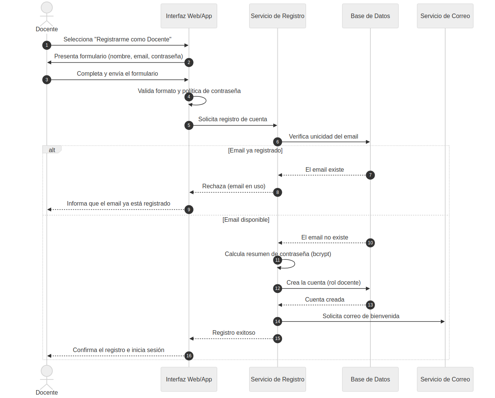
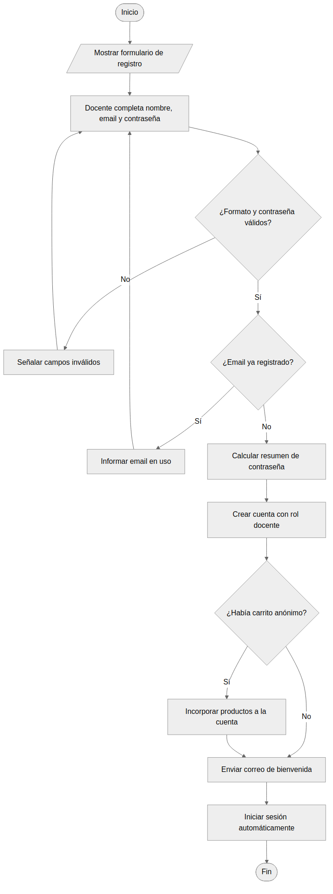
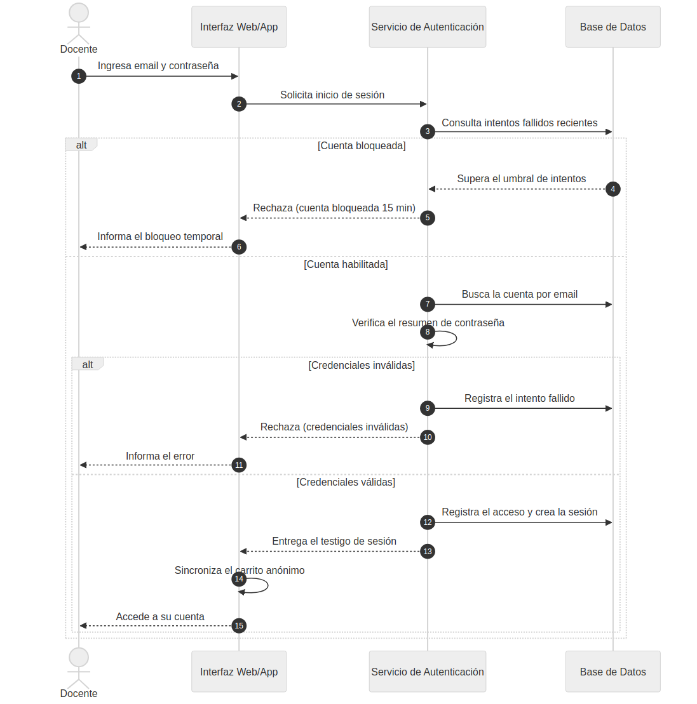
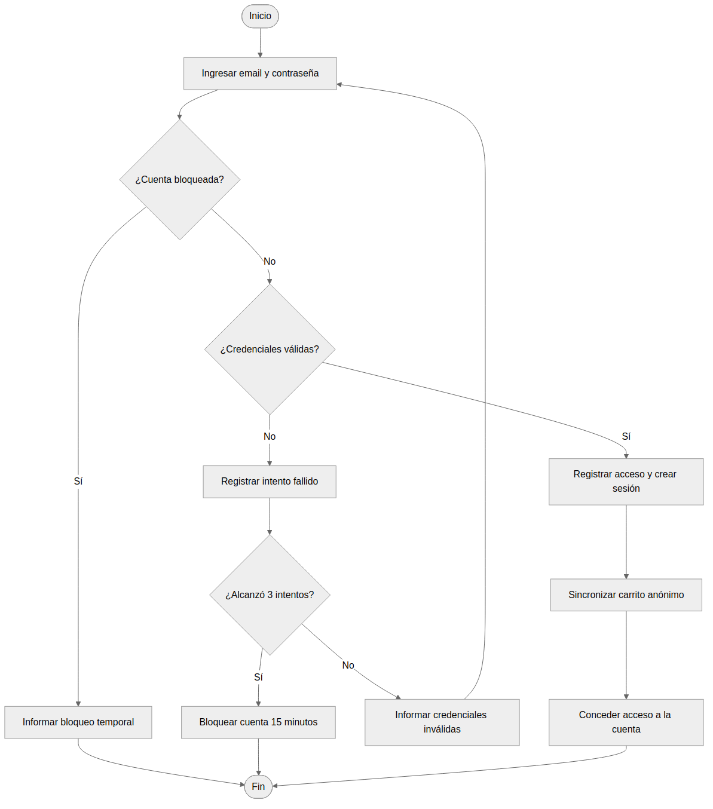
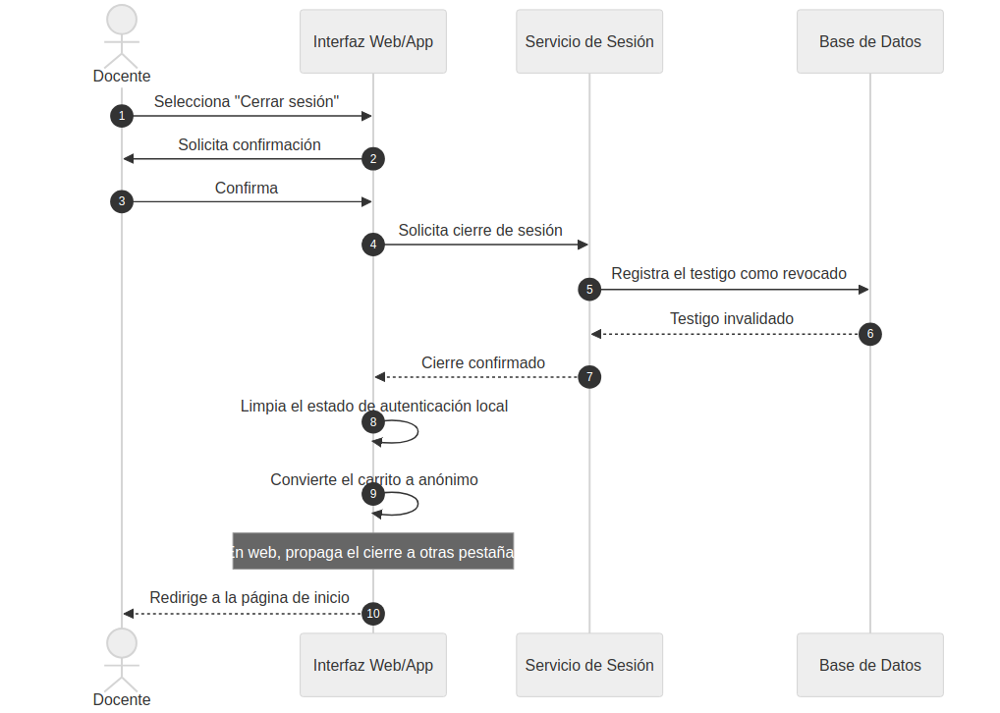
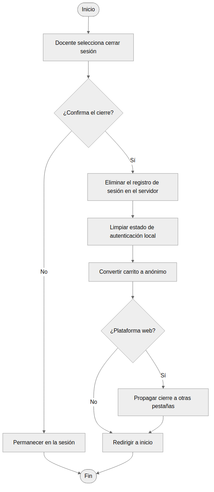
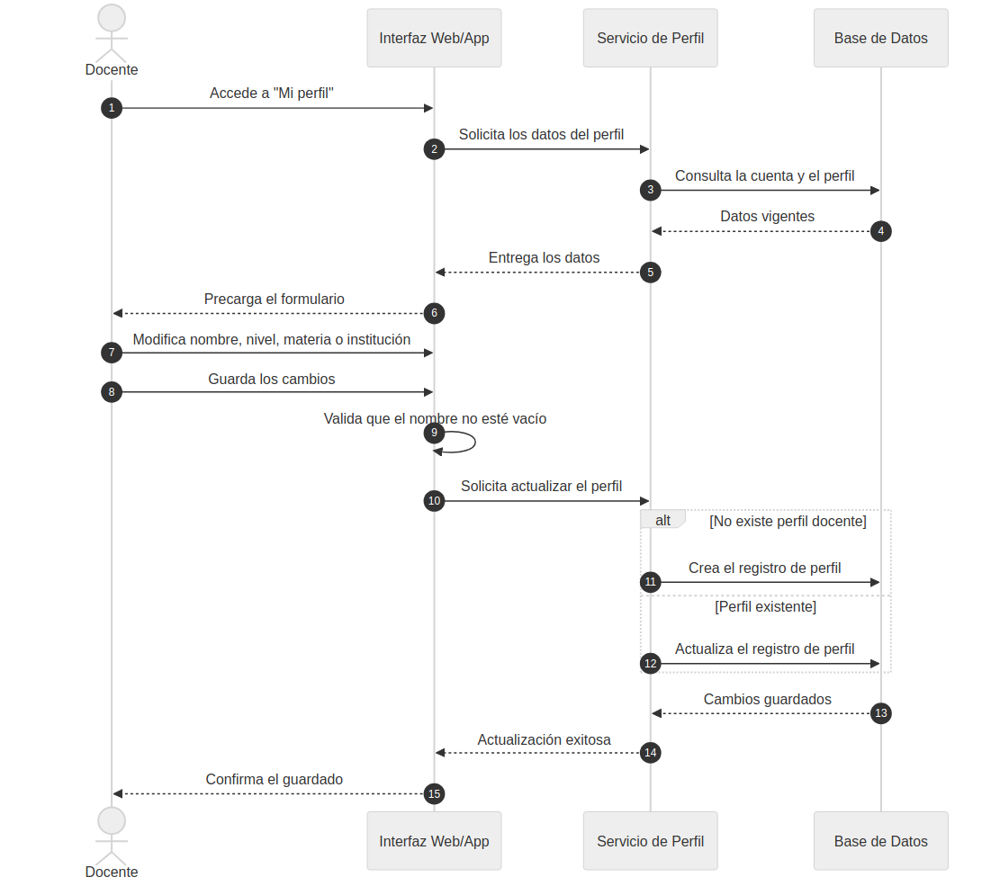
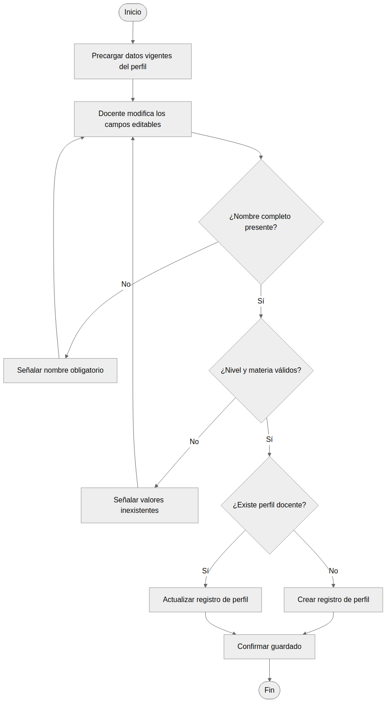
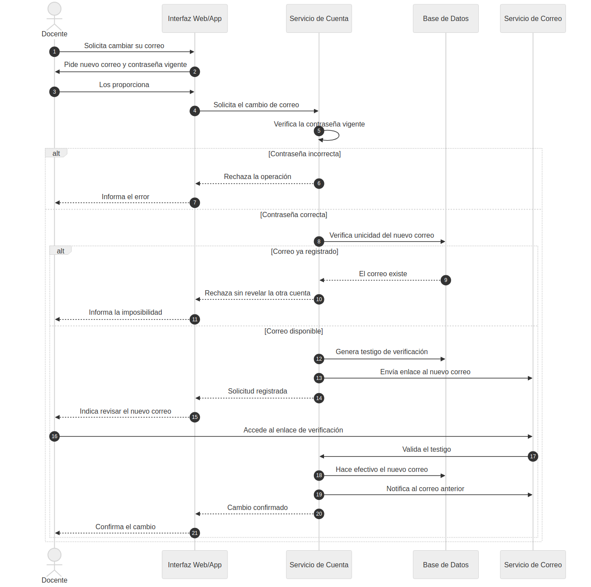
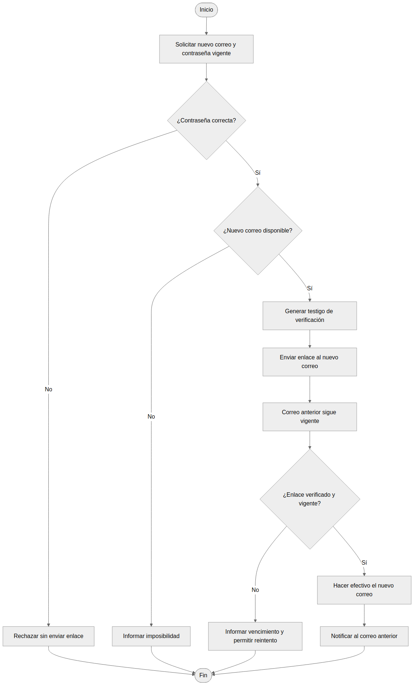

|  | **Sistema ACALUD** |
| --- | --- |
|  | Diagramas UML — Módulo 1: Identidad y Acceso |
|  | Versión: 00 | Fecha: 24/07/2026 | Página: 1 de 12 |

| Información del Documento |
| --- |
| Nombre del Proyecto | Sistema Acalud |
| Tipo de documento | Diagramas de comportamiento UML — Secuencia y Actividad |
| Módulo | 1 · Identidad y Acceso |
| Casos de uso | CU-01, CU-02, CU-03, CU-04, CU-34 |
| Documento antecedente | Especificación de Requerimientos, versión 00 |
| Propósito | Representar el comportamiento dinámico de los casos de uso del módulo mediante diagramas de secuencia y de actividad. |

---

## 1. Introducción

Este documento presenta los diagramas de comportamiento de los casos de uso del módulo de
Identidad y Acceso. Por cada caso de uso se incluyen dos diagramas complementarios:

- El **diagrama de secuencia** representa la interacción entre los participantes a lo largo
  del tiempo, mostrando el intercambio de mensajes entre el usuario, la interfaz, los
  servicios y la base de datos, incluyendo los caminos alternativos.
- El **diagrama de actividad** representa el flujo de control del caso de uso, con sus puntos
  de decisión y sus ramas, desde el inicio hasta la finalización.

Los diagramas derivan de los flujos principales y alternativos descritos en las
especificaciones funcionales y de los requerimientos consolidados.

---

## 2. CU-01 · Registrar Docente

Permite a un visitante crear una cuenta de docente. El caso contempla la validación de la
unicidad del correo, el resguardo de la contraseña mediante resumen criptográfico, la
incorporación del carrito anónimo si existiera, y el inicio de sesión automático tras el
registro.

### 2.1 Diagrama de secuencia

### 2.2 Diagrama de actividad

---

## 3. CU-02 · Iniciar Sesión

Permite a un docente autenticarse. El caso contempla el control de bloqueo por intentos
fallidos, la verificación de credenciales, el registro del acceso y la sincronización del
carrito anónimo.

### 3.1 Diagrama de secuencia

### 3.2 Diagrama de actividad

---

## 4. CU-03 · Cerrar Sesión

Permite a un docente finalizar su sesión. El caso contempla la confirmación, la invalidación
del testigo en el servidor, la limpieza del estado local, la conversión del carrito a anónimo
y, en la plataforma web, la propagación del cierre a las demás pestañas.

### 4.1 Diagrama de secuencia

### 4.2 Diagrama de actividad

---

## 5. CU-04 · Actualizar Perfil

Permite a un docente modificar los datos de su perfil. El caso contempla la precarga de los
datos vigentes, la validación del nombre obligatorio y de los valores de referencia, y la
creación del registro de perfil si no existiera.

### 5.1 Diagrama de secuencia

### 5.2 Diagrama de actividad

---

## 6. CU-34 · Cambiar Correo Electrónico

Permite a un docente modificar el correo asociado a su cuenta mediante verificación de la
titularidad del nuevo correo. El caso contempla la verificación de la contraseña vigente, la
unicidad del nuevo correo, el envío de un enlace de verificación, y la conservación del correo
anterior hasta la confirmación.

### 6.1 Diagrama de secuencia

### 6.2 Diagrama de actividad

---

## 7. Registro de revisiones

| Revisión | Fecha | Ítem | Descripción | Intervino |
| --- | --- | --- | --- | --- |
| 00 | 24/07/2026 | Documento total | Versión inicial |  |

## 8. Participantes y Aprobaciones

| **Confecciona** | **Revisa** | **Aprueba** |
| --- | --- | --- |
|  |  |  |
