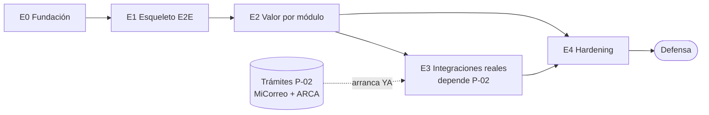

# 5.2 · Plan de implementación por etapas — gates y ruteo de modelos

| Campo | Valor |
|---|---|
| **Artefacto** | 5.2 Etapas con compuertas de calidad y modelo recomendado por tarea |
| **Versión** | 0.1.0 · **Fecha:** 2026-07-04 · **Estado:** 🟡 Borrador |
| **Filosofía** | Hitos verificables, no semanas-calendario (el cuello de botella es tu revisión, no la velocidad del agente — R-05). Esqueleto E2E primero (integrar temprano lo que puede fallar), luego valor por módulo, luego integraciones reales, luego hardening. |

## Cómo leer una etapa

Cada etapa tiene: **objetivo**, **tareas** (con módulo/CU y **modelo sugerido**), y un
**gate de salida** — criterios verificables que deben cumplirse para habilitar la siguiente.
Ninguna etapa empieza si el gate anterior no cerró.

### Ruteo de modelos (regla operativa)

| Modelo | Cuándo | Por qué |
|---|---|---|
| **Sonnet 5** (default) | CRUDs, pantallas, adapters simples, tests, seed, reportes | Barato, rápido, output verificable por vos; gana en trabajo de terminal |
| **Opus 4.8 / Fable 5** (pre-asignado) | Checkout, auth, cliente ARCA SOAP, máquina de estados, idempotencia | Aquí un bug "parece funcionar" y está mal; el costo de una corrida fallida supera la diferencia de tokens |
| **Escalar bajo demanda** | Cuando Sonnet falla 2× lo mismo | No entrar en loop de reintentos baratos (queman más que el modelo caro) |

Cambio de modelo en Claude Code: `/model`. La columna "Modelo" de cada tarea es la
recomendación de arranque.

---

## Etapa 0 · Fundación
**Objetivo:** repo vivo con las reglas puestas (todo 5.1).

| Tarea | Módulo | Modelo |
|---|---|---|
| Scaffolding monorepo + CLAUDE.md + CI | — | Sonnet |
| Migración inicial con constraints críticos (2.3 §6) | infra | Opus (los constraints son el cimiento) |
| Puertos vacíos + adapters fake (ADR-006) | platform | Sonnet |

**Gate 0:** CI verde con hello-world · BD levanta con todos los constraints · linter de
dependencias hexagonal activo y probado (un import ilegal debe romper el build).

## Etapa 1 · Esqueleto E2E (el más importante)
**Objetivo:** un hilo delgado que atraviese TODO de punta a punta, con fakes donde haga
falta. Prueba que las piezas encastran antes de construir en volumen.

| Tarea | Módulo/CU | Modelo |
|---|---|---|
| Auth mínima: registro + login + sesión dual (cookie/bearer) | identidad · CU-001/002/003 | **Opus** (ADR-004 es sensible) |
| Rewrite Vercel `/api/*` + APK que loguea con bearer | web | Sonnet |
| Catálogo read-only (listado + ficha) | catalogo · CU-006 parcial | Sonnet |
| Checkout fake E2E: carrito → pedido → **pago fake aprobado** → estado pagado | compras · CU-010/012 con PaymentProvider fake | **Opus** |
| Deploy real: Vercel + Render + Supabase conectados | infra | Sonnet |

**Gate 1 (el hito que prueba la arquitectura):** un usuario se registra en la **web
desplegada**, agrega al carrito, "paga" (fake), y ve el pedido pagado — **y lo mismo desde
la APK**. La sesión dual funciona en ambos. Si esto anda, el 80 % del riesgo estructural
murió.

## Etapa 2 · Valor por módulo (el grueso)
**Objetivo:** completar los casos de uso reales, módulo por módulo, priorizando los Core
(Compras e Institucional — 2.3 §1). Cada módulo cierra con sus escenarios Gherkin en verde.

| Bloque de tareas | CU | Modelo |
|---|---|---|
| **Compras completo**: descuentos, carrito real, máquina de estados del pedido, stock/kardex | CU-010/022/E04 + máquina | **Opus** (transaccional) |
| **Identidad completo**: perfil, verificación email, recuperación, MFA admin | CU-004/005/E01/E02 | **Opus** (auth) |
| **Institucional completo**: instituciones, membresías, invitaciones, sesiones de uso, reportes, dashboard | CU-023..033 | Sonnet (Opus para CU-024 que reusa checkout) |
| **Catálogo/Contenido**: demos, recursos libres/licenciados con derecho en vivo, vitrina, favoritos | CU-007/008/009/017/018 | Sonnet (Opus para CU-009: autorización) |
| **Comunidad**: encuestas, propuestas, resultados | CU-014/015/016 | Sonnet |
| **Administración**: ABM catálogo, parametrizar encuesta, revisar propuestas, ciclo de pedido | CU-019/020/021/E03 | Sonnet |
| **Plataforma**: outbox worker + scheduler (expiración) + auditoría | CU-E05 + jobs | **Opus** (idempotencia del worker) |
| **Frontend de cada módulo** (web = APK) | todos | Sonnet (frontend-design skill) |

**Gate 2:** los 38 CU con sus escenarios Gherkin en verde · cobertura objetivo alcanzada ·
paridad web/APK verificada por módulo · seed NFR-C3 cargado · reportes miden bajo volumen
(NFR-L6). *Nota: los adapters siguen en fake/tabla-local — las integraciones reales son la
etapa 3.*

## Etapa 3 · Integraciones reales (depende de P-02)
**Objetivo:** reemplazar fakes por los adapters reales de prueba. **Esta etapa depende de
trámites externos** (token MiCorreo, certificado ARCA) que van a velocidad burocrática — por
eso está separada y sus tareas se activan a medida que cada credencial llega. Los fallbacks
ya construidos (etapa 2) hacen que el sistema funcione aunque una integración no esté lista.

| Tarea | Depende de | Modelo | Gate específico |
|---|---|---|---|
| Adapter **Mercado Pago sandbox** real + webhook con firma + **reconciliación server-to-server** | credenciales MP | **Opus/Fable** | Webhook firmado procesa; duplicado/concurrente = no-op (test contra BD real); reconciliación consulta a MP |
| Adapter **MiCorreo** (cotización + tracking) | token (P-02) | Sonnet + revisión | Conmuta a tabla local ante caída (test); si no hay token, se queda en tabla local |
| Adapter **ARCA homologación** (WSAA + WSFEv1 SOAP) | certificado (P-02) | **Opus/Fable** | Obtiene CAE de prueba; ticket se renueva anticipadamente; si falla, PDF cubre |

**Gate 3:** ≥2 integraciones reales demostrables en vivo (requisito de tesis) · cada una con
su fallback probado · scanner de secretos confirma que ninguna credencial está en el repo.

## Etapa 4 · Hardening y demo
**Objetivo:** cerrar los ⏳ de seguridad/confiabilidad y dejar la demo blindada.

| Tarea | Fuente | Modelo |
|---|---|---|
| Headers de seguridad (CSP, HSTS, nosniff) + errores sin internals | 3.1 V8 / 3.3 V14 | Sonnet |
| Rate limits finos (PA/PC/PD/PG) activados y testeados | 3.3 V2.2/11.1 | Sonnet |
| Sanitización de uploads por magic bytes + re-procesado de imágenes | 3.1 V6 | Sonnet |
| **Simulacro de restore** ejecutado y documentado | NFR-R2 | Sonnet + verificación humana |
| Load test k6 a 3× ráfaga con thresholds | NFR-C2 | Sonnet |
| Lighthouse ≥ 80/90 en flujos críticos | NFR-X3/X4 | Sonnet |
| Runbook de demo + prueba de fallbacks y de partición | 4.1 §5 / 3.2 §4 | Sonnet |

**Gate 4 (listo para defender):** checklist ASVS sin ⏳ en flujos críticos · SLO instrumentado
y medido · restore drill firmado · runbook de demo ejecutado con fallbacks y partición
probados · Lighthouse en target · unit economics de cuota medidas y bajo 80 %.

## Mapa de dependencias entre etapas

**Lectura clave:** E3 depende de trámites que no controlás y no acelera con el agente —
por eso **los trámites P-02 se inician el día uno**, en paralelo a E0/E1/E2. E4 puede
empezar sobre E2 sin esperar E3 (los fallbacks ya funcionan).

## Registro de cambios
| Versión | Fecha | Cambio |
|---|---|---|
| 0.1.0 | 2026-07-04 | 5 etapas con gates verificables + ruteo de modelos por tarea + mapa de dependencias |
