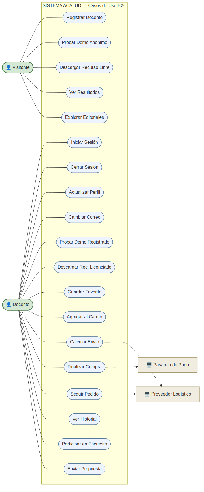
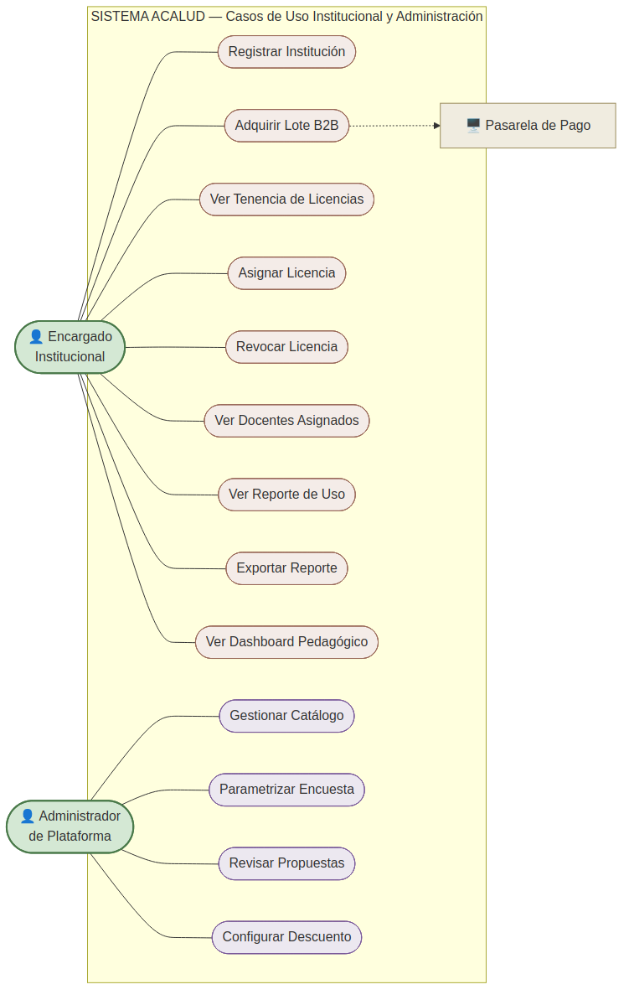
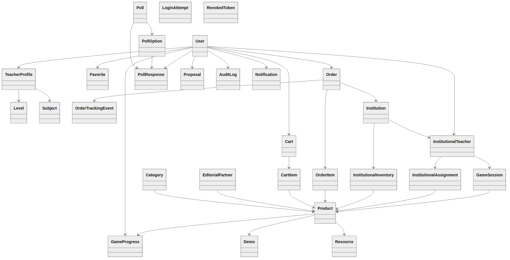
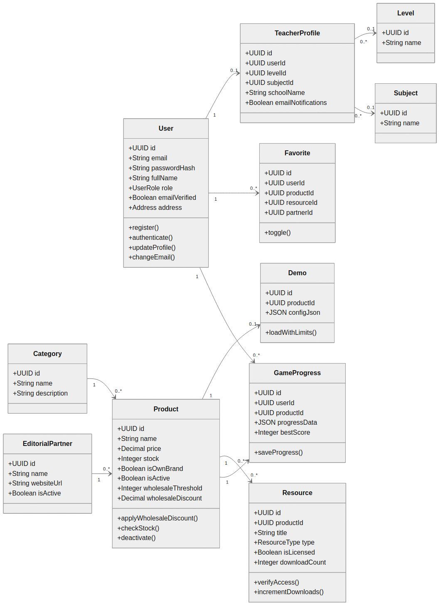
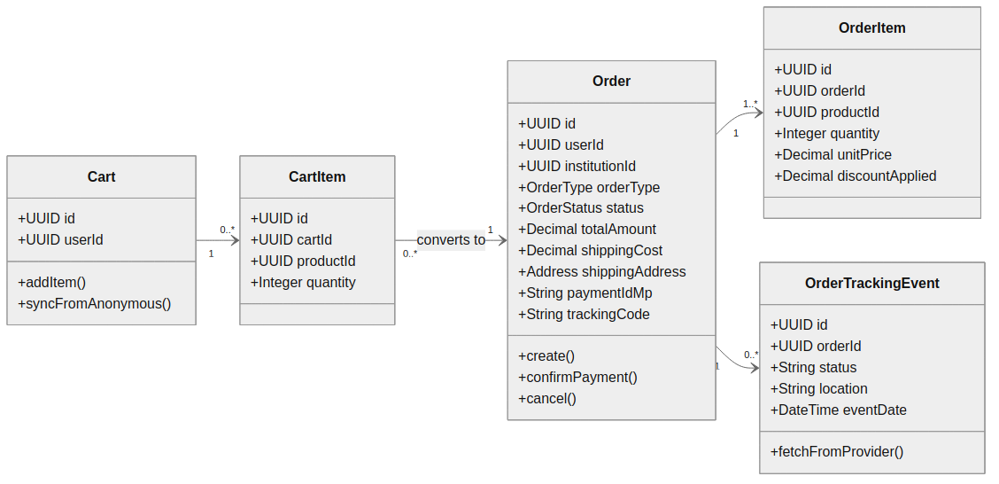
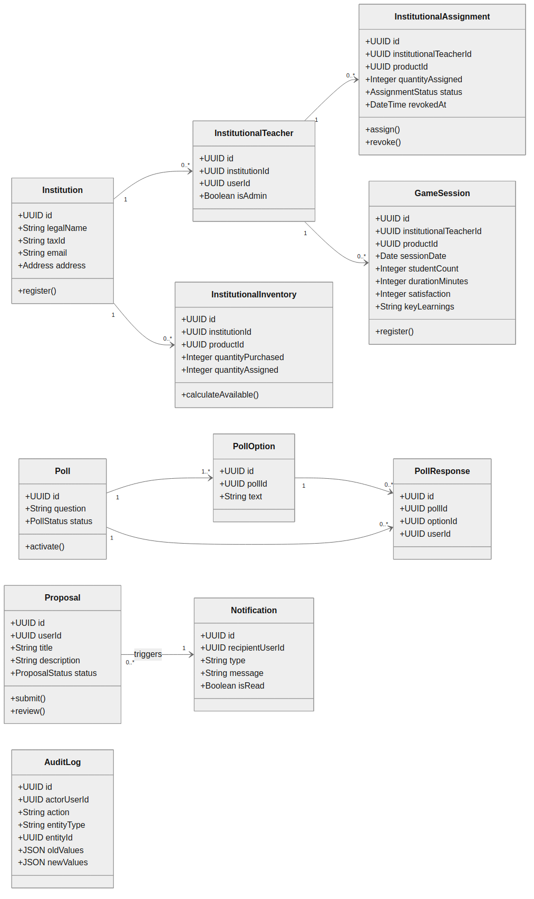

|  | **Sistema ACALUD** |
| --- | --- |
|  | Diagramas UML Generales — Casos de Uso y Clases |
|  | Versión: 00 | Fecha: 24/07/2026 | Página: 1 de 14 |

| Información del Documento |
| --- |
| Nombre del Proyecto | Sistema Acalud |
| Tipo de documento | Diagramas UML estructurales de nivel sistema |
| Contenido | Diagrama de casos de uso general y diagrama de clases |
| Documentos antecedentes | Diagrama Entidad-Relación v00; Diagramas UML por caso de uso (Fase 4) |
| Propósito | Presentar la vista de conjunto del sistema: el modelo de casos de uso con sus actores y el modelo de clases derivado del modelo de datos. |

---

## 1. Introducción

Este documento presenta los dos diagramas UML de nivel sistema que sintetizan la arquitectura
funcional y estructural de Acalud:

- El **diagrama de casos de uso** ofrece la vista funcional completa: los 34 casos de uso,
  los actores que los ejecutan y los sistemas externos con los que el sistema interactúa.
- El **diagrama de clases** ofrece la vista estructural: las entidades del dominio
  representadas como clases, con sus atributos, operaciones y relaciones, derivadas del modelo
  de datos.

Ambos diagramas coronan la documentación, integrando en una vista de conjunto lo desarrollado
en detalle a lo largo de las fases anteriores.

---

## 2. Diagrama de casos de uso

El sistema define cuatro actores y dos sistemas externos.

| Actor | Descripción |
| --- | --- |
| Visitante | Usuario no autenticado. Accede a las funciones públicas: registro, demos anónimas, recursos gratuitos, resultados de encuestas y directorio de editoriales |
| Docente | Usuario autenticado del segmento B2C. Ejecuta las funciones de catálogo, compras, comunidad y gestión de su cuenta |
| Encargado Institucional | Docente con rol de administración en su institución. Ejecuta las funciones del circuito institucional |
| Administrador de Plataforma | Gestiona el catálogo, las encuestas, las propuestas y la configuración comercial |

| Sistema externo | Interacción |
| --- | --- |
| Pasarela de Pago | Procesa los pagos de las compras individuales e institucionales |
| Proveedor Logístico | Cotiza el envío y provee el seguimiento de los pedidos |

Por su extensión, el modelo se presenta en dos vistas complementarias, una por segmento de
actores.

### 2.1 Casos de uso B2C

Comprende las funciones ejecutadas por el Visitante y el Docente.

### 2.2 Casos de uso Institucional y Administración

Comprende las funciones ejecutadas por el Encargado Institucional y el Administrador de
Plataforma.

---

## 3. Diagrama de clases

El diagrama de clases deriva del modelo de datos. Cada entidad se representa como una clase con
sus atributos tipados y las operaciones principales que le corresponden según su
responsabilidad en el dominio. Las relaciones se expresan con su multiplicidad.

Por su extensión, el modelo se presenta primero en una vista global de conjunto, y luego en
tres vistas de detalle por área.

### 3.1 Vista global

La vista global presenta las veintinueve clases del modelo con sus relaciones, sin detalle de
atributos, para ofrecer la estructura completa del dominio de un vistazo.

### 3.2 Núcleo — Identidad y Catálogo

Comprende las clases de usuarios, perfiles, datos maestros, productos, demos, recursos,
favoritos, editoriales y progreso de juego.

### 3.3 Transaccional — Compras

Comprende las clases del circuito comercial: carrito, órdenes, detalle y seguimiento.

### 3.4 Institucional, Comunidad y Transversal

Comprende las clases del circuito pedagógico, de la comunidad y las entidades transversales de
auditoría y notificación.

---

## 4. Correspondencia entre modelos

El diagrama de clases mantiene correspondencia directa con el modelo de datos. Cada clase se
corresponde con una tabla del esquema físico; cada atributo, con una columna; y cada relación,
con una clave foránea. Las operaciones de las clases representan el comportamiento descrito en
los casos de uso y en los diagramas de secuencia.

La convención de nomenclatura difiere entre ambos modelos por convención de cada disciplina:
el modelo de datos emplea el formato de las bases de datos relacionales, mientras que el
diagrama de clases emplea el formato de la programación orientada a objetos. La correspondencia
es directa: la tabla `teacher_profiles` se corresponde con la clase `TeacherProfile`, la
columna `password_hash` con el atributo `passwordHash`, y así sucesivamente.

---

## 5. Registro de revisiones

| Revisión | Fecha | Ítem | Descripción | Intervino |
| --- | --- | --- | --- | --- |
| 00 | 24/07/2026 | Documento total | Versión inicial |  |

## 6. Participantes y Aprobaciones

| **Confecciona** | **Revisa** | **Aprueba** |
| --- | --- | --- |
|  |  |  |
